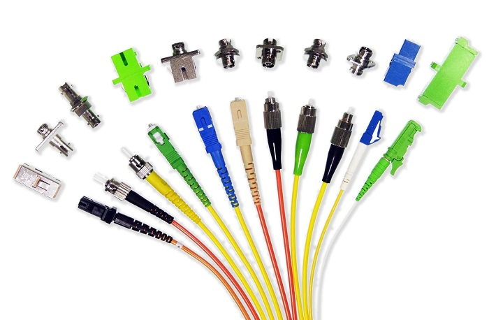
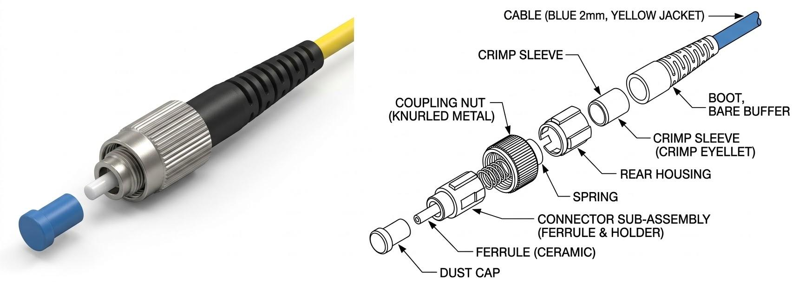
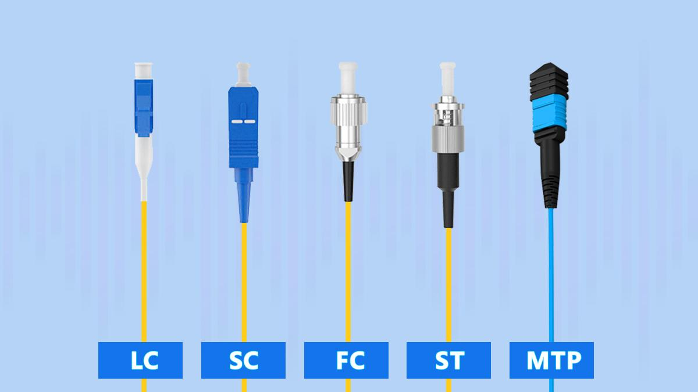
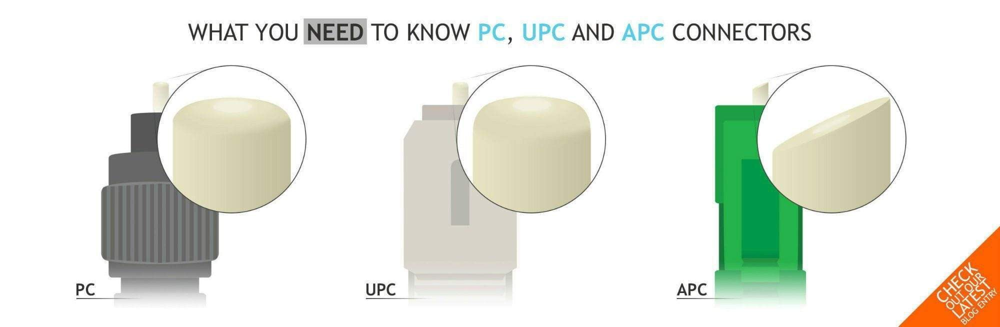

# Fiber Optic Connectors

Fiber Optic Network တစ်ခုတွင် Fiber Cable များကို **Optical Transceiver, Patch Panel, ODF, Splitter, OTDR** နှင့် အခြား Optical Equipment များသို့ ချိတ်ဆက်ရန် **Fiber Optic Connector** များကို အသုံးပြုကြသည်။

Copper Cable များတွင် Electrical Signal ကို ချိတ်ဆက်ပေးသကဲ့သို့ Fiber Optic Connector သည် **Optical Signal** သည် Fiber တစ်ခုမှ တစ်ခုသို့ သို့မဟုတ် Fiber နှင့် Optical Device ကြားသို့ အလင်းဆုံးရှုံးမှု နည်းနိုင်သမျှနည်းအောင် ချိတ်ဆက်ပေးသော အစိတ်အပိုင်းတစ်ခုဖြစ်သည်။

*Fiber Optic Connector များ*

## Fiber Optic Connector ဆိုတာဘာလဲ

**Fiber Optic Connector** ဆိုသည်မှာ Optical Fiber နှစ်ချောင်းကို အလွယ်တကူ ဖြုတ်တပ်နိုင်အောင် ချိတ်ဆက်ပေးခြင်း သို့မဟုတ် Optical Fiber နှင့် Optical Equipment ကြားတွင် Optical Connection ပြုလုပ်ပေးခြင်းအတွက် အသုံးပြုသော Connector ဖြစ်သည်။

Connector ၏ အဓိကရည်ရွယ်ချက်မှာ Fiber Core နှစ်ခုကို တိကျစွာ Alignment ပြုလုပ်ပေးပြီး Optical Signal ဖြတ်သန်းရာတွင် ဖြစ်ပေါ်နိုင်သော **Insertion Loss** နှင့် **Reflection** ကို နည်းနိုင်သမျှနည်းအောင် ပြုလုပ်ပေးရန်ဖြစ်သည်။

## Fiber Optic Connector ၏ အဓိကအစိတ်အပိုင်းများ

*FC Connector အစိတ်အပိုင်းများ*

Connector တစ်ခုတွင် အစိတ်အပိုင်းများစွာ ပါဝင်သော်လည်း အောက်ပါအစိတ်အပိုင်းများသည် အရေးကြီးသည်။

### Ferrule

**Ferrule** သည် Fiber ကို တိကျစွာ ထိန်းထားပေးသော အစိတ်အပိုင်းဖြစ်သည်။ အများအားဖြင့် Ceramic ဖြင့် ပြုလုပ်ထားပြီး Fiber ကို Ferrule ၏ အလယ်ဗဟိုတွင် တိကျစွာ ထည့်သွင်းထားသည်။

Ferrule ၏ အဓိကတာဝန်မှာ Connector နှစ်ခု ချိတ်ဆက်သောအခါ Fiber Core များ တစ်ခုနှင့်တစ်ခု မှန်ကန်စွာ Alignment ဖြစ်စေရန်ဖြစ်သည်။

### Connector Body

Connector Body သည် Ferrule နှင့် အခြားအစိတ်အပိုင်းများကို ထိန်းထားပေးသော အပြင်ဘက်ဖွဲ့စည်းပုံဖြစ်သည်။

### Boot

**Boot** သည် Fiber Cable နှင့် Connector ဆက်သည့်နေရာကို ကာကွယ်ပေးပြီး Fiber ကို အလွန်အမင်း ကွေးသွားခြင်းမှ ကာကွယ်ပေးသည်။

### Coupling / Locking Mechanism

Connector Type အလိုက် **Push-Pull, Bayonet, Threaded** စသည့် Locking Mechanism များကို အသုံးပြုနိုင်သည်။ ၎င်းတို့သည် Connector နှစ်ခု သို့မဟုတ် Connector နှင့် Adapter ကြားတွင် ခိုင်မာစွာ ချိတ်ဆက်ထားနိုင်ရန် ကူညီပေးသည်။

## အသုံးများသော Fiber Optic Connector အမျိုးအစားများ

*အသုံးများသော Fiber Optic Connector များ*

Network များတွင် Connector အမျိုးအစားများစွာရှိသော်လည်း **SC, LC, ST, FC** တို့သည် လူသိများပြီး အသုံးများသော Connector Type များဖြစ်သည်။

### SC Connector

**SC (Subscriber Connector)** သည် Push-Pull Mechanism ကို အသုံးပြုသော Connector ဖြစ်သည်။

၎င်း၏ Connector Body သည် အများအားဖြင့် LC ထက် ကြီးမားပြီး Installation ပြုလုပ်ရာတွင် ကိုင်တွယ်ရလွယ်ကူသည်။

SC Connector ကို FTTH, Patch Panel နှင့် အခြား Fiber Optic Network များတွင် တွေ့ရနိုင်သည်။

### LC Connector

**LC (Lucent Connector)** သည် SC ထက် အရွယ်အစားသေးငယ်သော Connector ဖြစ်ပြီး **Small Form Factor** Connector အမျိုးအစားတစ်ခုဖြစ်သည်။

အရွယ်အစားသေးငယ်သောကြောင့် High-Density Patch Panel နှင့် Network Equipment များတွင် Port များစွာ ထည့်သွင်းအသုံးပြုရန် သင့်တော်သည်။

### ST Connector

**ST (Straight Tip)** Connector သည် Bayonet-style locking mechanism ကို အသုံးပြုသည်။

ယခင်က LAN နှင့် Multimode Fiber Network များတွင် တွေ့ရများခဲ့သော်လည်း ခေတ်သစ် Network များတွင် LC နှင့် SC တို့ကို ပိုမိုတွေ့ရလေ့ရှိသည်။

### FC Connector

**FC (Ferrule Connector)** သည် Threaded Coupling Mechanism ကို အသုံးပြုသော Connector ဖြစ်သည်။

တုန်ခါမှုရှိနိုင်သော Environment များတွင် Connection ကို တည်ငြိမ်စွာ ထိန်းထားနိုင်ရန် အားသာချက်ရှိသည်။ Telecommunications နှင့် Measurement Equipment များတွင်လည်း တွေ့ရနိုင်သည်။

## SC, LC, ST နှင့် FC Connector များ၏ ကွာခြားချက်

| Connector | Full Name | Locking Mechanism | အရွယ်အစား | အသုံးများသောနေရာ |
|---|---|---|---|---|
| SC | Subscriber Connector | Push-Pull | အလယ်အလတ်/ကြီး | FTTH, Patch Panel |
| LC | Lucent Connector | Push-Pull / Latch | သေး | High-Density Equipment |
| ST | Straight Tip | Bayonet | အလယ်အလတ် | Legacy LAN, Multimode |
| FC | Ferrule Connector | Threaded | အလယ်အလတ် | Telecom, Measurement |

Connector Type ကို ရွေးချယ်ရာတွင် Connector ၏ အရွယ်အစားတစ်ခုတည်းကို မကြည့်ဘဲ အသုံးပြုမည့် Equipment, Adapter, Fiber Type, Installation Environment နှင့် Network Design တို့ကိုပါ ထည့်သွင်းစဉ်းစားရမည်။

## PC, UPC နှင့် APC ဆိုတာဘာလဲ

*PC, UPC နှင့် APC Connector များ*

Fiber Optic Connector များကို Connector Body ပုံစံအပြင် **Polish Type** အလိုက်လည်း ခွဲခြားနိုင်သည်။

### PC — Physical Contact

**PC (Physical Contact)** သည် Fiber End Face ကို Physical Contact ဖြစ်စေရန် Polish ပြုလုပ်ထားသောပုံစံဖြစ်သည်။

### UPC — Ultra Physical Contact

**UPC (Ultra Physical Contact)** သည် PC ထက် ပိုမိုကောင်းမွန်သော End-Face Polish ဖြင့် ပြုလုပ်ထားသော Connector ဖြစ်သည်။

UPC Connector များသည် Reflection ကို လျော့ချရန် ရည်ရွယ်ထားပြီး Communication System အမျိုးမျိုးတွင် အသုံးပြုနိုင်သည်။

### APC — Angled Physical Contact

**APC (Angled Physical Contact)** သည် Fiber End Face ကို ပုံမှန်အတိုင်း မတ်မတ်မထားဘဲ အနည်းငယ်ထောင့်ပေး၍ Polish ပြုလုပ်ထားသော Connector ဖြစ်သည်။

ဤပုံစံသည် Back Reflection ကို ပိုမိုလျော့ချနိုင်သောကြောင့် **FTTH, PON နှင့် အခြား Reflection-sensitive Optical Systems** များတွင် အသုံးများသည်။

APC Connector ကို အများအားဖြင့် **အစိမ်းရောင်** ဖြင့် ခွဲခြားသိနိုင်ပြီး UPC Connector များကို **အပြာရောင်** ဖြင့် တွေ့ရလေ့ရှိသည်။

> **အရေးကြီးချက်:** APC နှင့် UPC Connector များကို တိုက်ရိုက်တွဲဖက်ချိတ်ဆက်ခြင်း မပြုလုပ်သင့်ပါ။ Network Design တွင် သတ်မှတ်ထားသော Connector Polish Type နှင့် ကိုက်ညီသော Adapter နှင့် Patch Cord ကို အသုံးပြုရမည်။

## Simplex နှင့် Duplex Connector

Fiber Connector များကို Fiber Count အလိုက်လည်း ခွဲခြားနိုင်သည်။

**Simplex** Connection တွင် Fiber တစ်ချောင်းကို အသုံးပြုသည်။

**Duplex** Connection တွင် Fiber နှစ်ချောင်းကို အသုံးပြုသည်။ အချို့သော Communication System များတွင် Fiber တစ်ချောင်းစီကို Transmit နှင့် Receive အတွက် အသုံးပြုနိုင်သည်။

သို့သော် Modern Optical Technology အချို့တွင် **BiDi (Bidirectional)** စနစ်ကို အသုံးပြု၍ Fiber တစ်ချောင်းတည်းမှ Transmit နှင့် Receive နှစ်မျိုးလုံးကို လုပ်ဆောင်နိုင်သည်။

## Fiber Optic Connector တွင် Loss ဘာကြောင့် ဖြစ်နိုင်သလဲ

Connector နှစ်ခုကို ချိတ်ဆက်သောအခါ Optical Signal ၏ Power အားလုံးကို တစ်ဖက်မှတစ်ဖက်သို့ အပြည့်အဝ မရောက်နိုင်ပါ။

အဓိကအကြောင်းရင်းများမှာ -

* **Core Misalignment** — Fiber Core နှစ်ခု တိကျစွာ မညီခြင်း
* **End-Face Contamination** — Connector End Face တွင် ဖုန်၊ အညစ်အကြေး သို့မဟုတ် အခြားအရာများရှိခြင်း
* **End-Face Damage** — Fiber End Face ခြစ်ရာ၊ ပျက်စီးရာများရှိခြင်း
* **Poor Polish** — Fiber End Face Polish အရည်အသွေး မကောင်းခြင်း
* **Improper Connection** — Connector ကို မှန်ကန်စွာ မချိတ်ဆက်ထားခြင်း

ဤအရာများသည် **Insertion Loss** တိုးလာစေနိုင်ပြီး အချို့အခြေအနေများတွင် **Return Loss / Optical Reflection** ကိုလည်း ထိခိုက်စေနိုင်သည်။

## Connector Cleaning ဘာကြောင့် အရေးကြီးသလဲ

Fiber Optic Connector ၏ End Face သည် အလွန်သေးငယ်သောကြောင့် မျက်စိဖြင့် မမြင်ရလောက်သော ဖုန်မှုန့်ပမာဏပင် Optical Performance ကို ထိခိုက်စေနိုင်သည်။

ထို့ကြောင့် Connector ကို ချိတ်ဆက်မည့်အချိန်တိုင်း **Inspect → Clean → Inspect → Connect** ဆိုသည့် အခြေခံလုပ်ငန်းစဉ်ကို လိုက်နာခြင်းသည် ကောင်းမွန်သော Fiber Installation Practice တစ်ခုဖြစ်သည်။

Connector ကို သန့်ရှင်းစေရန် သင့်လျော်သော **Fiber Optic Cleaning Tool** များကို အသုံးပြုသင့်ပြီး လက်ဖြင့် Ferrule End Face ကို မထိသင့်ပါ။

## Fiber Connector ရွေးချယ်ရာတွင် စဉ်းစားရမည့်အချက်များ

Connector ရွေးချယ်ရာတွင် အောက်ပါအချက်များကို ထည့်သွင်းစဉ်းစားသင့်သည်။

* **Fiber Type** — Single-mode သို့မဟုတ် Multimode
* **Connector Type** — SC, LC, FC, ST စသည်
* **Polish Type** — UPC သို့မဟုတ် APC
* **Equipment Interface** — အသုံးပြုမည့် Device ၏ Port နှင့် ကိုက်ညီမှု
* **Density** — High-density Installation ဖြစ်ပါက Connector Size
* **Insertion Loss** — Connection ကြောင့် ဖြစ်ပေါ်နိုင်သော Loss
* **Return Loss** — Reflection ကို ထိန်းချုပ်ရန်လိုအပ်မှု
* **Operating Environment** — Indoor, Outdoor, Vibration စသည့် အခြေအနေများ
* **Installation Standard** — Project နှင့် Network Design တွင် သတ်မှတ်ထားသော Standard

## လက်တွေ့အသုံးပြုမှုများ

Fiber Optic Connector များကို Fiber Network ၏ နေရာအမျိုးမျိုးတွင် တွေ့ရနိုင်သည်။

* **FTTH Network** — Customer connection နှင့် Distribution Point များ
* **ODF / Fiber Distribution Frame** — Fiber Termination နှင့် Cross-Connection
* **Patch Panel** — Fiber Cable များကို Equipment များနှင့် ချိတ်ဆက်ရန်
* **Optical Transceiver** — Switch, Router နှင့် အခြား Network Equipment များ
* **Data Center** — High-density Fiber Connections
* **Telecommunication Network** — Long-distance နှင့် Access Network များ
* **Testing Equipment** — OTDR, OPM နှင့် အခြား Optical Measurement Equipment များ

## Fiber Connector အသုံးပြုရာတွင် သတိပြုရန်

Fiber Connector သည် သေးငယ်သော်လည်း Optical Link Performance အပေါ် အရေးကြီးသော သက်ရောက်မှုရှိသည်။

အထူးသဖြင့် -

* Connector End Face ကို လက်ဖြင့် မထိပါနှင့်။
* Connector မသုံးသည့်အချိန်တွင် Dust Cap တပ်ထားပါ။
* Connector များကို ချိတ်ဆက်မီ သန့်ရှင်းပြီး Inspect ပြုလုပ်ပါ။
* APC နှင့် UPC ကို မရောနှောဘဲ သတ်မှတ်ထားသော Type ကို အသုံးပြုပါ။
* Connector ကို အင်အားအလွန်အကျွံ အသုံးပြု၍ မချိတ်ပါနှင့်။
* Fiber Cable ကို သတ်မှတ်ထားသော Minimum Bend Radius ထက် ပိုမိုမကွေးပါနှင့်။
* Connector Loss များနေပါက Cleaning, Inspection နှင့် Connection Alignment ကို စစ်ဆေးပါ။

## အနှစ်ချုပ်

**Fiber Optic Connector** သည် Optical Fiber Network တွင် Fiber များနှင့် Optical Equipment များကို ချိတ်ဆက်ပေးသော အရေးကြီးသည့် Component တစ်ခုဖြစ်သည်။

SC, LC, ST နှင့် FC တို့သည် အသုံးများသော Connector Type များဖြစ်ပြီး Connector တစ်ခုနှင့်တစ်ခုတွင် Size နှင့် Locking Mechanism ကွာခြားသည်။

ထို့အပြင် **PC, UPC နှင့် APC** တို့သည် Fiber End Face ၏ Polish ပုံစံများဖြစ်ပြီး Optical Reflection နှင့် Connection Performance အပေါ် သက်ရောက်မှုရှိသည်။

ကောင်းမွန်သော Fiber Connection တစ်ခုရရှိရန် Connector Type မှန်ကန်စွာ ရွေးချယ်ခြင်းအပြင် **Connector Inspection, Cleaning, Proper Handling** တို့ကိုလည်း အရေးကြီးစွာ လိုက်နာရန်လိုအပ်သည်။