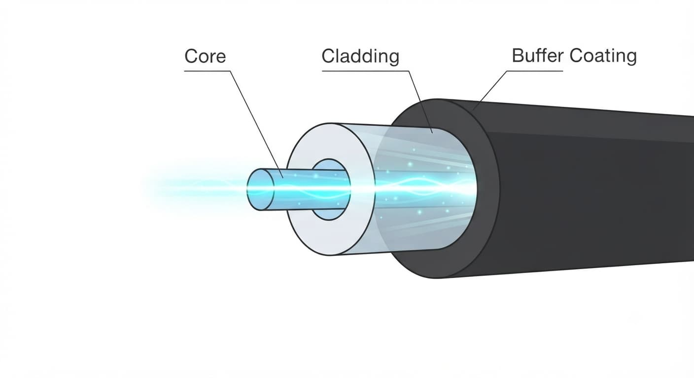
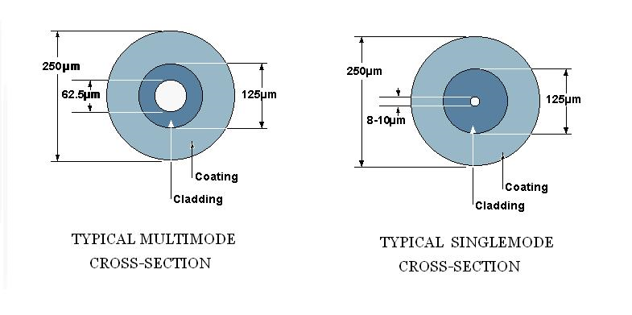
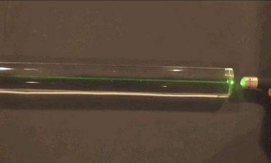

# Core, Cladding and Coating

Optical Fiber တစ်ချောင်းကို အပြင်မှကြည့်လျှင် ကြိုးတစ်ချောင်းကဲ့သို့သာ မြင်ရသော်လည်း အတွင်းပိုင်းတွင် light signal များကို သယ်ဆောင်ပေးရန်နှင့် Fiber ကို ကာကွယ်ပေးရန် အလွှာများစွာ ပါဝင်သည်။ ထိုအလွှာများအနက် အခြေခံအကျဆုံးမှာ **Core**, **Cladding** နှင့် **Coating** တို့ဖြစ်သည်။

Core သည် Light Signal သွားလာသည့် အဓိကနေရာဖြစ်ပြီး Cladding သည် အလင်းကို Core အတွင်းတွင် ထိန်းသိမ်းပေးသည်။ Coating သည် Glass Fiber ကို အပြင်ပိုင်းမှ Mechanical Damage နှင့် Environmental Effects များမှ ကာကွယ်ပေးသည်။

*Optical Fiber ၏ Core, Cladding နှင့် Coating ဖွဲ့စည်းပုံ*

## Optical Fiber ၏ အခြေခံဖွဲ့စည်းပုံ

Optical Fiber ၏ အဓိကအစိတ်အပိုင်းများကို အခြေခံအားဖြင့် အောက်ပါအတိုင်း နားလည်နိုင်သည်။

* **Core** — Light Signal ဖြတ်သန်းသွားသည့် အလယ်ဗဟို Glass Region
* **Cladding** — Core ကို ဝန်းရံထားပြီး Light ကို Core အတွင်းတွင် ထိန်းသိမ်းပေးသည့် Glass Region
* **Coating** — Glass Fiber ကို Mechanical Protection ပေးသည့် အပြင်ပိုင်း Protective Layer

Core နှင့် Cladding နှစ်ခုစလုံးသည် ပုံမှန်အားဖြင့် **Glass** ဖြင့် ပြုလုပ်ထားကြပြီး Coating သည် Glass မဟုတ်ဘဲ Polymer Material ဖြင့် ပြုလုပ်ထားသည်။

## Core

**Core** သည် Optical Fiber ၏ အလယ်ဗဟိုတွင်ရှိသော အလင်းသယ်ဆောင်သည့် အစိတ်အပိုင်းဖြစ်သည်။ Transmitter မှ ထုတ်ပေးသော Optical Signal သည် Fiber ထဲသို့ ဝင်ရောက်ပြီး Core အတွင်းမှ ဖြတ်သန်းသွားသည်။

Core ၏ အရွယ်အစားသည် Fiber အမျိုးအစားပေါ်မူတည်၍ ကွာခြားနိုင်သည်။ အထူးသဖြင့် **Single-Mode Fiber** နှင့် **Multimode Fiber** တို့တွင် Core Diameter ကွာခြားမှုရှိသည်။

Single-Mode Fiber တွင် Core သည် အလွန်သေးငယ်သောကြောင့် အဓိကအားဖြင့် Mode တစ်ခုကိုသာ Propagate လုပ်စေသည်။ Multimode Fiber တွင် Core ပိုကြီးသောကြောင့် Light Modes များစွာ Propagate လုပ်နိုင်သည်။

*Single-Mode Fiber နှင့် Multimode Fiber တို့၏ Core Diameter ကွာခြားမှု*

## Cladding

**Cladding** သည် Core ကို တိုက်ရိုက်ဝန်းရံထားသော Glass Layer ဖြစ်သည်။ Cladding ၏ အဓိကတာဝန်မှာ Light Signal ကို Core အတွင်းတွင် ဆက်လက် Propagate လုပ်နိုင်အောင် ကူညီပေးခြင်းဖြစ်သည်။

Core နှင့် Cladding တို့၏ **Refractive Index** သည် တူညီခြင်းမရှိဘဲ Core ၏ Refractive Index သည် Cladding ထက် ပိုမြင့်သည်။ ထို Refractive Index ကွာခြားမှုသည် Fiber အတွင်း Light Propagation ဖြစ်ပေါ်စေရန် အရေးကြီးသည်။

Cladding သည် Core ထက် အရွယ်အစားပိုကြီးသော်လည်း ၎င်း၏အဓိကလုပ်ဆောင်ချက်မှာ Signal ကို သယ်ဆောင်ခြင်းထက် Core အတွင်း Light ကို ထိန်းသိမ်းပေးခြင်းဖြစ်သည်။

## Core နှင့် Cladding တို့က Light ကို ဘယ်လို Propagate လုပ်ပေးသလဲ

Optical Fiber ထဲသို့ Light Signal ဝင်ရောက်သောအခါ Core နှင့် Cladding ကြားရှိ Refractive Index ကွာခြားမှုကြောင့် Light သည် Fiber အတွင်းသို့ ဆက်လက် Propagate လုပ်နိုင်သည်။

အခြေခံသဘောတရားမှာ **Total Internal Reflection** ဖြစ်သည်။ သင့်လျော်သော Angle နှင့် Conditions များအောက်တွင် Light သည် Core နှင့် Cladding ကြား Boundary တွင် အတွင်းဘက်သို့ ပြန်လှန်သွားပြီး Fiber တစ်လျှောက် ဆက်လက်သွားလာနိုင်သည်။

*Core နှင့် Cladding အတွင်း Light Propagation ဖြစ်ပေါ်ပုံ*

သို့သော် Optical Fiber အတွင်း Light Propagation ကို ရိုးရိုးရှင်းရှင်း Light Ray တစ်ကြောင်းက Core နှင့် Cladding ကြားတွင် ပြန်လှန်သွားလာနေခြင်းအဖြစ်သာ နားလည်ရန် မလုံလောက်ပါ။ အမှန်တကယ်တွင် Light ၏ Propagation ပုံစံသည် Fiber ၏ Core အရွယ်အစား၊ Refractive Index နှင့် အသုံးပြုသည့် Wavelength တို့အပေါ် မူတည်သည်။ ထိုအချက်များက Light သည် Fiber အတွင်း မည်သို့ Propagate လုပ်နိုင်သည်ကို သတ်မှတ်ပေးသည်။

## Coating

**Coating** သည် Glass Fiber ၏ အပြင်ဘက်တွင် ထားရှိသော Protective Layer ဖြစ်သည်။ Core နှင့် Cladding တို့က Optical Function ကို အဓိကတာဝန်ယူသော်လည်း Coating သည် Fiber ကို Physical Protection ပေးရန် အဓိကတာဝန်ရှိသည်။

Coating သည် Glass Fiber ကို အောက်ပါအခြေအနေများမှ ကာကွယ်ပေးရန် အရေးကြီးသည်။

* Bending နှင့် Mechanical Stress
* Surface Damage
* Moisture နှင့် Environmental Effects
* Handling ပြုလုပ်စဉ် ဖြစ်ပေါ်နိုင်သော ထိခိုက်မှုများ

Coating ပျက်စီးသွားခြင်း သို့မဟုတ် Fiber ကို အလွန်အမင်း ကွေးညွှတ်ခြင်းများ ဖြစ်ပေါ်ပါက Glass Fiber ၏ Mechanical Reliability နှင့် Optical Performance နှစ်ခုစလုံးကို ထိခိုက်နိုင်သည်။

## Core, Cladding နှင့် Coating တို့၏ ကွာခြားချက်

| အစိတ်အပိုင်း | အဓိကတာဝန် | ပုံမှန် Material |
|---|---|---|
| Core | Light Signal ကို Propagate လုပ်ပေးခြင်း | Glass |
| Cladding | Light ကို Core အတွင်းတွင် ထိန်းသိမ်းပေးခြင်း | Glass |
| Coating | Glass Fiber ကို Physical Protection ပေးခြင်း | Polymer |

Core နှင့် Cladding တို့သည် Optical Performance အတွက် အဓိကကျပြီး Coating သည် Fiber ၏ Mechanical Protection နှင့် Reliability အတွက် အဓိကကျသည်။

## Single-Mode နှင့် Multimode Fiber တွင် Core Diameter

Core Diameter သည် Fiber ၏ Propagation Characteristics ကို သက်ရောက်မှုရှိစေသော အရေးကြီးသည့် Parameter တစ်ခုဖြစ်သည်။

**Single-Mode Fiber (SMF)** တွင် Core Diameter သေးငယ်သောကြောင့် Light သည် အဓိကအားဖြင့် Fundamental Mode ဖြင့် Propagate လုပ်သည်။ ထိုကြောင့် Long-Distance နှင့် High-Bandwidth Communication Systems များတွင် အသုံးများသည်။

**Multimode Fiber (MMF)** တွင် Core Diameter ပိုကြီးသောကြောင့် Light Modes များစွာ Propagate လုပ်နိုင်သည်။ ထိုအခြေအနေသည် Modal Dispersion ဖြစ်ပေါ်စေနိုင်ပြီး Transmission Distance နှင့် Bandwidth ကို သက်ရောက်စေသည်။

Core Diameter ကိုကြည့်ခြင်းတစ်ခုတည်းဖြင့် Fiber ၏ Performance အားလုံးကို သတ်မှတ်နိုင်ခြင်းမရှိဘဲ Refractive Index Profile၊ Operating Wavelength နှင့် အခြား Optical Characteristics များကိုလည်း ထည့်သွင်းစဉ်းစားရသည်။

## Fiber တစ်ချောင်းအတွင်း အစိတ်အပိုင်းများ၏ ဆက်စပ်မှု

Core, Cladding နှင့် Coating တို့သည် သီးခြားလုပ်ဆောင်ချက်များရှိသော်လည်း Fiber တစ်ချောင်းအဖြစ် အတူတကွလုပ်ဆောင်ကြသည်။

1. **Core** သည် Light Signal ကို သယ်ဆောင်ပြီး Propagate လုပ်ပေးသည်။
2. **Cladding** သည် Core နှင့် သင့်လျော်သော Refractive Index Relationship ဖြင့် Light Propagation ကို ထိန်းချုပ်ပေးသည်။
3. **Coating** သည် Core နှင့် Cladding ပါဝင်သော Glass Fiber ကို Physical Damage နှင့် Environmental Stress များမှ ကာကွယ်ပေးသည်။

ထို့ကြောင့် Optical Fiber ၏ Optical Function ကို နားလည်ရန် Core နှင့် Cladding ကို သိရန်လိုအပ်ပြီး Fiber ကို လက်တွေ့အသုံးပြုခြင်းနှင့် ထိန်းသိမ်းခြင်းအတွက် Coating ၏ အရေးပါမှုကိုလည်း နားလည်ထားရန် လိုအပ်သည်။

## လက်တွေ့အသုံးချမှုတွင် အရေးပါပုံ

Fiber Installation နှင့် Maintenance ပြုလုပ်ရာတွင် Core, Cladding နှင့် Coating တို့၏ အခန်းကဏ္ဍကို နားလည်ထားခြင်းသည် အရေးကြီးသည်။

ဥပမာအားဖြင့် Fiber ကို အလွန်အမင်း ကွေးခြင်း၊ ဖိခြင်း သို့မဟုတ် ဆွဲအားလွန်ကဲစွာ ပေးခြင်းသည် Coating အပြင် Glass Fiber ကိုပါ ထိခိုက်စေနိုင်သည်။ ထိုကဲ့သို့သော Physical Stress များသည် Optical Loss တိုးလာခြင်း သို့မဟုတ် Fiber ပျက်စီးခြင်းတို့ ဖြစ်စေနိုင်သည်။

ထို့အပြင် Splicing ပြုလုပ်ရာတွင် Core Alignment တိကျမှုသည် အရေးကြီးသည်။ Core များ ကောင်းမွန်စွာ Alignment မဖြစ်ပါက Optical Signal Coupling မကောင်းဘဲ Loss ဖြစ်ပေါ်နိုင်သည်။

## အနှစ်ချုပ်

**Core, Cladding နှင့် Coating** တို့သည် Optical Fiber ၏ အခြေခံဖွဲ့စည်းပုံကို နားလည်ရန် အရေးကြီးသော အစိတ်အပိုင်းသုံးခုဖြစ်သည်။ Core သည် Light Signal ကို Propagate လုပ်ပေးပြီး Cladding သည် Core ၏ Optical Environment ကို ဖန်တီးပေးကာ Light ကို Fiber အတွင်းတွင် ထိန်းသိမ်းနိုင်ရန် ကူညီပေးသည်။ Coating သည် ထို Glass Fiber ကို Mechanical နှင့် Environmental Damage များမှ ကာကွယ်ပေးသည်။

ထို့ကြောင့် Optical Fiber ၏ အလုပ်လုပ်ပုံကို အခြေခံမှစ၍ နားလည်လိုပါက **Core က Light ကို သယ်ဆောင်ပေးသည်၊ Cladding က Light Propagation ကို ထိန်းချုပ်ပေးသည်၊ Coating က Fiber ကို ကာကွယ်ပေးသည်** ဟူသော အခြေခံဆက်စပ်မှုကို ဦးစွာနားလည်ထားသင့်သည်။