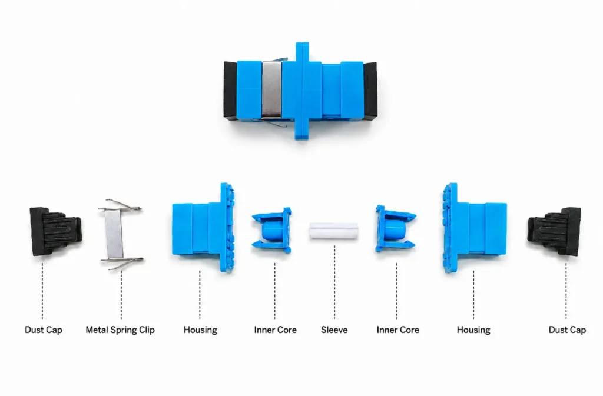
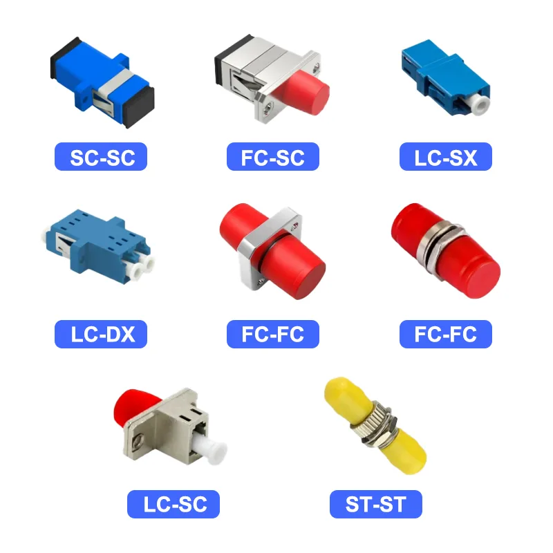
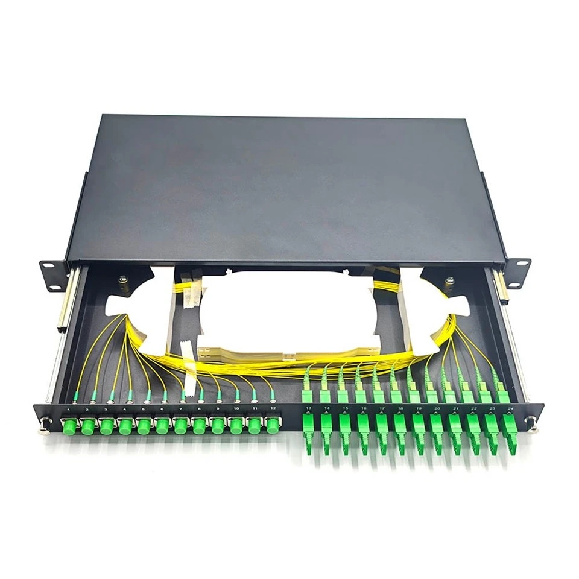

# Fiber Optic Adapters

Fiber Optic Network တစ်ခုမှာ Fiber Optic Connector တွေကို တစ်ခုနဲ့တစ်ခု ချိတ်ဆက်ဖို့အတွက် **Fiber Optic Adapter** ကို အသုံးပြုပါတယ်။

Connector တစ်ခုတည်းနဲ့ Fiber နှစ်ချောင်းကို တိုက်ရိုက်ချိတ်ဆက်လို့မရတဲ့အတွက် Adapter က Connector နှစ်ခုရဲ့ Ferrule တွေကို တိကျစွာ align ဖြစ်အောင် ထိန်းပေးပြီး Optical Signal ဖြတ်သန်းနိုင်အောင် ကူညီပေးပါတယ်။

အထူးသဖြင့် ODF, Patch Panel, Fiber Termination Box (FTB), Wall Outlet စတဲ့နေရာတွေမှာ Fiber Optic Adapter တွေကို အများဆုံးတွေ့ရပါတယ်။

## Fiber Optic Adapter ဆိုတာဘာလဲ?

Fiber Optic Adapter ကို **Fiber Adapter** သို့မဟုတ် **Coupler** လို့လည်း ခေါ်ကြပါတယ်။

၎င်းဟာ Passive Optical Component တစ်ခုဖြစ်ပြီး Fiber Optic Connector နှစ်ခုကို တစ်ခုနဲ့တစ်ခု ချိတ်ဆက်နိုင်အောင် ပြုလုပ်ထားတာဖြစ်ပါတယ်။

Adapter ရဲ့ အဓိကလုပ်ဆောင်ချက်က Connector တွေရဲ့ **Ferrule** နှစ်ခုကို အတွင်းမှာရှိတဲ့ Alignment Sleeve အသုံးပြုပြီး တိကျစွာ align ဖြစ်အောင် ထိန်းပေးခြင်းဖြစ်ပါတယ်။

Connector နှစ်ခုကြားမှာ Alignment မမှန်ကန်ရင် Optical Signal Loss တိုးလာနိုင်ပါတယ်။ ဒါကြောင့် Adapter ရဲ့ Alignment အရည်အသွေးက Fiber Connection ရဲ့ Performance အတွက် အရေးကြီးပါတယ်။

## Fiber Optic Adapter ရဲ့ အဓိကအစိတ်အပိုင်း

*Fiber Optic Adapter အစိတ်အပိုင်းများ*

Fiber Optic Adapter တစ်ခုမှာ အဓိကအားဖြင့် အောက်ပါအစိတ်အပိုင်းတွေ ပါဝင်ပါတယ်။

* **Dust Cap** — အသုံးမပြုချိန်မှာ ဖုန်နဲ့ အညစ်အကြေးတွေ မဝင်ရောက်အောင် ကာကွယ်ပေးတဲ့ အဖုံးဖြစ်ပါတယ်။
* **Metal Spring Clip** — Adapter ကို Patch Panel, Fiber Termination Box စတဲ့နေရာတွေမှာ ခိုင်မြဲစွာ တပ်ဆင်ထားနိုင်အောင် ကူညီပေးတဲ့ သတ္တုကလစ်ဖြစ်ပါတယ်။
* **Housing** — Adapter ရဲ့ အပြင်ဘက်ကိုယ်ထည်ဖြစ်ပြီး အတွင်းပိုင်းအစိတ်အပိုင်းတွေကို ထိန်းသိမ်းပေးပါတယ်။
* **Inner Core** — အတွင်းရှိ Alignment Sleeve ကို သတ်မှတ်နေရာမှာ ခိုင်မာစွာ ထိန်းသိမ်းပေးတဲ့ အတွင်းပိုင်းအစိတ်အပိုင်းဖြစ်ပါတယ်။
* **Alignment Sleeve** — Connector နှစ်ခုရဲ့ Ferrule တွေကို တိကျစွာ align ဖြစ်အောင် ကူညီပေးတဲ့ အလယ်ပိုင်း Sleeve ဖြစ်ပါတယ်။
  
## Fiber Optic Adapter ဘယ်လိုအလုပ်လုပ်သလဲ?

Fiber Optic Connector နှစ်ခုကို Adapter ထဲမှာ ထည့်သွင်းတဲ့အခါ Connector တစ်ခုချင်းစီရဲ့ Ferrule တွေဟာ Adapter အတွင်းရှိ Alignment Sleeve ထဲကို ဝင်ရောက်သွားပါတယ်။

Alignment Sleeve က Ferrule နှစ်ခုရဲ့ အလယ်ဗဟိုကို တစ်နေရာတည်းမှာ ရှိအောင် ထိန်းပေးပါတယ်။

ဒီလို Alignment မှန်ကန်တဲ့အခါ Fiber Core နှစ်ခုဟာ တစ်ခုနဲ့တစ်ခု နီးကပ်စွာ align ဖြစ်ပြီး Optical Signal ကို ဖြတ်သန်းပေးနိုင်ပါတယ်။

Alignment မမှန်ကန်ခြင်း၊ Connector End Face ညစ်ပတ်ခြင်း၊ Ferrule ပျက်စီးခြင်းတို့ကြောင့် Insertion Loss တိုးလာနိုင်ပါတယ်။

## Fiber Optic Adapter အမျိုးအစားများ

*Fiber Optic Adapter အမျိုးအစားများ*

Fiber Optic Adapter တွေကို Connector Type, Fiber Configuration နဲ့ Application အပေါ်မူတည်ပြီး အမျိုးမျိုးခွဲခြားနိုင်ပါတယ်။

### SC Adapter

SC Adapter ကို **SC Connector** နှစ်ခုကို ချိတ်ဆက်ရာမှာ အသုံးပြုပါတယ်။

SC Adapter တွေဟာ Push-Pull Locking Mechanism ပါဝင်တဲ့ SC Connector တွေအတွက် အသုံးပြုဖို့ ဒီဇိုင်းပြုလုပ်ထားပါတယ်။

FTTH Network, ODF, Patch Panel နဲ့ Fiber Termination Box တွေမှာ SC Adapter ကို တွေ့ရများပါတယ်။

### LC Adapter

LC Adapter ကို **LC Connector** နှစ်ခုကို ချိတ်ဆက်ရာမှာ အသုံးပြုပါတယ်။

LC Connector ရဲ့ အရွယ်အစားက SC Connector ထက် သေးငယ်တဲ့အတွက် High-Density Fiber Patch Panel, Data Center နဲ့ Network Equipment တွေမှာ LC Adapter ကို အသုံးများပါတယ်။

### FC Adapter

FC Adapter ကို **FC Connector** နှစ်ခုကို ချိတ်ဆက်ရာမှာ အသုံးပြုပါတယ်။

FC Connector မှာ Threaded Locking Mechanism ပါဝင်တဲ့အတွက် Vibration ရှိနိုင်တဲ့ Environment တွေမှာ Secure Connection ရရှိစေပါတယ်။

Telecommunication နဲ့ Measurement Equipment တွေမှာ FC Connector/Adapter ကို တွေ့နိုင်ပါတယ်။

### ST Adapter

ST Adapter ကို **ST Connector** နှစ်ခုကို ချိတ်ဆက်ရာမှာ အသုံးပြုပါတယ်။

ST Connector မှာ Bayonet Locking Mechanism အသုံးပြုထားပြီး အချို့သော Legacy Fiber Network တွေမှာ တွေ့ရနိုင်ပါတယ်။

## Simplex နှင့် Duplex Adapter

Fiber Optic Adapter တွေကို Fiber Connection အရ **Simplex** နဲ့ **Duplex** ဆိုပြီးလည်း ခွဲခြားနိုင်ပါတယ်။

### Simplex Adapter

Simplex Adapter က Fiber Connector တစ်စုံကို ချိတ်ဆက်နိုင်အောင် ပြုလုပ်ထားတာဖြစ်ပါတယ်။

Fiber တစ်ချောင်းတည်းကို အသုံးပြုတဲ့ Connection တွေမှာ သင့်တော်ပါတယ်။

### Duplex Adapter

Duplex Adapter က Fiber Connector နှစ်စုံကို တစ်ပြိုင်နက် ချိတ်ဆက်နိုင်အောင် ပြုလုပ်ထားတာဖြစ်ပါတယ်။

Duplex Fiber Patch Cord နဲ့ Duplex Fiber Connection တွေမှာ အသုံးပြုပါတယ်။

## Single-mode နှင့် Multimode Adapter

Fiber Optic Adapter ကို Single-mode နဲ့ Multimode Network နှစ်မျိုးလုံးမှာ တွေ့ရနိုင်ပါတယ်။

Adapter ကိုရွေးချယ်ရာမှာ Connector Type တစ်ခုတည်းကို ကြည့်ရုံနဲ့ မပြီးဘဲ အသုံးပြုမယ့် Fiber System နဲ့ Component တွေရဲ့ Compatibility ကိုပါ စစ်ဆေးသင့်ပါတယ်။

Single-mode နဲ့ Multimode Fiber Network တွေမှာ အသုံးပြုတဲ့ Connector/Adapter တွေရဲ့ Physical Interface က တူညီနိုင်ပေမယ့် Network Design နဲ့ Optical Components တွေရဲ့ Compatibility ကို မှန်ကန်စွာ သတ်မှတ်ထားဖို့ လိုအပ်ပါတယ်။

## PC, UPC နှင့် APC Compatibility

Fiber Optic Connector တွေမှာ **PC, UPC, APC** ဆိုတဲ့ Polish Type တွေ ရှိပါတယ်။

Adapter ကိုရွေးချယ်ရာမှာ Connector Polish Type ကိုလည်း ထည့်သွင်းစဉ်းစားရပါတယ်။

အထူးသဖြင့် **APC Connector** နဲ့ **UPC Connector** ကို မရောနှောအသုံးပြုသင့်ပါ။

APC Connector ရဲ့ Angled End Face နဲ့ UPC Connector ရဲ့ Flat End Face ဟာ မတူညီတဲ့အတွက် သင့်တော်တဲ့ Adapter နဲ့ Connector Combination ကို အသုံးပြုရပါမယ်။

FTTH Network တွေမှာ APC Connection တွေကို အသုံးများတဲ့အတွက် Installation လုပ်တဲ့အခါ APC Components တွေရဲ့ Compatibility ကို သေချာစစ်ဆေးသင့်ပါတယ်။

## Fiber Optic Adapter ကို ဘယ်နေရာတွေမှာ အသုံးပြုသလဲ?

*Fiber Optic Adapter များတပ်ဆင်ထားပုံ*

Fiber Optic Adapter တွေကို Fiber Network ရဲ့ Connection Point အမျိုးမျိုးမှာ အသုံးပြုပါတယ်။

### ODF

**Optical Distribution Frame (ODF)** ထဲမှာ Fiber Connector တွေကို Patch Cord နဲ့ချိတ်ဆက်ဖို့ Adapter တွေကို အသုံးပြုပါတယ်။

### Fiber Patch Panel

Data Center နဲ့ Telecommunication Network တွေမှာ Fiber Patch Panel အတွင်း Connector တွေကို စနစ်တကျချိတ်ဆက်နိုင်ဖို့ Adapter တွေကို တပ်ဆင်ထားပါတယ်။

### Fiber Termination Box

FTTH Installation တွေမှာ Fiber Termination Box အတွင်း SC Adapter တွေကို အသုံးပြုတာတွေ့ရများပါတယ်။

### Wall Outlet

အဆောက်အအုံအတွင်း Fiber Network Connection Point အဖြစ် အသုံးပြုတဲ့ Fiber Wall Outlet တွေမှာလည်း Adapter တွေ ပါဝင်နိုင်ပါတယ်။

## Adapter ရွေးချယ်ရာမှာ ဘာတွေကြည့်ရမလဲ?

Fiber Optic Adapter တစ်ခုရွေးချယ်တဲ့အခါ အောက်ပါအချက်တွေကို စစ်ဆေးသင့်ပါတယ်။

* Connector Type — SC, LC, FC, ST စသည်
* Simplex သို့မဟုတ် Duplex
* Single-mode သို့မဟုတ် Multimode Application
* PC, UPC သို့မဟုတ် APC Compatibility
* Alignment Sleeve အရည်အသွေး
* Mounting Type
* အသုံးပြုမယ့် ODF / Patch Panel / FTB နဲ့ Mechanical Compatibility
* Insertion Loss နဲ့ Return Loss လိုအပ်ချက်
* Operating Environment

## Adapter ကြောင့် Loss ဖြစ်နိုင်သလား?

Fiber Optic Adapter ကိုယ်တိုင်က Passive Component ဖြစ်ပေမယ့် Connection Quality မကောင်းရင် Optical Loss တိုးလာနိုင်ပါတယ်။

အဓိကဖြစ်နိုင်တဲ့အကြောင်းရင်းတွေကတော့—

* Connector End Face ညစ်ပတ်ခြင်း
* Ferrule Alignment မမှန်ခြင်း
* Alignment Sleeve ပျက်စီးခြင်း
* Connector Ferrule ပျက်စီးခြင်း
* Connector Type မကိုက်ညီခြင်း
* APC/UPC ကို မမှန်ကန်စွာ တွဲဖက်ခြင်း
* Connector ကို Adapter ထဲသို့ မမှန်ကန်စွာ တပ်ဆင်ခြင်း

ဒါကြောင့် Adapter ကို ပြောင်းလဲရုံနဲ့ Loss ပြဿနာအားလုံးကို ဖြေရှင်းနိုင်မယ်လို့ မယူဆသင့်ပါဘူး။ Connector End Face ကို စစ်ဆေးပြီး သန့်ရှင်းမှုနဲ့ Physical Condition ကိုပါ စစ်ဆေးသင့်ပါတယ်။

## Fiber Optic Adapter ကို အသုံးပြုရာမှာ သတိပြုရန်

Fiber Connection တစ်ခုကို တပ်ဆင်တဲ့အခါ Adapter နဲ့ Connector တွေရဲ့ End Face ကို သန့်ရှင်းစွာ ထိန်းသိမ်းထားဖို့ အရေးကြီးပါတယ်။

**Inspect → Clean → Inspect → Connect** ဆိုတဲ့ လုပ်ငန်းစဉ်ကို လိုက်နာခြင်းက Connection Quality ကို ထိန်းသိမ်းရာမှာ အထောက်အကူပြုပါတယ်။

Connector ကို Adapter ထဲသို့ အတင်းအကျပ် မထည့်သင့်ပါ။ Mechanical Interface မကိုက်ညီတဲ့ Connector နှစ်မျိုးကိုလည်း အတင်းအကျပ် ချိတ်ဆက်ခြင်း မပြုလုပ်သင့်ပါ။

## Fiber Optic Connector နှင့် Adapter ကွာခြားချက်

Connector နဲ့ Adapter ဟာ ဆက်စပ်နေတဲ့ Components တွေဖြစ်ပေမယ့် လုပ်ဆောင်ချက် မတူညီပါဘူး။

| Component | အဓိကလုပ်ဆောင်ချက် |
|---|---|
| Fiber Optic Connector | Fiber Cable ရဲ့ Fiber ကို Terminate လုပ်ပြီး Equipment သို့မဟုတ် Adapter နဲ့ ချိတ်ဆက်ရန် |
| Fiber Optic Adapter | Connector နှစ်ခုရဲ့ Ferrule တွေကို Align လုပ်ပြီး တစ်ခုနဲ့တစ်ခု ချိတ်ဆက်ရန် |

အလွယ်ပြောရရင်—

**Connector = Fiber ကို Connection Interface ဖြစ်အောင် ပြုလုပ်ပေးတဲ့ Component**

**Adapter = Connector နှစ်ခုကို ချိတ်ဆက်ပေးတဲ့ Component**

ဒါကြောင့် Fiber Optic Network တစ်ခုမှာ Connector နဲ့ Adapter နှစ်မျိုးစလုံးဟာ အရေးကြီးတဲ့ အစိတ်အပိုင်းတွေ ဖြစ်ပါတယ်။

## အနှစ်ချုပ်

Fiber Optic Adapter ဟာ Fiber Optic Connector နှစ်ခုကို တစ်ခုနဲ့တစ်ခု ချိတ်ဆက်နိုင်အောင် ပြုလုပ်ထားတဲ့ Passive Optical Component တစ်ခုဖြစ်ပါတယ်။

Adapter အတွင်းရှိ Alignment Sleeve က Connector Ferrule နှစ်ခုကို တိကျစွာ align ဖြစ်အောင် ကူညီပေးပြီး Optical Signal ဖြတ်သန်းမှုကို ကောင်းမွန်စေပါတယ်။

SC, LC, FC, ST စတဲ့ Connector Type အလိုက် သက်ဆိုင်ရာ Adapter တွေရှိပြီး Simplex, Duplex, PC, UPC, APC စတဲ့ Connection Characteristics တွေကိုလည်း ထည့်သွင်းစဉ်းစားရပါတယ်။

ODF, Patch Panel, Fiber Termination Box နဲ့ FTTH Network တွေမှာ Adapter တွေကို အများဆုံးအသုံးပြုကြပါတယ်။

အကောင်းဆုံး Fiber Connection ရရှိဖို့ Adapter ရွေးချယ်မှုတင်မကဘဲ Connector End Face သန့်ရှင်းမှု၊ Ferrule Alignment နဲ့ Component Compatibility တွေကိုပါ သေချာစစ်ဆေးဖို့ လိုအပ်ပါတယ်။