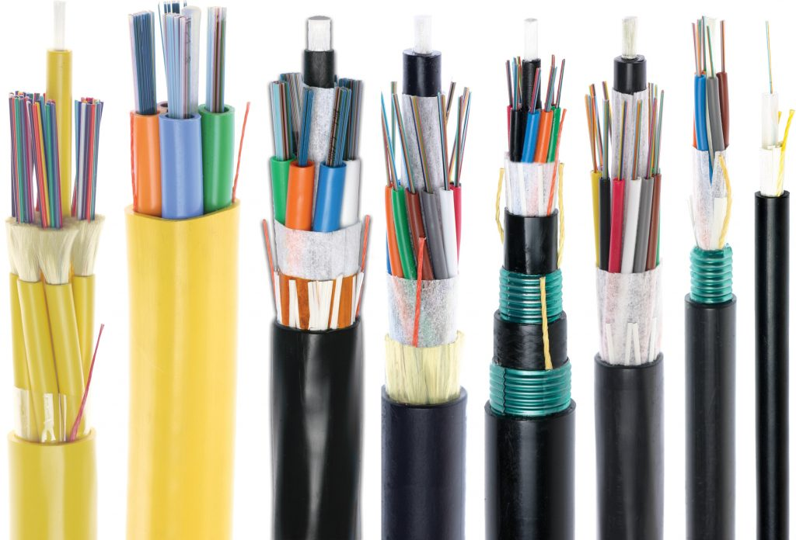
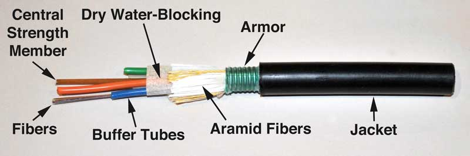
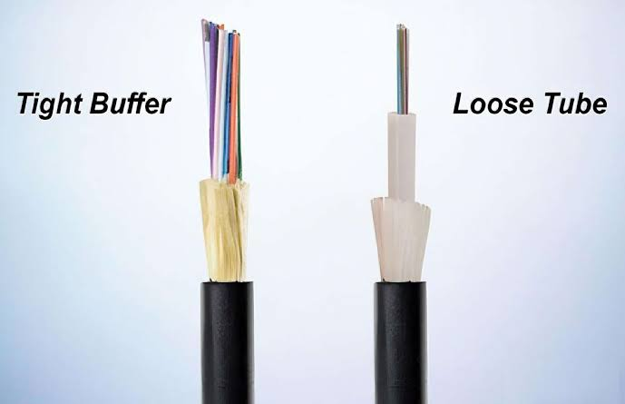
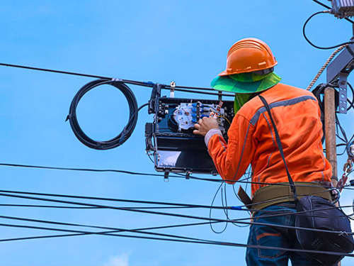

# Fiber Optic Cables

Fiber Optic Cable ဆိုတာ Optical Fiber တွေကို အပြင်ဘက်ကနေ ကာကွယ်ပေးပြီး Fiber Optic Signal တွေကို တစ်နေရာကနေ တစ်နေရာသို့ ပို့ဆောင်နိုင်အောင် ပြုလုပ်ထားတဲ့ Cable ဖြစ်ပါတယ်။

Fiber တစ်ချောင်းတည်းကို အပြင်မှာ သီးခြားအသုံးပြုတာထက် Cable အဖြစ် ပြုလုပ်ထားခြင်းက Fiber ကို Mechanical Stress, Moisture, Bending နဲ့ ပတ်ဝန်းကျင်ဆိုင်ရာ သက်ရောက်မှုတွေကနေ ပိုမိုကာကွယ်ပေးနိုင်ပါတယ်။

Telecommunication Network, FTTH, Data Center, Internet Backbone နဲ့ အခြား High-Speed Communication Network တွေမှာ Fiber Optic Cable တွေကို ကျယ်ကျယ်ပြန့်ပြန့် အသုံးပြုကြပါတယ်။

*Fiber Optic Cable သည် Optical Fiber ကို ကာကွယ်ပေးပြီး Optical Signal များကို အကွာအဝေးတစ်လျှောက် ပို့ဆောင်ပေးသည်။*

## Fiber Optic Cable ရဲ့ ဖွဲ့စည်းပုံ

Fiber Optic Cable တစ်ချောင်းမှာ Optical Fiber တွေကို တိုက်ရိုက်အသုံးပြုထားရုံသာမက Fiber တွေကို ကာကွယ်ပေးပြီး Cable ကို လိုအပ်တဲ့ Mechanical Strength နဲ့ Environmental Protection ရရှိစေဖို့ အလွှာအမျိုးမျိုးနဲ့ ဖွဲ့စည်းထားပါတယ်။

Cable အမျိုးအစားနဲ့ အသုံးပြုမယ့်နေရာပေါ်မူတည်ပြီး ဖွဲ့စည်းပုံအနည်းငယ်ကွာခြားနိုင်ပေမယ့် အဓိကအားဖြင့် အောက်ပါအစိတ်အပိုင်းတွေ ပါဝင်နိုင်ပါတယ်။

* Fibers — Optical Signal တွေကို သယ်ဆောင်ပေးတဲ့ Optical Fibers တွေ ဖြစ်ပါတယ်။ Cable တစ်ချောင်းမှာ လိုအပ်ချက်ပေါ်မူတည်ပြီး Fiber အရေအတွက် မတူညီနိုင်ပါတယ်။

* Central Strength Member — Cable ရဲ့ အလယ်ပိုင်းမှာ တည်ရှိပြီး Cable ကို Structural Support ပေးကာ ဆွဲအားကို ခံနိုင်ရည်ရှိစေဖို့ အဓိကအခန်းကဏ္ဍက ပါဝင်ပါတယ်။

* Buffer Tubes — Fibers တွေကို အပြင်ဘက်က Mechanical Stress နဲ့ Environmental Effects တွေကနေ ကာကွယ်ပေးတဲ့ Tube တွေ ဖြစ်ပါတယ်။ Loose Tube Cable တွေမှာ Fiber တွေကို Buffer Tube အတွင်း ထည့်သွင်းထားလေ့ရှိပါတယ်။

* Dry Water-Blocking — Cable အတွင်းကို ရေဝင်ရောက်ခြင်းနဲ့ Moisture ပြန့်နှံ့ခြင်းကို တားဆီးပေးတဲ့ Material ဖြစ်ပါတယ်။ အထူးသဖြင့် Outdoor Cable တွေမှာ ရေကာကွယ်မှုအတွက် အရေးကြီးပါတယ်။

* Aramid Fibers — Cable ကို Tensile Strength ပိုမိုရရှိစေပြီး Installation ပြုလုပ်တဲ့အချိန်မှာ ဆွဲအားကြောင့် Fiber တွေ ထိခိုက်မှုမဖြစ်စေရန် ကူညီပေးတဲ့ Strength Material ဖြစ်ပါတယ်။

* Armor — Cable ကို Mechanical Damage တွေ၊ ဖိအားတွေ၊ ကြွက်ကိုက်ခြင်းလို Physical Damage တွေကနေ ပိုမိုကာကွယ်ပေးတဲ့ Protective Layer ဖြစ်ပါတယ်။ Cable Design နဲ့ Installation Environment ပေါ်မူတည်ပြီး Armor ပါဝင်နိုင်ပါတယ်။

* Jacket — Cable ရဲ့ အပြင်ဆုံးအလွှာဖြစ်ပြီး အတွင်းပိုင်းအစိတ်အပိုင်းတွေကို ရေ၊ အစိုဓာတ်၊ အပူချိန်ပြောင်းလဲမှုနဲ့ Physical Damage တွေကနေ ကာကွယ်ပေးပါတယ်။ Cable ရဲ့ အသုံးပြုမယ့် Environment ပေါ်မူတည်ပြီး Jacket Material နဲ့ Design ကွာခြားနိုင်ပါတယ်။

«မှတ်ချက်: Fiber Optic Cable တိုင်းမှာ အထက်ပါအစိတ်အပိုင်းအားလုံး ပါဝင်ရမယ်လို့ မဆိုလိုပါဘူး။ Indoor, Outdoor, Aerial, Duct, Direct Burial နဲ့ Armored Cable စတဲ့ Cable Design အမျိုးအစားအလိုက် ဖွဲ့စည်းပုံနဲ့ Protective Layers တွေ ကွာခြားနိုင်ပါတယ်။»

*Fiber Optic Cable ၏ အတွင်းဖွဲ့စည်းပုံကို ပြထားသောပုံ*

## Fiber Optic Cable ဘယ်လိုအလုပ်လုပ်သလဲ?

Fiber Optic Cable ထဲမှာရှိတဲ့ Optical Fiber က Data ကို Electrical Signal အစား **Light Signal** အဖြစ် သယ်ဆောင်ပေးပါတယ်။

Transmitter က Electrical Data ကို Optical Signal အဖြစ် ပြောင်းလဲပြီး Fiber ထဲကို ပို့ပေးပါတယ်။ Optical Signal ဟာ Fiber ရဲ့ Core အတွင်းကနေ ဖြတ်သန်းသွားပြီး Receiver ဘက်ရောက်တဲ့အခါ ပြန်လည်လက်ခံပြီး Data အဖြစ် အသုံးပြုနိုင်ပါတယ်။

Fiber Optic Cable ရဲ့ အဓိကအားသာချက်က Light Signal ကို အသုံးပြုတဲ့အတွက် Copper Cable တွေထက် Bandwidth မြင့်မားပြီး Long Distance Communication အတွက် သင့်တော်တာ ဖြစ်ပါတယ်။

## Fiber Optic Cable အမျိုးအစားများ

Fiber Optic Cable တွေကို အသုံးပြုမယ့်နေရာ၊ Installation Method နဲ့ Environmental Conditions အပေါ်မူတည်ပြီး အမျိုးမျိုး ခွဲခြားနိုင်ပါတယ်။

### Indoor Fiber Optic Cable

Indoor Fiber Optic Cable တွေကို Building အတွင်း၊ Data Center၊ Office နဲ့ Equipment Room စတဲ့နေရာတွေမှာ အသုံးပြုပါတယ်။

အဆောက်အအုံအတွင်းမှာ အသုံးပြုရတာဖြစ်တဲ့အတွက် Cable ရဲ့ Flexibility နဲ့ Fire Safety Requirements တွေကို ထည့်သွင်းစဉ်းစားရပါတယ်။

### Outdoor Fiber Optic Cable

Outdoor Fiber Optic Cable တွေကို အပြင်ဘက်ပတ်ဝန်းကျင်မှာ အသုံးပြုဖို့ ဒီဇိုင်းပြုလုပ်ထားပါတယ်။

Temperature Change, Moisture, UV Exposure နဲ့ Mechanical Stress စတဲ့ Environmental Conditions တွေကို ခံနိုင်ရည်ရှိအောင် ပြုလုပ်ထားနိုင်ပါတယ်။

### Aerial Fiber Optic Cable

Aerial Cable ကို Pole သို့မဟုတ် အခြား Overhead Structure တွေပေါ်မှာ တပ်ဆင်အသုံးပြုပါတယ်။

အချို့သော Aerial Cable တွေမှာ Cable ကို ကိုယ်တိုင် Support လုပ်နိုင်အောင် **ADSS (All-Dielectric Self-Supporting)** Design ကို အသုံးပြုထားပါတယ်။

### Duct Fiber Optic Cable

Duct Cable ကို Underground Duct သို့မဟုတ် Conduit အတွင်းမှာ ထည့်သွင်းအသုံးပြုပါတယ်။

Cable ကို တိုက်ရိုက်မြေထဲမှာ မချထားဘဲ Duct အတွင်းကနေ တပ်ဆင်တဲ့အတွက် Installation နဲ့ Maintenance အတွက် သင့်တော်တဲ့ Network Design တစ်ခု ဖြစ်ပါတယ်။

### Direct Burial Fiber Optic Cable

Direct Burial Cable ကို သီးခြား Duct မလိုဘဲ မြေထဲကို တိုက်ရိုက်မြှုပ်နှံတပ်ဆင်နိုင်အောင် ဒီဇိုင်းပြုလုပ်ထားပါတယ်။

Mechanical Protection နဲ့ Environmental Protection ပိုမိုလိုအပ်တဲ့နေရာတွေမှာ သင့်တော်တဲ့ Cable Design ကို အသုံးပြုရပါတယ်။

### Armored Fiber Optic Cable

Armored Cable မှာ Fiber ကို Mechanical Protection ပိုမိုရရှိစေရန် Armor Layer ထည့်သွင်းထားပါတယ်။

Rodent Damage, Crushing နဲ့ Mechanical Stress ပိုမိုဖြစ်နိုင်တဲ့ Environment တွေမှာ Armored Cable ကို အသုံးပြုနိုင်ပါတယ်။

## Fiber Count ဆိုတာဘာလဲ?

Fiber Optic Cable တွေကို Fiber အရေအတွက်အလိုက်လည်း ခွဲခြားနိုင်ပါတယ်။

ဥပမာ—

* 1 Fiber
* 2 Fibers
* 4 Fibers
* 8 Fibers
* 12 Fibers
* 24 Fibers
* 48 Fibers
* 96 Fibers
* 144 Fibers

Network ရဲ့ လိုအပ်ချက်အပေါ်မူတည်ပြီး Fiber Count ကို ရွေးချယ်ရပါတယ်။

လက်ရှိအသုံးပြုမယ့် Fiber အရေအတွက်တင်မကဘဲ နောင်မှာ Network Expansion လုပ်နိုင်မယ့်အခြေအနေကိုပါ ထည့်သွင်းစဉ်းစားပြီး Fiber Count ကို သတ်မှတ်တာ ပိုမိုသင့်တော်ပါတယ်။

## Loose Tube နှင့် Tight Buffered Cable

Fiber Optic Cable တွေကို Fiber ကို ဘယ်လိုကာကွယ်ထားသလဲဆိုတာအပေါ်မူတည်ပြီး **Loose Tube** နဲ့ **Tight Buffered** Design တွေကို တွေ့ရနိုင်ပါတယ်။

*Fiber Optic Cable Types*

### Loose Tube

Loose Tube Design မှာ Optical Fiber ကို Tube အတွင်းမှာ လွတ်လပ်စွာ ထားရှိထားပါတယ်။

Tube အတွင်းမှာ Gel သို့မဟုတ် အခြား Water-Blocking Material တွေ အသုံးပြုထားနိုင်ပြီး Outdoor နဲ့ Long-Distance Cable တွေမှာ အသုံးများပါတယ်။

### Tight Buffered

Tight Buffered Design မှာ Fiber တစ်ချောင်းချင်းစီကို Buffer Material နဲ့ ပိုမိုနီးကပ်စွာ ကာကွယ်ထားပါတယ်။

ဒီလို Design က Cable ကို Handling လုပ်ရလွယ်ကူပြီး Indoor Application တွေမှာ အသုံးများပါတယ်။

## Fiber Optic Cable ကို ဘယ်နေရာတွေမှာ အသုံးပြုသလဲ?

Fiber Optic Cable တွေကို Network အမျိုးမျိုးမှာ အသုံးပြုကြပါတယ်။

### FTTH

FTTH Network တွေမှာ Central Office ကနေ Customer Premises အထိ Fiber Connection တည်ဆောက်ရာမှာ Distribution Cable နဲ့ Drop Cable တွေကို အသုံးပြုပါတယ်။

### Telecommunication Network

Telecommunication Network တွေမှာ Long-Distance Backbone နဲ့ Distribution Link တွေအတွက် Fiber Optic Cable ကို အသုံးပြုပါတယ်။

### Data Center

Data Center တွေမှာ Server, Switch နဲ့ Network Equipment တွေကြား High-Speed Connection တည်ဆောက်ရာမှာ Fiber Cable တွေကို အသုံးပြုပါတယ်။

### Internet Backbone

Long-Distance Internet Backbone Network တွေမှာ High Bandwidth နဲ့ Long-Distance Transmission လိုအပ်တဲ့အတွက် Fiber Optic Cable ကို အဓိကအသုံးပြုကြပါတယ်။

*Fiber Optic Cable ကို Network Installation တွင် အသုံးပြုပုံ*

## Fiber Optic Cable ရွေးချယ်ရာမှာ ဘာတွေကြည့်ရမလဲ?

Fiber Optic Cable တစ်ခုကို ရွေးချယ်တဲ့အခါ Cable ရဲ့ ပုံစံကိုသာ ကြည့်ပြီး မရွေးသင့်ပါဘူး။

အောက်ပါအချက်တွေကို ထည့်သွင်းစဉ်းစားသင့်ပါတယ်။

* **Fiber Type** — Single-mode သို့မဟုတ် Multimode
* **Fiber Count** — လိုအပ်တဲ့ Fiber အရေအတွက်
* **Installation Environment** — Indoor, Outdoor, Underground, Aerial စသည်
* **Installation Method** — Duct, Direct Burial, Aerial စသည်
* **Mechanical Protection** — Armor လိုအပ်မှု
* **Bending Requirement** — တပ်ဆင်မယ့်နေရာမှာ Bending လိုအပ်ချက်
* **Environmental Conditions** — Temperature, Moisture, UV Exposure စသည်
* **Future Expansion** — နောင် Network တိုးချဲ့နိုင်မယ့် လိုအပ်ချက်

Cable ရွေးချယ်မှု မမှန်ကန်ရင် Installation ပြီးနောက် Cable Damage, Excessive Loss နဲ့ Maintenance ပြဿနာတွေ ဖြစ်ပေါ်နိုင်ပါတယ်။

## Fiber Optic Cable Installation မှာ သတိပြုရန်

Fiber Optic Cable ကို Installation လုပ်တဲ့အခါ Cable ကို မလိုအပ်ဘဲ အလွန်အကျွံ ဆွဲခြင်း၊ ကွေးခြင်းနဲ့ ဖိနှိပ်ခြင်းတွေကို ရှောင်ရှားသင့်ပါတယ်။

Cable ရဲ့ **Minimum Bend Radius** ကို ထုတ်လုပ်သူရဲ့ Specification အတိုင်း လိုက်နာရပါမယ်။

Installation လုပ်တဲ့အခါ Pulling Tension ကိုလည်း သတ်မှတ်ထားတဲ့ Limit အတွင်းမှာ ထိန်းထားဖို့ လိုအပ်ပါတယ်။

Cable Jacket ပျက်စီးခြင်း၊ အလွန်အကျွံ Bending ဖြစ်ခြင်း ဒါမှမဟုတ် Crushing ဖြစ်ခြင်းတွေက Fiber Performance ကို ထိခိုက်စေနိုင်ပါတယ်။

Installation ပြီးတဲ့အခါ Link ရဲ့ Optical Performance ကို OPM, OTDR စတဲ့ Testing Equipment တွေနဲ့ စစ်ဆေးနိုင်ပါတယ်။

## အနှစ်ချုပ်

Fiber Optic Cable ဟာ Optical Fiber ကို ကာကွယ်ပေးပြီး Light Signal တွေကို အကွာအဝေးတစ်လျှောက် ပို့ဆောင်ပေးနိုင်အောင် ပြုလုပ်ထားတဲ့ Cable ဖြစ်ပါတယ်။

Cable တစ်ခုမှာ Core, Cladding, Coating/Buffer, Strength Member နဲ့ Outer Jacket စတဲ့ အစိတ်အပိုင်းတွေ ပါဝင်နိုင်ပြီး အသုံးပြုမယ့် Environment နဲ့ Cable Design အပေါ်မူတည်ပြီး ဖွဲ့စည်းပုံကွာခြားနိုင်ပါတယ်။

Indoor, Outdoor, Aerial, Duct, Direct Burial နဲ့ Armored Cable စတဲ့ အမျိုးအစားတွေရှိပြီး Network လိုအပ်ချက်နဲ့ Installation Environment အပေါ်မူတည်ပြီး သင့်တော်တဲ့ Cable ကို ရွေးချယ်ရပါတယ်။

Fiber Count, Fiber Type, Mechanical Protection, Bend Radius နဲ့ Environmental Conditions တွေကို မှန်ကန်စွာ စဉ်းစားပြီး Cable ကို ရွေးချယ်တပ်ဆင်ခြင်းက Fiber Network ရဲ့ Reliability နဲ့ Long-Term Performance အတွက် အရေးကြီးပါတယ်။