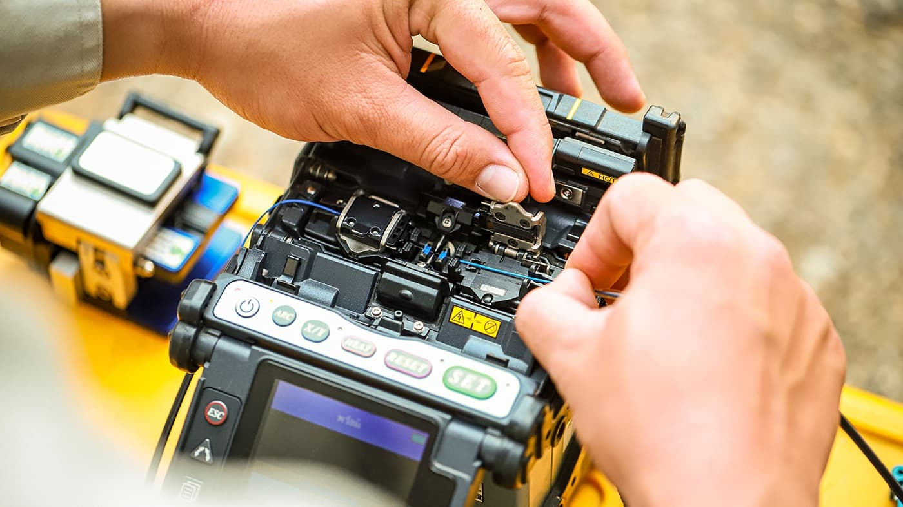
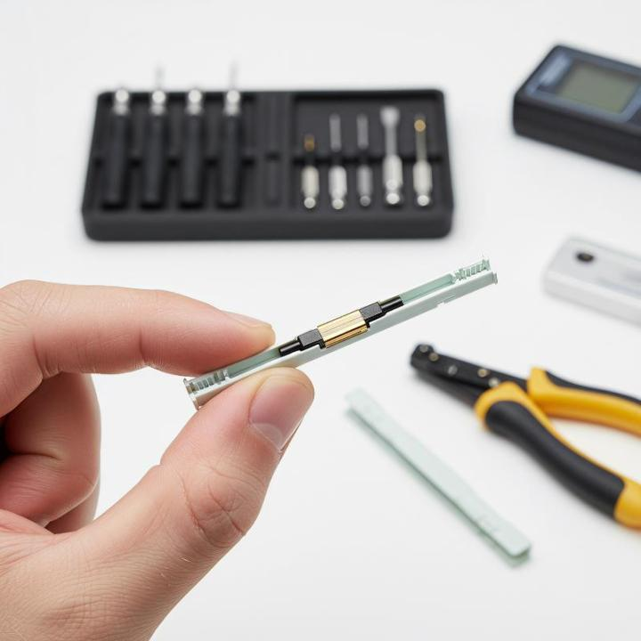
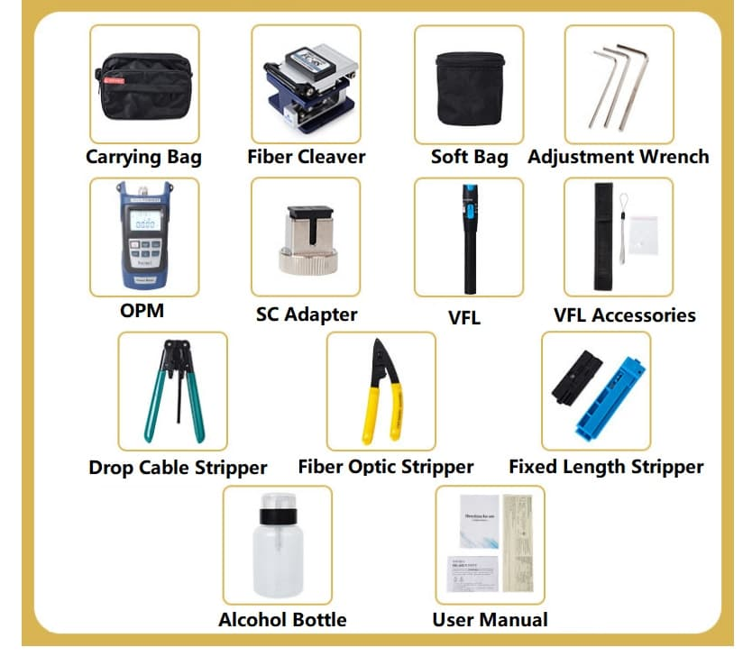

# Fiber Splicing

**Fiber Splicing** ဆိုသည်မှာ Optical Fiber နှစ်ချောင်းကို တစ်ဆက်တည်းဖြစ်အောင် ချိတ်ဆက်ပေးသည့် လုပ်ငန်းစဉ်ဖြစ်သည်။ Fiber Cable တစ်ချောင်း၏ အရှည်မလုံလောက်သောအခါ၊ Cable ပျက်စီးမှုကို ပြုပြင်သည့်အခါ သို့မဟုတ် Network တစ်ခုကို တိုးချဲ့တည်ဆောက်သည့်အခါ Fiber Splicing ကို အသုံးပြုရသည်။

Splicing ၏ အဓိကရည်ရွယ်ချက်မှာ Fiber နှစ်ချောင်းအကြား **Optical Signal** ဖြတ်သန်းရာတွင် ဆုံးရှုံးမှုနည်းပြီး ယုံကြည်စိတ်ချရသော Connection တစ်ခု ရရှိစေရန် ဖြစ်သည်။

## Fiber Splicing ဘာကြောင့် လိုအပ်သလဲ?

Optical Fiber သည် အလွန်ပါးလွှာပြီး တစ်ချောင်းတည်းဖြင့် Network တစ်ခုလုံးကို တည်ဆောက်ရန် မဖြစ်နိုင်ပါ။ လိုအပ်သော Cable Length နှင့် Network Layout အရ Fiber Cable များကို တစ်ဆက်ပြီးတစ်ဆက် ချိတ်ဆက်ရနိုင်သည်။

Fiber Splicing ကို အောက်ပါအခြေအနေများတွင် အသုံးများသည်။

* Fiber Cable အသစ်များကို ဆက်သွယ်ရာတွင်
* ပျက်စီးသွားသော Fiber ကို ပြုပြင်ရာတွင်
* Long-Distance Fiber Link များ တည်ဆောက်ရာတွင်
* FTTH Network တည်ဆောက်ရာတွင်
* Fiber Distribution နှင့် Closure အတွင်း Fiber များ ချိတ်ဆက်ရာတွင်
* Network Expansion ပြုလုပ်ရာတွင်

Splicing Connection ကောင်းမွန်မှုသည် Network ၏ **Optical Loss** နှင့် Link Performance အပေါ် သက်ရောက်မှုရှိနိုင်သည်။

## Fiber Splicing ဘယ်လိုအလုပ်လုပ်သလဲ?

Fiber Splicing ပြုလုပ်ရာတွင် Fiber နှစ်ချောင်း၏ အဆုံးပိုင်းများကို သန့်ရှင်းစွာ ပြင်ဆင်ပြီး Core များကို တိကျစွာ ချိန်ညှိကာ ချိတ်ဆက်ပေးရသည်။

အခြေခံလုပ်ငန်းစဉ်ကို အောက်ပါအတိုင်း နားလည်နိုင်သည်။

1. Fiber Cable မှ လိုအပ်သော Fiber ကို ခွဲထုတ်သည်။
2. Fiber အဆုံးရှိ Protective Coating ကို သတ်မှတ်ထားသောအတိုင်း ဖယ်ရှားသည်။
3. Bare Fiber ကို သင့်လျော်သော Cleaning Method ဖြင့် သန့်ရှင်းပေးသည်။
4. **Fiber Cleaver** ဖြင့် Fiber အဆုံးကို တိကျပြီး ပြောင်ပြောင်ရှင်းရှင်း ဖြစ်အောင် ဖြတ်တောက်သည်။
5. Fiber နှစ်ချောင်းကို Splicing Method အလိုက် ချိန်ညှိပြီး ချိတ်ဆက်သည်။
6. Splice Point ကို **Splice Protection Sleeve** ဖြင့် ကာကွယ်သည်။
7. Spliced Fiber ကို သတ်မှတ်ထားသော Fiber Tray သို့မဟုတ် Closure အတွင်း စနစ်တကျ သိမ်းဆည်းသည်။
8. လိုအပ်ပါက **Optical Loss** ကို စမ်းသပ်စစ်ဆေးသည်။

Fiber Splicing တွင် Fiber End Face ၏ အခြေအနေ၊ Alignment နှင့် သန့်ရှင်းမှုတို့သည် Connection Quality အတွက် အရေးကြီးသည်။

## Fusion Splicing

**Fusion Splicing** သည် Optical Fiber နှစ်ချောင်းကို အပူစွမ်းအင်အသုံးပြု၍ အမြဲတမ်း ချိတ်ဆက်ပေးသော Splicing Method ဖြစ်သည်။

Fusion Splicer စက်သည် Fiber နှစ်ချောင်း၏ အဆုံးပိုင်းများကို တိကျစွာ ချိန်ညှိပြီး ထိန်းချုပ်ထားသော Electric Arc ဖြင့် Fiber များကို ပေါင်းစပ်ပေးသည်။

*Fusion Splicing ဖြင့် Optical Fiber နှစ်ချောင်းကို ပေါင်းစပ်ချိတ်ဆက်ခြင်း*

Fusion Splicing ၏ အခြေခံလုပ်ငန်းစဉ်မှာ -

1. Fiber Coating ကို သတ်မှတ်ထားသောအရှည်အတိုင်း ဖယ်ရှားသည်။
2. Fiber ကို သန့်ရှင်းပေးသည်။
3. Fiber Cleaver ဖြင့် Fiber End ကို တိကျစွာ ဖြတ်သည်။
4. Fiber နှစ်ချောင်းကို Fusion Splicer အတွင်း ထည့်သွင်းသည်။
5. စက်က Fiber များ၏ Alignment ကို စစ်ဆေးပြီး ချိန်ညှိသည်။
6. Electric Arc ဖြင့် Fiber နှစ်ချောင်းကို ပေါင်းစပ်သည်။
7. Splice Result နှင့် Estimated Loss ကို စက်မှ စစ်ဆေးနိုင်သည်။
8. Splice Point ကို Protection Sleeve ဖြင့် ကာကွယ်သည်။

Fusion Splicing သည် ပုံမှန်အားဖြင့် **Low Splice Loss** နှင့် တည်ငြိမ်သော Connection ရရှိရန် ရည်ရွယ်သည့် Fiber Network များတွင် အသုံးများသည်။

## Mechanical Splicing

**Mechanical Splicing** သည် Fiber နှစ်ချောင်းကို အပူဖြင့် မပေါင်းစပ်ဘဲ Mechanical Splice Unit တစ်ခုအတွင်းတွင် Fiber End များကို တိကျစွာ ချိန်ညှိထားပြီး ချိတ်ဆက်ပေးသော နည်းလမ်းဖြစ်သည်။

*Mechanical Splicing ဖြင့် Fiber နှစ်ချောင်းကို Mechanical Splice Unit အတွင်း ချိတ်ဆက်ခြင်း*

Mechanical Splicing ၏ အခြေခံလုပ်ငန်းစဉ်မှာ -

1. Fiber Coating ကို ဖယ်ရှားသည်။
2. Fiber ကို သန့်ရှင်းပေးသည်။
3. Fiber Cleaver ဖြင့် Fiber End များကို တိကျစွာ ဖြတ်သည်။
4. Fiber နှစ်ချောင်းကို Mechanical Splice Unit အတွင်း ထည့်သွင်းသည်။
5. Fiber End များကို Alignment ပြုလုပ်သည်။
6. Splice Unit ၏ Mechanical Structure ဖြင့် Fiber များကို နေရာတကျ ထိန်းထားသည်။
7. Connection ကို သတ်မှတ်ထားသော Protection Method ဖြင့် ကာကွယ်သည်။

Mechanical Splicing သည် Fusion Splicer မလိုအပ်သောကြောင့် အချို့သော Repair နှင့် Installation အခြေအနေများတွင် အသုံးဝင်နိုင်သည်။

## Fusion Splicing နှင့် Mechanical Splicing

Splicing Method နှစ်မျိုးစလုံးသည် Optical Fiber နှစ်ချောင်းကို ချိတ်ဆက်ရန် အသုံးပြုနိုင်သော်လည်း ချိတ်ဆက်ပုံမှာ မတူညီပါ။

| အချက် | Fusion Splicing | Mechanical Splicing |
|---|---|---|
| ချိတ်ဆက်ပုံ | Fiber ကို အပူဖြင့် ပေါင်းစပ်သည် | Mechanical Unit ဖြင့် ချိန်ညှိထားသည် |
| အဓိကအသုံးပြုသည့် Equipment | Fusion Splicer | Mechanical Splice Unit |
| Connection | Permanent Splice | Mechanical Alignment ဖြင့် ချိတ်ဆက်ထားခြင်း |
| အသုံးပြုမှု | Fiber Network Installation နှင့် Long-Term Links | Repair နှင့် အချို့သော Installation များ |
| Splice Quality | သင့်လျော်စွာ ပြုလုပ်ပါက Low-Loss Connection ရရှိနိုင်သည် | Alignment နှင့် Splice Quality အပေါ် မူတည်သည် |

## Fiber Splicing အတွက် အသုံးများသော Tools

Fiber Splicing ပြုလုပ်ရာတွင် Splicing Method အလိုက် Tools နှင့် Equipment များကို အသုံးပြုရသည်။

*Splicing ပြုလုပ်ရာမှာ အသုံးများသော Tools များ*

အခြေခံ Fiber Preparation နှင့် Splicing အတွက် အသုံးများသောပစ္စည်းများမှာ -

* **Fiber Stripper** — Fiber Coating ကို ဖယ်ရှားရန် အသုံးပြုသည်။
* **Fiber Cleaver** — Fiber End ကို တိကျစွာ ဖြတ်တောက်ရန် အသုံးပြုသည်။
* **Fiber Cleaning Tools** — Fiber End ကို သန့်ရှင်းရန် အသုံးပြုသည်။
* **Fusion Splicer** — Fusion Splicing ပြုလုပ်ရန် အသုံးပြုသည်။
* **Splice Protection Sleeve** — Splice Point ကို Mechanical Protection ပေးရန် အသုံးပြုသည်။
* **Fiber Splice Tray** — Spliced Fiber များကို စနစ်တကျ သိမ်းဆည်းရန် အသုံးပြုသည်။
* **Optical Power Meter** နှင့် **Light Source** — Fiber Link ၏ Optical Power နှင့် Loss ကို စမ်းသပ်ရာတွင် အသုံးပြုနိုင်သည်။

## Splicing Quality ကို ဘာတွေက သက်ရောက်စေသလဲ?

Fiber Splice တစ်ခု၏ Quality သည် Splicing Method တစ်ခုတည်းပေါ်တွင် မူတည်ခြင်းမဟုတ်ပါ။ Fiber Preparation နှင့် လုပ်ငန်းစဉ်အတွင်းရှိ အချက်များစွာက Connection Quality ကို သက်ရောက်စေသည်။

အရေးကြီးသောအချက်များမှာ -

* Fiber End Face သန့်ရှင်းမှု
* Cleave Quality
* Fiber Alignment
* Fiber အမျိုးအစားနှင့် သက်ဆိုင်ရာ Compatibility
* Splicing Equipment ၏ မှန်ကန်သော Setup
* Splice Point ၏ Protection
* Cable နှင့် Fiber ကို စနစ်တကျ စီမံထားခြင်း

Fiber End တွင် ဖုန်မှုန့် သို့မဟုတ် အညစ်အကြေးများ ရှိနေခြင်းသည် Splicing Quality ကို ထိခိုက်စေနိုင်သည်။ ထို့ကြောင့် Fiber Preparation နှင့် Cleaning ကို အလေးထားရန် လိုအပ်သည်။

## Fiber Splicing ပြီးနောက် စမ်းသပ်ခြင်း

Splicing ပြီးသွားသည်နှင့် Connection ကောင်းမွန်သည်ဟု ချက်ချင်းသတ်မှတ်မထားသင့်ပါ။ Network Requirement အရ Splice သို့မဟုတ် Fiber Link ကို စမ်းသပ်စစ်ဆေးနိုင်သည်။

**Optical Power Meter** နှင့် **Light Source** ကို အသုံးပြု၍ Optical Power နှင့် Loss ကို စစ်ဆေးနိုင်သည်။ ပိုမိုအသေးစိတ်သော Fiber Link Analysis လိုအပ်ပါက **OTDR (Optical Time-Domain Reflectometer)** ကို အသုံးပြု၍ Fiber Link အတွင်းရှိ Splice, Connector, Loss နှင့် အခြား Event များကို စစ်ဆေးနိုင်သည်။

စမ်းသပ်ခြင်း၏ ရည်ရွယ်ချက်မှာ Fiber Link သည် သတ်မှတ်ထားသော Network Requirement နှင့် ကိုက်ညီမှုရှိ၊ မရှိ သိရှိရန် ဖြစ်သည်။

## Practical Example

ဥပမာအားဖြင့် FTTH Network တစ်ခုတွင် Main Fiber Cable မှ Customer တစ်ဦး၏ အိမ်ဘက်သို့ Fiber Connection တည်ဆောက်ရန် လိုအပ်သည်ဟု ယူဆပါစို့။

Cable Route အတိုင်း Fiber Cable များကို တပ်ဆင်ပြီးနောက် Fiber နှစ်ချောင်းကို တစ်ဆက်တည်း ချိတ်ဆက်ရန် လိုအပ်လာနိုင်သည်။ ထိုအချိန်တွင် Fiber အဆုံးများကို သေချာပြင်ဆင်ပြီး သင့်လျော်သော Splicing Method ဖြင့် ချိတ်ဆက်ပေးရသည်။

Splice ပြီးနောက် Splice Point ကို Protection ပေးပြီး Fiber ကို Splice Tray သို့မဟုတ် Closure အတွင်း စနစ်တကျ ထည့်သွင်းထားသည်။ ထို့နောက် လိုအပ်သည့်အတိုင်း Optical Test ပြုလုပ်ခြင်းဖြင့် Link ၏ အခြေအနေကို စစ်ဆေးနိုင်သည်။

## အနှစ်ချုပ်

**Fiber Splicing** သည် Optical Fiber နှစ်ချောင်းကို Optical Signal ကောင်းမွန်စွာ ဖြတ်သန်းနိုင်စေရန် ချိတ်ဆက်ပေးသော အရေးကြီးသည့် Fiber Optic Installation လုပ်ငန်းစဉ်တစ်ခု ဖြစ်သည်။

အဓိက Splicing Method နှစ်မျိုးမှာ **Fusion Splicing** နှင့် **Mechanical Splicing** ဖြစ်ပြီး Fusion Splicing တွင် Fiber များကို အပူစွမ်းအင်ဖြင့် ပေါင်းစပ်သော်လည်း Mechanical Splicing တွင် Mechanical Splice Unit ဖြင့် Fiber End များကို Alignment ပြုလုပ်၍ ချိတ်ဆက်သည်။

ကောင်းမွန်သော Fiber Splice ရရှိရန် Fiber Cleaning, Cleaving, Alignment, Splicing နှင့် Protection အဆင့်များကို သေချာစွာ လုပ်ဆောင်ရန်လိုအပ်ပြီး လိုအပ်သည့်အခါ Optical Testing ဖြင့် Connection Quality ကို စစ်ဆေးသင့်သည်။