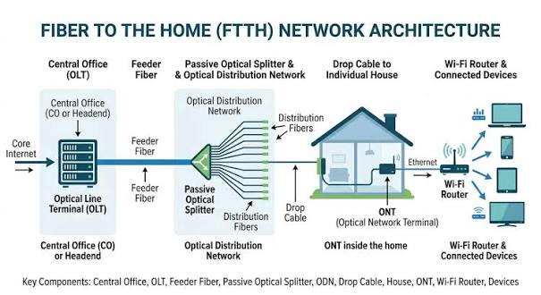

# FTTH

## FTTH ဆိုတာဘာလဲ

**FTTH (Fiber To The Home)** ဆိုသည်မှာ Internet သို့မဟုတ် အခြား Communication Service များကို သုံးစွဲသူ၏ အိမ်အတွင်းအထိ **Fiber Optic Cable** ဖြင့် တိုက်ရိုက်ပို့ဆောင်ပေးသည့် Access Network နည်းပညာတစ်ခုဖြစ်သည်။

FTTH တွင် Customer နေရာအထိ Copper Cable ကို အဓိကအသုံးပြုခြင်းမဟုတ်ဘဲ **Optical Fiber** ကို အသုံးပြုထားသောကြောင့် Data ကို အလင်းအချက်ပြအဖြစ် အကွာအဝေးရှည်ရှည် ပို့ဆောင်နိုင်သည်။

FTTH Network ကို အများအားဖြင့် ISP ဘက်ရှိ **OLT** မှစတင်ပြီး Distribution Fiber Network မှတစ်ဆင့် Customer အိမ်ရှိ **ONT/ONU** အထိ ချိတ်ဆက်ထားသည်။

## FTTH Network ဖွဲ့စည်းပုံ

FTTH Network တစ်ခုတွင် အဓိကအားဖြင့် အောက်ပါ Components များ ပါဝင်သည်။

* **OLT (Optical Line Terminal)** — ISP ဘက်ရှိ Central Office သို့မဟုတ် Headend တွင်ရှိပြီး FTTH Subscriber များထံ Optical Signal ပေးပို့ခြင်းနှင့် လက်ခံခြင်းကို ပြုလုပ်သည်။
* **ODN (Optical Distribution Network)** — OLT နှင့် Customer နေရာကြားရှိ Passive Fiber Network ဖြစ်သည်။
* **Optical Splitter** — Optical Signal တစ်ခုကို Customer များစွာထံ ဖြန့်ဝေပေးနိုင်ရန် Signal ကို ခွဲပေးသည်။
* **Fiber Distribution Cable** — OLT ဘက်မှ Customer ဘက်သို့ Fiber Connection ကို ဖြန့်ဖြူးပေးသည်။
* **ONT/ONU** — Customer အိမ်တွင် Optical Signal ကို Ethernet စသည့် အသုံးပြုနိုင်သော Interface များအဖြစ် ပြောင်းလဲပေးသည်။

*FTTH Network တွင် OLT မှ Customer အိမ်ရှိ ONT/ONU အထိ Fiber Connection ဖြန့်ဝေထားပုံ*

## FTTH အလုပ်လုပ်ပုံ

FTTH Network တွင် Data သည် ISP Network မှ Customer အိမ်အထိ Optical Fiber လမ်းကြောင်းအတိုင်း သွားလာသည်။

အခြေခံလုပ်ဆောင်ပုံမှာ -

1. ISP Network မှ Internet Data ကို **OLT** သို့ ပေးပို့သည်။
2. OLT သည် Data ကို Optical Signal အဖြစ် ပြောင်းလဲပြီး Fiber Network ထဲသို့ ပေးပို့သည်။
3. Optical Signal သည် **ODN** အတွင်းရှိ Fiber Cable များမှတစ်ဆင့် ဖြတ်သန်းသွားသည်။
4. **Optical Splitter** ရှိပါက Signal ကို သတ်မှတ်ထားသော Split Ratio အတိုင်း Customer များစွာထံ ဖြန့်ဝေပေးသည်။
5. Customer အိမ်ရှိ **ONT/ONU** သည် Optical Signal ကို လက်ခံပြီး Ethernet Interface သို့မဟုတ် Wi-Fi Router အသုံးပြုနိုင်သော Network Connection အဖြစ် ပြောင်းလဲပေးသည်။
6. Customer Device များသည် ထို Connection မှတစ်ဆင့် Internet ကို အသုံးပြုနိုင်သည်။

## OLT နှင့် ONT/ONU

FTTH Network ၏ အစွန်းနှစ်ဖက်တွင် **OLT** နှင့် **ONT/ONU** တို့သည် အရေးကြီးသော Network Equipment များဖြစ်သည်။

**OLT** သည် ISP ဘက်တွင်ရှိပြီး Subscriber များကို Access Network မှတစ်ဆင့် Service ပေးနိုင်ရန် Network ကို ထိန်းချုပ်ပေးသည်။

**ONT (Optical Network Terminal)** သို့မဟုတ် **ONU (Optical Network Unit)** သည် Customer ဘက်တွင်ရှိပြီး Optical Fiber မှရရှိသော Signal ကို Customer Network တွင် အသုံးပြုနိုင်သော Interface များအဖြစ် ပြောင်းလဲပေးသည်။

ဥပမာအားဖြင့် ONT တွင် Ethernet Port ပါရှိပါက Ethernet Cable ဖြင့် Wi-Fi Router သို့မဟုတ် Computer ကို ချိတ်ဆက်နိုင်သည်။

## Passive Optical Network

FTTH Deployment များတွင် **PON (Passive Optical Network)** Architecture ကို အများဆုံးတွေ့ရသည်။

PON တွင် OLT နှင့် Customer ONT/ONU များကြား Network လမ်းကြောင်း၌ လျှပ်စစ်အားသုံး Active Equipment များကို Distribution အဆင့်တွင် မလိုအပ်ဘဲ **Passive Optical Splitter** နှင့် Fiber Cable များကို အသုံးပြုနိုင်သည်။

PON Architecture ၏ အခြေခံလမ်းကြောင်းကို -

**OLT → Feeder Fiber → Optical Splitter → Distribution/Drop Fiber → ONT/ONU**

ဟု နားလည်နိုင်သည်။

## FTTH တွင် Fiber Cable လမ်းကြောင်း

FTTH Network ကို Customer အိမ်အထိ တည်ဆောက်ရာတွင် Fiber Cable လမ်းကြောင်းကို အဆင့်အလိုက် ခွဲခြားနိုင်သည်။

* **Feeder Fiber** — Central Office သို့မဟုတ် OLT ဘက်မှ Distribution Network အထိ ချိတ်ဆက်ပေးသည်။
* **Distribution Fiber** — Network အတွင်းရှိ Distribution Point များမှ Customer ဘက်သို့ Fiber ကို ဖြန့်ဝေပေးသည်။
* **Drop Fiber** — Customer ၏ အိမ် သို့မဟုတ် Premises အထိ နောက်ဆုံးချိတ်ဆက်ပေးသည့် Fiber Cable ဖြစ်သည်။

ထို Fiber လမ်းကြောင်းတစ်လျှောက်တွင် Connector, Splice, Splitter နှင့် Closure များကဲ့သို့သော Network Components များ ပါဝင်နိုင်သည်။

## FTTH တွင် သတိပြုရမည့် အချက်များ

FTTH Network ၏ Performance နှင့် Reliability ကို ထိန်းသိမ်းရန် Fiber Link တစ်ခုလုံး၏ Optical Condition ကို ဂရုစိုက်ရသည်။

အထူးသဖြင့် -

* Fiber Cable ကို သတ်မှတ်ထားသော **Bend Radius** ထက် ပိုမိုကွေးခြင်း မပြုလုပ်သင့်ပါ။
* Connector များ၏ End Face ကို သန့်ရှင်းစွာ ထိန်းသိမ်းရမည်။
* Splicing အရည်အသွေးကောင်းမွန်ရန် လိုအပ်သည်။
* Fiber Link တစ်လျှောက်ရှိ **Optical Loss** ကို သတ်မှတ်ထားသော Budget အတွင်း ရှိမရှိ စစ်ဆေးရမည်။
* Fault ဖြစ်ပေါ်ပါက **Optical Power Meter** သို့မဟုတ် **OTDR** ကဲ့သို့သော Testing Equipment များကို အသုံးပြု၍ Fiber Link ကို စစ်ဆေးနိုင်သည်။

## FTTH ၏ အားသာချက်များ

FTTH သည် Customer Premises အထိ Fiber Optic ကို အသုံးပြုထားသောကြောင့် Broadband Access Network အတွက် အားသာချက်များစွာ ရှိသည်။

* High Bandwidth ကို ထောက်ပံ့နိုင်သည်။
* အကွာအဝေးရှည်သော Fiber Link များအတွက် သင့်လျော်သည်။
* Copper Cable နှင့် နှိုင်းယှဉ်ပါက Electromagnetic Interference ၏ သက်ရောက်မှုကို ခံရမှုနည်းသည်။
* Network Capacity ကို လိုအပ်ချက်အရ တိုးမြှင့်နိုင်ရန် Fiber Infrastructure ကို အသုံးချနိုင်သည်။
* Internet, Voice နှင့် Video ကဲ့သို့သော Service များကို တစ်ခုတည်းသော Access Network မှတစ်ဆင့် ပေးနိုင်သည်။

## FTTH ကို ဘယ်နေရာတွေမှာ အသုံးပြုသလဲ

FTTH ကို Residential Internet Service အတွက် အဓိကအသုံးပြုသော်လည်း အခြား Customer Premises များတွင်လည်း အသုံးပြုနိုင်သည်။

ဥပမာ -

* အိမ်ရာများနှင့် Residential Buildings
* Apartment နှင့် Condominium များ
* Small Office နှင့် Home Office
* အခြား Broadband Customer Premises များ

FTTH Network တည်ဆောက်ပုံသည် Service Provider ၏ Network Architecture, Subscriber Density, Split Ratio, Fiber Route နှင့် သတ်မှတ်ထားသော Optical Budget တို့အပေါ် မူတည်၍ ကွဲပြားနိုင်သည်။

## အနှစ်ချုပ်

**FTTH (Fiber To The Home)** သည် Fiber Optic ကို Customer ၏ အိမ်အတွင်းအထိ တိုက်ရိုက်အသုံးပြုသည့် Broadband Access Network နည်းပညာဖြစ်သည်။

၎င်း၏ အခြေခံ Network လမ်းကြောင်းမှာ **OLT → ODN → Optical Splitter → Fiber Distribution → ONT/ONU** ဟူ၍ နားလည်နိုင်သည်။ OLT သည် ISP ဘက်မှ Network Access ကို ပံ့ပိုးပေးပြီး ONT/ONU သည် Customer ဘက်တွင် Optical Signal ကို အသုံးပြုနိုင်သော Network Connection အဖြစ် ပြောင်းလဲပေးသည်။

FTTH ၏ အဓိကအခြေခံကို နားလည်ရန် **OLT, ODN, Optical Splitter, Fiber Cable နှင့် ONT/ONU** တို့၏ တာဝန်များနှင့် ၎င်းတို့ကြားရှိ Fiber Connection လမ်းကြောင်းကို နားလည်ထားရန် အရေးကြီးသည်။