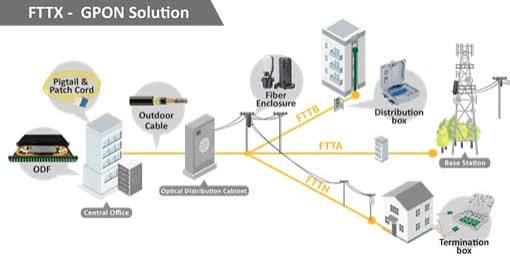

# FTTx

**FTTx (Fiber To The x)** ဆိုသည်မှာ Fiber Optic Network ကို အသုံးပြု၍ Service Provider Network မှ User သို့မဟုတ် သတ်မှတ်ထားသော Network Point တစ်ခုအထိ ဆက်သွယ်ပေးသည့် **Fiber Access Network Architecture** များကို စုပေါင်းခေါ်ဆိုသော အမည်ဖြစ်သည်။

FTTx တွင် `x` သည် Fiber Optic ကြိုး၏ အဆုံးသတ်နေရာကို ကိုယ်စားပြုသည်။ ထို့ကြောင့် FTTH, FTTB, FTTC နှင့် FTTN ကဲ့သို့သော နည်းလမ်းများသည် Fiber ကို ဘယ်နေရာအထိ ဆွဲသွားထားသည်ဆိုသည့်အချက်ပေါ်တွင် ကွာခြားသည်။

## FTTx ဆိုတာဘာလဲ

FTTx ၏ အဓိကအယူအဆမှာ Access Network အတွင်းရှိ Copper Cable သို့မဟုတ် အခြား Transmission Medium များ၏ အစား **Fiber Optic** ကို User ဘက်သို့ ပိုမိုနီးကပ်စွာ အသုံးပြုခြင်းဖြစ်သည်။

Network တစ်ခုတွင် Fiber သည် Service Provider ဘက်မှ စတင်ပြီး User အနီးရှိ သတ်မှတ်ထားသော Point တစ်ခုအထိ ရောက်ရှိနိုင်သည်။ ထို Point သည် Home, Building, Curb သို့မဟုတ် Neighborhood အစရှိသဖြင့် Architecture အလိုက် ကွာခြားနိုင်သည်။

FTTx Architecture တစ်ခုတွင် ပုံမှန်အားဖြင့် အောက်ပါအဆင့်များ ပါဝင်နိုင်သည်။

* Service Provider / Central Office
* Optical Line Terminal (OLT)
* Fiber Distribution Network
* Splitter နှင့် Distribution Point များ
* Customer Premises Equipment
* User Device များ

## FTTx Network အလုပ်လုပ်ပုံ

FTTx Network ၏ အခြေခံလုပ်ဆောင်ပုံမှာ Service Provider ဘက်မှ ပေးပို့သည့် Data ကို Optical Signal အဖြစ် Fiber Optic Network မှတစ်ဆင့် User ဘက်သို့ ပို့ဆောင်ခြင်းဖြစ်သည်။

*FTTx Network Architecture*

ပုံမှန် Fiber Access Network တစ်ခုတွင် လုပ်ဆောင်ပုံကို အကြမ်းဖျင်းအားဖြင့် -

1. **OLT** သည် Service Provider Network မှ Data ကို Access Network ဘက်သို့ ပေးပို့သည်။
2. Fiber Distribution Network မှတစ်ဆင့် Optical Signal သည် User ဘက်သို့ ဆက်လက်သွားသည်။
3. PON Architecture အသုံးပြုထားပါက **Optical Splitter** မှ Optical Signal ကို Customer များအတွက် ခွဲဝေပေးနိုင်သည်။
4. Fiber သည် FTTx Architecture သတ်မှတ်ထားသည့် အဆုံးသတ်နေရာအထိ ရောက်ရှိသည်။
5. လိုအပ်ပါက ONT/ONU သို့မဟုတ် အခြား Network Equipment များမှ Optical Signal ကို User Equipment အသုံးပြုနိုင်သည့် Network Interface အဖြစ် ပြောင်းလဲပေးသည်။

## FTTx အမျိုးအစားများ

FTTx တွင် `x` နေရာ၌ အသုံးပြုထားသော စာလုံးသည် Fiber ၏ အဆုံးသတ်နေရာကို ဖော်ပြသည်။ အသုံးများသော Architecture များမှာ **FTTH, FTTB, FTTC နှင့် FTTN** တို့ဖြစ်သည်။

### FTTH — Fiber To The Home

**FTTH (Fiber To The Home)** သည် Fiber Optic ကို User ၏ Home အထိ တိုက်ရိုက်ရောက်ရှိစေသော Architecture ဖြစ်သည်။

Home အတွင်းတွင် ONT/ONU ကဲ့သို့သော Equipment ကို အသုံးပြုပြီး Network Service ကို Router သို့မဟုတ် အခြား User Equipment များထံ ဆက်လက်ဖြန့်ဝေနိုင်သည်။

FTTH တွင် Fiber သည် User Premises အထိ ရောက်ရှိသောကြောင့် Access Network ၏ နောက်ဆုံးပိုင်းတွင် Fiber ကို အပြည့်အဝ အသုံးပြုထားသည့် Architecture ဖြစ်သည်။

### FTTB — Fiber To The Building

**FTTB (Fiber To The Building)** တွင် Fiber သည် Residential Building သို့မဟုတ် Commercial Building အထိ ရောက်ရှိသည်။

Building အတွင်းတွင် Network Equipment တစ်ခုမှတစ်ဆင့် Individual Users များထံသို့ Ethernet သို့မဟုတ် အခြား Access Medium ဖြင့် ဆက်လက်ချိတ်ဆက်နိုင်သည်။

ထို့ကြောင့် FTTB တွင် Fiber သည် Building အထိ ရောက်သော်လည်း User တစ်ဦးချင်းစီ၏ Premises အတွင်းအထိ Fiber ရောက်ရှိရန် မလိုအပ်နိုင်ပါ။

### FTTC — Fiber To The Curb

**FTTC (Fiber To The Curb)** တွင် Fiber သည် User များအနီးရှိ Curb သို့မဟုတ် Distribution Point အထိ ရောက်ရှိသည်။

ထိုနေရာမှ User Premises အထိ နောက်ဆုံးအပိုင်းကို Copper သို့မဟုတ် အခြား Access Medium ဖြင့် ဆက်သွယ်နိုင်သည်။

Fiber သည် User အနီးအထိ ရောက်ရှိထားသော်လည်း Home အတွင်းအထိ တိုက်ရိုက်မရောက်သောကြောင့် FTTH နှင့် Architecture ကွာခြားသည်။

### FTTN — Fiber To The Node

**FTTN (Fiber To The Node)** တွင် Fiber သည် User များကို ဝန်ဆောင်မှုပေးသည့် Network Node တစ်ခုအထိ ရောက်ရှိသည်။

Node မှ User Premises အထိ နောက်ဆုံးအပိုင်းကို Copper သို့မဟုတ် အခြား Access Technology ဖြင့် ဆက်သွယ်နိုင်သည်။

Fiber Termination Point သည် User ထံမှ ပိုမိုဝေးသောနေရာတွင် ရှိနိုင်သောကြောင့် FTTH ထက် Last-Mile Segment ၏ Fiber အသုံးပြုမှု နည်းပါးသည်။

## FTTx အမျိုးအစားများ၏ ကွာခြားချက်

| Architecture | Fiber ရောက်ရှိသည့်နေရာ | နောက်ဆုံးပိုင်း |
|---|---|---|
| **FTTH** | Home | Fiber |
| **FTTB** | Building | Building အတွင်းမှ အခြား Medium ဖြင့် ဆက်နိုင် |
| **FTTC** | Curb / အနီးရှိ Distribution Point | Copper သို့မဟုတ် အခြား Medium |
| **FTTN** | Network Node | Copper သို့မဟုတ် အခြား Medium |

ဤကွာခြားချက်၏ အဓိကအချက်မှာ Fiber ကို User နှင့် မည်မျှနီးကပ်အောင် တည်ဆောက်ထားသလဲဆိုသည်ဖြစ်သည်။

## FTTx နှင့် PON

FTTx သည် Fiber Access Network Architecture ကို ဖော်ပြသည့် အကျယ်ပြန့်သော Term ဖြစ်ပြီး **PON (Passive Optical Network)** သည် ထို Fiber Access Network ကို တည်ဆောက်ရာတွင် အသုံးပြုနိုင်သည့် Network Architecture တစ်မျိုးဖြစ်သည်။

PON Network တွင် OLT မှ ထွက်လာသော Fiber ကို Passive Optical Splitter များဖြင့် Customer များထံ ခွဲဝေပေးနိုင်သည်။

ဥပမာအားဖြင့် FTTH Network တစ်ခုကို GPON သို့မဟုတ် XGS-PON ကဲ့သို့သော PON Technology ဖြင့် တည်ဆောက်နိုင်သည်။ ထို့ကြောင့် **FTTH နှင့် GPON/XGS-PON သည် အဓိပ္ပာယ်တူသော Term မဟုတ်ပါ**။ FTTH သည် Fiber ၏ အဆုံးသတ်နေရာကို ဖော်ပြပြီး PON Technology သည် Network တည်ဆောက်ပုံနှင့် Transmission Architecture ကို ဖော်ပြသည်။

## FTTx ရွေးချယ်ရာတွင် စဉ်းစားရမည့်အချက်များ

FTTx Architecture တစ်ခုကို တည်ဆောက်ရာတွင် Fiber ကို User အထိ မည်မျှနီးကပ်အောင် ဆွဲသွားမည်ဆိုသည်အပြင် Network Design နှင့် Deployment Requirement များကိုလည်း စဉ်းစားရသည်။

အဓိကစဉ်းစားရမည့်အချက်များမှာ -

* Coverage Area နှင့် User Density
* လက်ရှိရှိပြီးသား Cable Infrastructure
* Fiber Deployment Cost
* Civil Work နှင့် Installation Requirement
* Required Bandwidth
* Distance နှင့် Optical Budget
* Network Equipment နှင့် Maintenance
* Future Network Expansion

Fiber ကို User အထိ ပိုမိုနီးကပ်စွာ တည်ဆောက်ထားလေလေ Access Network ၏ Fiber Coverage ပိုမိုများပြားလာမည်ဖြစ်ပြီး Network Design နှင့် Deployment Requirement များလည်း ပြောင်းလဲလာနိုင်သည်။

## Practical Example

ဥပမာအားဖြင့် Apartment Building တစ်ခုတွင် Service Provider သည် Building အထိ Fiber ကို ဆွဲသွားပြီး Building အတွင်းရှိ User များထံ Network Equipment မှတစ်ဆင့် Service ဖြန့်ဝေမည်ဆိုပါက **FTTB** Architecture ဖြစ်နိုင်သည်။

အကယ်၍ Fiber ကို User တစ်ဦးချင်းစီ၏ Home အတွင်းရှိ ONT/ONU အထိ တိုက်ရိုက်ဆွဲသွားပါက **FTTH** ဖြစ်သည်။

ထို့ကြောင့် FTTx အမျိုးအစားကို ခွဲခြားရာတွင် အဓိကမေးခွန်းမှာ **“Fiber သည် ဘယ်နေရာအထိ ရောက်ရှိသလဲ?”** ဆိုသည့်အချက်ဖြစ်သည်။

## FTTx ၏ အရေးပါမှု

Modern Broadband Network များတွင် Data Traffic နှင့် Bandwidth Requirement များ တိုးလာခြင်းကြောင့် Fiber Optic သည် Access Network များတွင် အရေးပါသော Transmission Medium တစ်ခုဖြစ်လာသည်။

FTTx Architecture များသည် Fiber ကို User ဘက်သို့ မည်မျှနီးကပ်စွာ အသုံးပြုမည်ကို Network Design အလိုက် သတ်မှတ်နိုင်စေပြီး Residential, Commercial နှင့် အခြား Broadband Access Deployment များအတွက် မတူညီသော Design Approach များကို အသုံးပြုနိုင်စေသည်။

## အနှစ်ချုပ်

**FTTx (Fiber To The x)** သည် Fiber Optic ကို Service Provider Network မှ User သို့မဟုတ် User အနီးရှိ သတ်မှတ်ထားသော Network Point တစ်ခုအထိ အသုံးပြုသည့် Fiber Access Network Architecture များကို စုပေါင်းခေါ်ဆိုခြင်းဖြစ်သည်။

**FTTH** သည် Home အထိ၊ **FTTB** သည် Building အထိ၊ **FTTC** သည် Curb သို့မဟုတ် User အနီးရှိ Point အထိ၊ **FTTN** သည် Network Node အထိ Fiber ရောက်ရှိသည့် Architecture များဖြစ်သည်။

FTTx ကို နားလည်ရန် အရေးကြီးဆုံးအချက်မှာ `x` က Fiber ၏ **Termination Point** ကို ကိုယ်စားပြုသည်ဆိုခြင်းဖြစ်ပြီး ထို Fiber Termination Point ၏ တည်နေရာပေါ်မူတည်၍ FTTx Architecture အမျိုးအစားများ ကွာခြားသွားခြင်းဖြစ်သည်။