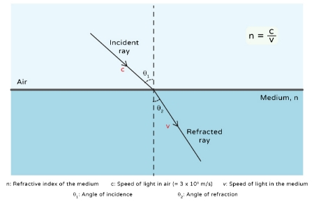
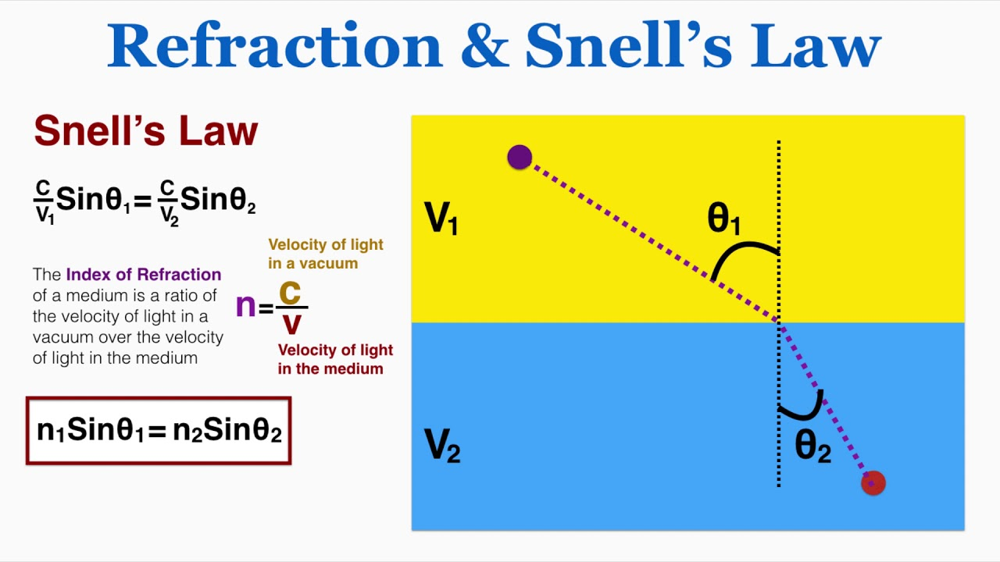
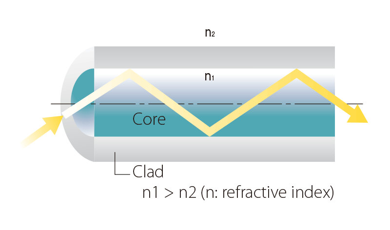

# Index of Refraction (IOR): Understanding Refractive Index in Fiber Optics

Fiber Optic ကို နားလည်ရန် **Light Signal** သည် Fiber အတွင်း ဘာကြောင့် သတ်မှတ်ထားသော လမ်းကြောင်းအတိုင်း သွားနိုင်သလဲဆိုတာ သိထားရန် အရေးကြီးပါတယ်။

ဒီနေရာမှာ အခြေခံကျတဲ့ optical property တစ်ခုကတော့ **Index of Refraction (IOR)** သို့မဟုတ် **Refractive Index** ဖြစ်ပါတယ်။

IOR သည် Light သည် medium တစ်ခုအတွင်း ဖြတ်သန်းသောအခါ ဘယ်လောက်အတိုင်းအတာအထိ အရှိန်ပြောင်းလဲသွားနိုင်သလဲ၊ medium နှစ်ခုကြား boundary ကို ဖြတ်သန်းတဲ့အခါ Light ရဲ့ လမ်းကြောင်း ဘယ်လိုပြောင်းလဲနိုင်သလဲဆိုတာ နားလည်ရန် အသုံးပြုတဲ့ တန်ဖိုးတစ်ခုဖြစ်ပါတယ်။

---

## Index of Refraction (IOR) ဆိုတာဘာလဲ?

**Index of Refraction (IOR)** ကို `n` ဖြင့် ဖော်ပြလေ့ရှိပြီး vacuum ထဲရှိ Light ၏ အရှိန်နှင့် သက်ဆိုင်ရာ medium ထဲရှိ Light ၏ အရှိန်တို့၏ အချိုးအဖြစ် သတ်မှတ်နိုင်ပါတယ်။

Formula ကတော့ -

**n = c / v**

ဖြစ်ပါတယ်။

ဒီမှာ -

* **n** = Index of Refraction
* **c** = Vacuum ထဲရှိ Light ၏ အရှိန်
* **v** = သက်ဆိုင်ရာ medium ထဲရှိ Light ၏ အရှိန်

IOR တန်ဖိုးသည် material တစ်ခုအတွင်း Light ၏ propagation behavior ကို နားလည်ရန် အရေးကြီးပါတယ်။

ဥပမာအားဖြင့် Air ၏ IOR သည် 1 နှင့် အလွန်နီးစပ်ပြီး Glass နှင့် Silica ကဲ့သို့သော optical materials များတွင် IOR သည် 1 ထက် ပိုမြင့်ပါတယ်။

*Medium မတူညီသည့်အခါ Light ၏ propagation နှင့် refractive behavior ကွာခြားနိုင်ပုံ*

---

## IOR နဲ့ Light ဘာကြောင့် ဆက်စပ်သလဲ?

Light သည် medium တစ်ခုမှ အခြား medium တစ်ခုသို့ ဖြတ်သန်းတဲ့အခါ medium နှစ်ခု၏ IOR မတူညီပါက Light ၏ လမ်းကြောင်း ပြောင်းလဲနိုင်ပါတယ်။

ဒီဖြစ်စဉ်ကို **Refraction** လို့ခေါ်ပါတယ်။

ဥပမာ -

**Air → Glass**

ဆိုတဲ့ boundary တစ်ခုကို Light ဖြတ်သန်းတဲ့အခါ Glass ရဲ့ IOR က Air ထက် မြင့်တဲ့အတွက် Light ရဲ့ propagation direction ပြောင်းလဲနိုင်ပါတယ်။

ဒါကြောင့် medium နှစ်ခုရဲ့ IOR ကွာခြားချက်ဟာ Light ရဲ့ propagation behavior ကို သတ်မှတ်ရာမှာ အရေးကြီးတဲ့ factor တစ်ခုဖြစ်ပါတယ်။

---

## Snell's Law

Medium နှစ်ခုကြားမှာ Light ဖြတ်သန်းတဲ့အခါ ဖြစ်ပေါ်တဲ့ Refraction ကို **Snell's Law** ဖြင့် ဖော်ပြနိုင်ပါတယ်။

**n₁ sin θ₁ = n₂ sin θ₂**

ဒီမှာ -

* **n₁** = ပထမ medium ၏ IOR
* **n₂** = ဒုတိယ medium ၏ IOR
* **θ₁** = ပထမ medium တွင် Normal နှင့် ဖြစ်သော angle
* **θ₂** = ဒုတိယ medium တွင် Normal နှင့် ဖြစ်သော angle

Snell's Law ကို အသုံးပြုပြီး medium တစ်ခုမှ အခြား medium တစ်ခုသို့ Light ဝင်ရောက်တဲ့အခါ Light ရဲ့ လမ်းကြောင်း ဘယ်လိုပြောင်းနိုင်သလဲဆိုတာ တွက်ချက်နိုင်ပါတယ်။

*Snell's Law ဖြင့် medium နှစ်ခုကြား Refraction ကို ဖော်ပြပုံ*

---

## Fiber Optic မှာ IOR ဘာကြောင့် အရေးကြီးသလဲ?

Fiber Optic တစ်ခုမှာ အဓိကအားဖြင့် -

* **Core**
* **Cladding**

ဆိုတဲ့ optical regions နှစ်ခုရှိပါတယ်။

Core နဲ့ Cladding နှစ်ခုလုံးဟာ Glass သို့မဟုတ် သင့်လျော်သော optical material များဖြင့် ဖွဲ့စည်းထားနိုင်ပေမယ့် သူတို့ရဲ့ **Refractive Index** ကို တူညီအောင် မထားပါဘူး။

ပုံမှန် Step-Index Fiber တစ်ခုမှာ -

**Core IOR > Cladding IOR**

ဖြစ်အောင် ပြုလုပ်ထားပါတယ်။

ဒီ IOR ကွာခြားချက်က Fiber အတွင်း **Total Internal Reflection (TIR)** ဖြစ်ပေါ်နိုင်ရန် အခြေခံအချက်တစ်ခု ဖြစ်ပါတယ်။

*Fiber Optic Core နှင့် Cladding တို့၏ IOR ကွာခြားချက်*

---

## Core နှင့် Cladding ၏ IOR

Fiber Core မှာ Light Signal သွားလာတဲ့ အဓိက optical region ဖြစ်ပါတယ်။

Cladding က Core ကို ပတ်ပတ်လည်ဖုံးထားပြီး Core ထက် **Refractive Index နိမ့်သော** material ကို အသုံးပြုထားပါတယ်။

ဥပမာအနေနဲ့ concept နားလည်ရန် -

* Core IOR ≈ **1.48**
* Cladding IOR ≈ **1.46**

လိုမျိုး ဖြစ်နိုင်ပါတယ်။

သို့သော် အမှန်တကယ် IOR တန်ဖိုးများသည် Fiber အမျိုးအစား၊ material composition၊ wavelength နှင့် manufacturer specification တို့အပေါ် မူတည်ပြီး ကွာခြားနိုင်ပါတယ်။

အရေးကြီးတာက တန်ဖိုးအတိအကျထက် -

**Core ၏ IOR သည် Cladding ထက် မြင့်ရမည်**

ဆိုတဲ့ relationship ဖြစ်ပါတယ်။

---

## IOR က Total Internal Reflection နဲ့ ဘယ်လိုဆက်စပ်သလဲ?

Fiber Optic ရဲ့ အခြေခံအလုပ်လုပ်ပုံကို နားလည်ရန် **Total Internal Reflection (TIR)** ကိုလည်း နားလည်ဖို့လိုပါတယ်။

Light သည် **higher IOR medium** မှ **lower IOR medium** သို့ ရွေ့တဲ့အခါ သတ်မှတ်ထားတဲ့ angle condition တစ်ခုအောက်မှာ boundary ကို ဖြတ်မထွက်ဘဲ Internal Reflection ဖြစ်နိုင်ပါတယ်။

ဒီဖြစ်စဉ်ကို **Total Internal Reflection (TIR)** လို့ခေါ်ပါတယ်။

Fiber Optic မှာ Core ၏ IOR က Cladding ထက် မြင့်တဲ့အတွက် သင့်လျော်တဲ့ Launch Condition နဲ့ Propagation Condition ရှိပါက Light ကို Core အတွင်း လမ်းကြောင်းပေးနိုင်ပါတယ်။

**Total Internal Reflection (TIR)** အကြောင်းကို သီးခြား Article တစ်ပုဒ်အနေနဲ့ အသေးစိတ်လေ့လာချင်ပါက အောက်ပါ Article မှာ ဆက်လက်ဖတ်ရှုနိုင်ပါတယ်။

👉 [Read More: Total Internal Reflection (TIR)](total-internal-reflection.html)

ဒါကြောင့် Fiber Optic ရဲ့ Light Guiding behavior ကို နားလည်ရာမှာ -

**IOR → Refraction → Critical Angle → Total Internal Reflection**

ဆိုတဲ့ ဆက်နွယ်မှုကို နားလည်ထားဖို့ အရေးကြီးပါတယ်။

## Critical Angle

Higher IOR medium မှ Lower IOR medium သို့ Light ရွေ့တဲ့အခါ Refraction angle က 90° ဖြစ်လာစေတဲ့ Incident Angle ကို **Critical Angle** လို့ခေါ်ပါတယ်။

Critical Angle ကို -

**sin θc = n₂ / n₁**

ဖြင့် ဖော်ပြနိုင်ပါတယ်။

ဒီမှာ `n₁ > n₂` ဖြစ်ရပါမယ်။

Incident Angle သည် Critical Angle ထက် ကြီးသွားတဲ့အခါ သတ်မှတ်ထားတဲ့ အခြေအနေတွင် Total Internal Reflection ဖြစ်ပေါ်နိုင်ပါတယ်။

Fiber Optic အတွက် ဒီ concept က Core နဲ့ Cladding ကြား Light propagation ကို နားလည်ရန် အရေးကြီးပါတယ်။

---

## IOR သည် Wavelength နှင့်လည်း ဆက်စပ်သည်

IOR ကို material တစ်ခုအတွက် fixed number တစ်ခုအဖြစ် အမြဲတမ်း သတ်မှတ်လို့မရပါဘူး။

IOR သည် **Wavelength** ပေါ်မူတည်ပြီး အနည်းငယ်ပြောင်းလဲနိုင်ပါတယ်။

ဒီ phenomenon ကို **Dispersion** နဲ့ ဆက်စပ်ပြီး လေ့လာနိုင်ပါတယ်။

Fiber Optic Communication တွေမှာ အသုံးပြုတဲ့ wavelength မတူညီတဲ့အခါ Fiber ရဲ့ optical behavior လည်း အနည်းငယ်ကွာခြားနိုင်ပါတယ်။

ဒါကြောင့် Fiber specification တွေကို လေ့လာတဲ့အခါ IOR တစ်ခုတည်းကို ကြည့်ရုံနဲ့ မလုံလောက်ဘဲ သက်ဆိုင်ရာ wavelength ကိုလည်း ထည့်သွင်းစဉ်းစားဖို့လိုပါတယ်။

---

## Fiber Optic Design မှာ IOR ရဲ့ အရေးပါမှု

IOR ကို နားလည်ခြင်းက Fiber Optic system ရဲ့ အခြေခံ optical behavior ကို နားလည်နိုင်စေပါတယ်။

အထူးသဖြင့် -

* Core နှင့် Cladding ကို ဘာကြောင့် IOR မတူအောင် ပြုလုပ်ထားသလဲ
* Refraction ဘာကြောင့် ဖြစ်ပေါ်သလဲ
* Critical Angle ဆိုတာ ဘာလဲ
* Total Internal Reflection ဘယ်လိုဖြစ်ပေါ်သလဲ
* Light ကို Fiber Core အတွင်း ဘယ်လို လမ်းကြောင်းပေးနိုင်သလဲ
* Wavelength ပြောင်းလဲတဲ့အခါ Optical behavior ဘာကြောင့် ပြောင်းလဲနိုင်သလဲ

ဆိုတာတွေကို ဆက်စပ်ပြီး နားလည်နိုင်ပါတယ်။

---

## Simple Example

Air နဲ့ Glass ကို စဉ်းစားကြည့်ပါ။

Air ၏ IOR သည် Glass ထက် နိမ့်ပါတယ်။

Light သည် Air မှ Glass သို့ ဝင်တဲ့အခါ medium နှစ်ခုရဲ့ IOR မတူတဲ့အတွက် Light ရဲ့ လမ်းကြောင်း ပြောင်းလဲနိုင်ပါတယ်။

Fiber Optic မှာလည်း အလားတူ optical principle ကို အသုံးပြုပါတယ်။ သို့သော် Fiber အတွင်းမှာ Core နှင့် Cladding တို့ရဲ့ IOR ကို သတ်မှတ်ထားပြီး Light ကို Core အတွင်း လမ်းကြောင်းပေးနိုင်ရန် သင့်လျော်တဲ့ optical conditions ကို ဖန်တီးထားပါတယ်။

ဒီအခြေခံကို နားလည်ပြီးနောက် **Total Internal Reflection (TIR)** ကို လေ့လာရင် Fiber Optic ရဲ့ Light propagation ကို ပိုမိုရှင်းလင်းစွာ နားလည်နိုင်ပါလိမ့်မယ်။

---

## IOR ကို အကျဉ်းချုပ်မယ်ဆိုရင်

**Index of Refraction (IOR)** သည် medium တစ်ခုအတွင်း Light ၏ propagation behavior ကို နားလည်ရန် အရေးကြီးသော optical property တစ်ခုဖြစ်ပါတယ်။

Fiber Optic မှာတော့ -

**Core IOR > Cladding IOR**

ဖြစ်ခြင်းက အရေးကြီးပြီး ဒီ IOR difference က Total Internal Reflection ဖြစ်ပေါ်နိုင်တဲ့ optical condition ကို ဖန်တီးပေးပါတယ်။

ထို့ကြောင့် Fiber Optic ကို အခြေခံကနေ လေ့လာမယ်ဆိုရင် -

**IOR → Snell's Law → Critical Angle → Total Internal Reflection**

ဆိုတဲ့ concept တွေကို ဆက်စပ်ပြီး နားလည်ထားသင့်ပါတယ်။

---
