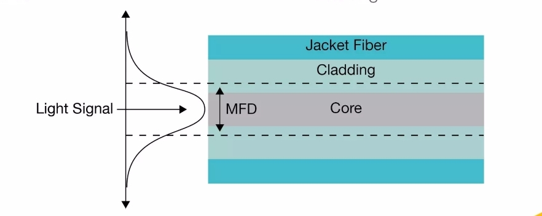
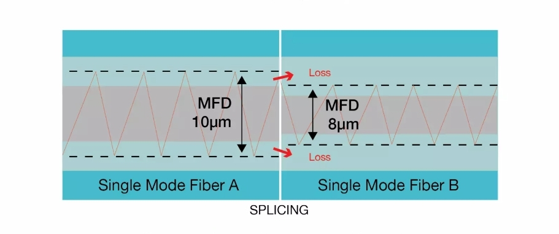

# Mode Field Diameter

## Mode Field Diameter ဆိုတာဘာလဲ

**Mode Field Diameter (MFD)** ဆိုသည်မှာ Fiber Optic အတွင်းရှိ Optical Signal ၏ အလင်းစွမ်းအင် ဖြန့်ကျက်နေသော ဧရိယာ၏ ထိရောက်သော အချင်းကို ဖော်ပြသည့် Parameter တစ်ခုဖြစ်သည်။

MFD ကို အထူးသဖြင့် **Single-Mode Fiber (SMF)** များတွင် အသုံးပြုသည်။ Single-Mode Fiber တွင် အလင်းသည် Core အတွင်းရှိ နေရာတစ်ခုတည်းတွင် အလင်းတန်းသေးသေးတစ်ခုအဖြစ်သာ ရှိနေသည်ဟု ရိုးရှင်းစွာ မယူဆသင့်ပါ။ Optical Field သည် Core အပြင်ဘက် **Cladding** ဘက်သို့လည်း အနည်းငယ် ဖြန့်ကျက်နေသည်။

ထို့ကြောင့် MFD သည် Fiber ၏ **Core Diameter** နှင့် တူညီသော အရာမဟုတ်ပါ။

*MFD သည် Optical Mode ၏ ထိရောက်သော အရွယ်အစားကို ဖော်ပြသည်။*

## MFD နှင့် Core Diameter ကွာခြားချက်

**Core Diameter** သည် Fiber ၏ Core အပိုင်း၏ Physical အရွယ်အစားကို ဖော်ပြခြင်းဖြစ်သည်။ **MFD** သည် ထို Core အတွင်း ဖြတ်သန်းနေသော Optical Field ၏ ဖြန့်ကျက်မှုကို ဖော်ပြခြင်းဖြစ်သည်။

ထို့ကြောင့် Fiber တစ်ခု၏ Core Diameter ကို သိရုံဖြင့် MFD ကို တိတိကျကျ သတ်မှတ်၍ မရပါ။

MFD သည် Fiber ၏ **Refractive Index Profile**, **Wavelength** နှင့် Fiber ၏ Optical Properties များအပေါ် မူတည်၍ ပြောင်းလဲနိုင်သည်။

## MFD ဘယ်လိုဖြစ်ပေါ်သလဲ

Single-Mode Fiber အတွင်းရှိ Optical Field သည် Core အတွင်းတွင် အများဆုံး Concentration ရှိသော်လည်း Core အစွန်းတွင် ချက်ချင်း သုညဖြစ်သွားခြင်းမရှိပါ။

Optical Field သည် Core မှ Cladding ဘက်သို့ တဖြည်းဖြည်း လျော့ကျသွားသည်။ ထို Field Distribution ကို အသုံးပြု၍ Optical Mode ၏ ထိရောက်သော အရွယ်အစားကို သတ်မှတ်နိုင်ပြီး ၎င်းကို MFD ဖြင့် ဖော်ပြသည်။

ထို့ကြောင့် MFD ကို နားလည်ရာတွင် -

**Core → Optical Field Distribution → Effective Mode Size**

ဟူသော ဆက်စပ်မှုကို သိထားရန် အရေးကြီးသည်။

## MFD ကို ဘာကြောင့် အရေးကြီးသလဲ

MFD သည် Fiber နှစ်ချောင်းကို ချိတ်ဆက်ရာတွင် **Coupling Efficiency** နှင့် **Splice Loss** တို့အပေါ် သက်ရောက်နိုင်သည်။

Fiber နှစ်ချောင်း၏ MFD များ မတူညီပါက Optical Field Distribution များ မကိုက်ညီနိုင်သောကြောင့် Fiber တစ်ချောင်းမှ တစ်ချောင်းသို့ Optical Power လွှဲပြောင်းရာတွင် Loss ဖြစ်ပေါ်နိုင်သည်။

ထို့ကြောင့် Fiber Splicing သို့မဟုတ် Fiber Coupling ပြုလုပ်ရာတွင် Core Alignment သာမက Optical Mode ၏ အရွယ်အစားနှင့် Distribution ကိုလည်း ထည့်သွင်းစဉ်းစားရန် လိုအပ်သည်။

## MFD ကွာခြားမှု၏ သက်ရောက်မှု

Fiber နှစ်ချောင်း၏ MFD တန်ဖိုးများ မတူညီသောအခါ Optical Field များ၏ အရွယ်အစားနှင့် Distribution များ ကွာခြားလာနိုင်သည်။

*Fiber နှစ်ချောင်း၏ MFD ကွာခြားမှုကြောင့် Optical Field Distribution မတူညီနိုင်ပုံ။*

ဥပမာအားဖြင့် MFD ကြီးသော Fiber မှ MFD သေးသော Fiber သို့ Optical Signal ကို Coupling ပြုလုပ်သောအခါ Optical Field များ၏ Distribution မကိုက်ညီမှုကြောင့် Coupling Loss ဖြစ်ပေါ်နိုင်သည်။

ထိုအခြေအနေကို ရိုးရှင်းစွာ -

* **MFD တူညီခြင်း** → Optical Field ပိုမိုကိုက်ညီနိုင်ခြင်း
* **MFD မတူညီခြင်း** → Optical Field မကိုက်ညီမှုကြောင့် Coupling Loss ဖြစ်နိုင်ခြင်း

ဟု နားလည်နိုင်သည်။

## MFD နှင့် Wavelength

MFD သည် Fiber ၏ **Operating Wavelength** နှင့်လည်း ဆက်စပ်သည်။

တူညီသော Single-Mode Fiber တစ်ခုကို မတူညီသော Wavelength များတွင် အသုံးပြုပါက Optical Field Distribution ပြောင်းလဲနိုင်သဖြင့် MFD တန်ဖိုးလည်း ပြောင်းလဲနိုင်သည်။

ထို့ကြောင့် Fiber Specification တွင် MFD ကို ဖော်ပြထားပါက မည်သည့် **Wavelength** တွင် သတ်မှတ်ထားသည်ကိုပါ ကြည့်ရှုရန် လိုအပ်သည်။

## MFD ကို ဘယ်မှာ အသုံးပြုသလဲ

MFD သည် Fiber Optic System Design နှင့် Fiber Connection ဆိုင်ရာ အလုပ်များတွင် အသုံးဝင်သော Parameter တစ်ခုဖြစ်သည်။

အထူးသဖြင့် -

* Single-Mode Fiber Specification များကို လေ့လာရာတွင်
* Fiber နှစ်ချောင်း၏ Compatibility ကို စစ်ဆေးရာတွင်
* Fiber Coupling ပြုလုပ်ရာတွင်
* Splice Loss ကို နားလည်သုံးသပ်ရာတွင်
* Optical Component များနှင့် Fiber များ၏ Coupling ကို Design ပြုလုပ်ရာတွင်

MFD ကို ထည့်သွင်းစဉ်းစားနိုင်သည်။

## MFD ကို နားလည်ရန် အဓိကအချက်များ

MFD ကို လေ့လာရာတွင် အောက်ပါအချက်များကို ခွဲခြားနားလည်ထားသင့်သည်။

* **MFD သည် Core Diameter မဟုတ်ပါ။**
* MFD သည် Optical Field ၏ ထိရောက်သော အရွယ်အစားကို ဖော်ပြသည်။
* Optical Field သည် Core အတွင်းတွင်သာ ကန့်သတ်မနေဘဲ Cladding ဘက်သို့လည်း ဖြန့်ကျက်နိုင်သည်။
* MFD သည် Wavelength နှင့် Fiber ၏ Optical Properties များအပေါ် မူတည်၍ ပြောင်းလဲနိုင်သည်။
* MFD ကွာခြားမှုသည် Fiber Coupling နှင့် Splicing တွင် Loss ဖြစ်ပေါ်စေနိုင်သည်။

## အနှစ်ချုပ်

**Mode Field Diameter (MFD)** သည် Single-Mode Fiber အတွင်းရှိ Optical Field ၏ ထိရောက်သော အရွယ်အစားကို ဖော်ပြသည့် အရေးကြီးသော Fiber Parameter တစ်ခုဖြစ်သည်။

MFD သည် **Core Diameter** နှင့် မတူဘဲ Optical Field သည် Core နှင့် Cladding အတွင်း မည်သို့ ဖြန့်ကျက်နေသည်ကို အခြေခံ၍ သတ်မှတ်ထားသည်။ ထို့အပြင် MFD သည် Wavelength နှင့် Fiber ၏ Optical Properties များနှင့် ဆက်စပ်နေပြီး Fiber Coupling နှင့် Splicing တွင် Optical Loss ကို နားလည်ရန် အရေးကြီးသည်။

Fiber နှစ်ချောင်း၏ MFD ကိုက်ညီမှုကောင်းမွန်ပါက Optical Field များ ပိုမိုကိုက်ညီနိုင်ပြီး Fiber Connection ၏ Optical Performance ကို ပိုမိုကောင်းမွန်စွာ ထိန်းသိမ်းနိုင်သည်။