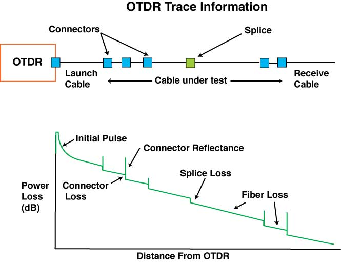
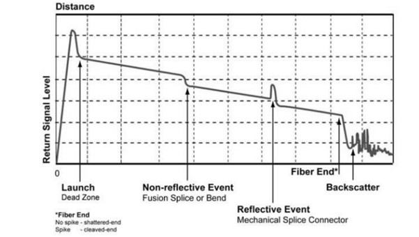
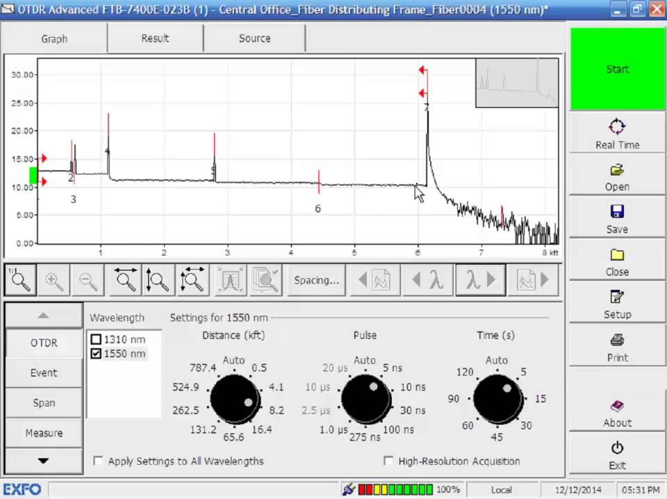

# OTDR Basics

**OTDR (Optical Time-Domain Reflectometer)** သည် Fiber Optic Cable အတွင်းရှိ Fiber Link ၏ အခြေအနေကို စစ်ဆေးတိုင်းတာရန် အသုံးပြုသည့် Test Equipment တစ်ခုဖြစ်သည်။

OTDR ဖြင့် Fiber Link တစ်ခု၏ **အရှည်၊ Optical Loss၊ Reflectance** နှင့် Fiber အတွင်းရှိ Event များ၏ တည်နေရာကို ခန့်မှန်းတိုင်းတာနိုင်သည်။ ထို့အပြင် Fiber Break၊ Connector၊ Splice နှင့် အခြား Loss ဖြစ်စေသောနေရာများကိုလည်း **OTDR Trace** ပေါ်တွင် ခွဲခြားလေ့လာနိုင်သည်။

## OTDR ဘယ်လိုအလုပ်လုပ်သလဲ

OTDR သည် Fiber အတွင်းသို့ Short Optical Pulse တစ်ခုကို ပေးပို့ပြီး Fiber တစ်လျှောက်မှ ပြန်လည်ရရှိလာသော Optical Signal ကို တိုင်းတာသည်။

Fiber အတွင်းသို့ Optical Pulse ဝင်ရောက်သွားသောအခါ အလင်း၏ အစိတ်အပိုင်းအချို့သည် Fiber တစ်လျှောက်တွင် အနည်းငယ်စီ ပြန်လည်ဖြန့်ကျက်လာသည်။ ထို Backscattered Light ကို OTDR က လက်ခံပြီး Signal ပြန်လာသည့် **Time** ကို အသုံးပြု၍ Fiber အတွင်းရှိ Event များ၏ အကွာအဝေးကို တွက်ချက်သည်။

အခြေခံလုပ်ဆောင်ပုံမှာ -

1. OTDR သည် Optical Pulse ကို Fiber ထဲသို့ ပေးပို့သည်။
2. Pulse သည် Fiber တစ်လျှောက် သွားလာသည်။
3. Fiber မှ Backscattered Light နှင့် Reflective Signal များ ပြန်လည်ရရှိသည်။
4. OTDR သည် ပြန်လာသည့် Signal ၏ Time နှင့် Power ကို တိုင်းတာသည်။
5. တိုင်းတာထားသော Data များကို **OTDR Trace** အဖြစ် ပြသသည်။
6. Trace ကို အသုံးပြု၍ Fiber Link အတွင်းရှိ Events များကို ခွဲခြားလေ့လာနိုင်သည်။

## OTDR Trace ဆိုတာဘာလဲ

**OTDR Trace** သည် OTDR မှ တိုင်းတာရရှိသော Fiber Link Data ကို Graph အဖြစ် ဖော်ပြထားခြင်းဖြစ်သည်။

ပုံမှန်အားဖြင့် Horizontal Axis တွင် Fiber ၏ **Distance** ကို ပြသပြီး Vertical Axis တွင် Optical Power သို့မဟုတ် Signal Level ကို ပြသသည်။

Fiber တစ်လျှောက်တွင် Loss သို့မဟုတ် Reflection ဖြစ်စေသော Event တစ်ခု ရှိပါက Trace ၏ ပုံသဏ္ဍာန် ပြောင်းလဲသွားနိုင်သည်။

*Fiber Link ကို OTDR ဖြင့်တိုင်းတာရရှိသော OTDR Trace*

OTDR Trace ကိုဖတ်ရာတွင် အဓိကအားဖြင့် -

* Fiber Link ၏ အစနှင့် အဆုံး
* Connector များ
* Fusion Splice များ
* Mechanical Splice များ
* Reflective Event များ
* Non-Reflective Loss Event များ
* Fiber Break သို့မဟုတ် End of Fiber

တို့ကို ရှာဖွေလေ့လာနိုင်သည်။

## OTDR Event ဆိုတာဘာလဲ

**OTDR Event** ဆိုသည်မှာ Fiber Link တစ်လျှောက်တွင် Optical Signal ၏ Power သို့မဟုတ် Reflection ကို သိသာစွာ ပြောင်းလဲစေသော နေရာတစ်ခုကို ဆိုလိုသည်။

ဥပမာအားဖြင့် Connector တစ်ခု၊ Splice တစ်ခု သို့မဟုတ် Fiber Break တစ်ခုသည် OTDR Trace ပေါ်တွင် Event တစ်ခုအဖြစ် ပေါ်လာနိုင်သည်။

*OTDR Trace ပေါ်တွင် တွေ့ရနိုင်သော Fiber Events များ*

OTDR တွင် တွေ့ရနိုင်သော Event များကို အခြေခံအားဖြင့် Reflective Event နှင့် Non-Reflective Event ဟူ၍ ခွဲခြားနားလည်နိုင်သည်။

### Reflective Event

**Reflective Event** သည် Optical Signal ၏ အစိတ်အပိုင်းတစ်ခုသည် OTDR ဘက်သို့ ပြန်လည်ရောင်ပြန်လာစေသော Event ဖြစ်သည်။

Connector၊ Mechanical Splice နှင့် Fiber End ကဲ့သို့သော နေရာများတွင် Reflection ဖြစ်နိုင်သည်။

### Non-Reflective Event

**Non-Reflective Event** သည် သိသာသော Reflection မရှိဘဲ Optical Power ကို လျော့ကျစေသော Event ဖြစ်သည်။

အရည်အသွေးမကောင်းသော Fusion Splice သို့မဟုတ် Fiber အတွင်းရှိ အချို့ Loss ဖြစ်စေသောနေရာများသည် Non-Reflective Event အဖြစ် Trace ပေါ်တွင် တွေ့နိုင်သည်။

## OTDR ဖြင့် ဘာတွေကို တိုင်းတာနိုင်သလဲ

OTDR ၏ အဓိကအသုံးပြုမှုမှာ Fiber Link ၏ အခြေအနေကို အကွာအဝေးနှင့် ဆက်စပ်၍ စစ်ဆေးခြင်းဖြစ်သည်။

ပုံမှန်အားဖြင့် အောက်ပါအချက်များကို လေ့လာနိုင်သည် -

* Fiber Link Length
* Event Location
* Splice Loss
* Connector Loss
* Optical Return Loss သို့မဟုတ် Reflectance ဆိုင်ရာ Measurement များ
* Fiber End Location
* Fiber Break Location
* Overall Link Loss

OTDR Model နှင့် Test Configuration အလိုက် ရရှိနိုင်သော Measurement Function များ ကွာခြားနိုင်သည်။

## OTDR Test လုပ်ရာတွင် အရေးကြီးသော Settings များ

OTDR ဖြင့် Test ပြုလုပ်ရာတွင် Measurement Result ၏ အရည်အသွေးသည် Test Setting များနှင့်လည်း ဆက်စပ်သည်။

*OTDR မတိုင်းတာမီ ချိန်ညှိရမည့် Test Setting များ*

အဓိက Setting များမှာ -

### Wavelength

Fiber ကို မည်သည့် **Wavelength** ဖြင့် Test ပြုလုပ်မည်ကို သတ်မှတ်ရသည်။ အသုံးပြုမည့် Fiber System နှင့် Test ရည်ရွယ်ချက်အပေါ်မူတည်၍ Wavelength ရွေးချယ်မှု ကွာခြားနိုင်သည်။

### Range

**Range** သည် OTDR က Fiber အတွင်း မည်မျှအကွာအဝေးအထိ တိုင်းတာမည်ကို သတ်မှတ်ခြင်းဖြစ်သည်။

Test ပြုလုပ်မည့် Fiber Length ထက် အလွန်တိုသော Range ကို ရွေးချယ်ပါက Fiber Link တစ်ခုလုံးကို မှန်ကန်စွာ မမြင်နိုင်နိုင်ပါ။

### Pulse Width

**Pulse Width** သည် OTDR မှ Fiber ထဲသို့ ပေးပို့သည့် Optical Pulse ၏ အကျယ်ဖြစ်သည်။

Pulse Width ပိုကြီးလာသည်နှင့်အမျှ Long Distance ကို စမ်းသပ်ရာတွင် အထောက်အကူဖြစ်နိုင်သော်လည်း အနီးကပ်ရှိ Event များကို ခွဲခြားနိုင်စွမ်း လျော့ကျနိုင်သည်။

Pulse Width ပိုသေးပါက အနီးကပ် Event များကို ပိုမိုခွဲခြားနိုင်သော်လည်း Long Distance Measurement အတွက် သင့်လျော်မှု ကွာခြားနိုင်သည်။

### Averaging Time

**Averaging Time** သည် OTDR က Measurement များကို စုစည်းပျမ်းမျှယူသည့် အချိန်ဖြစ်သည်။

Averaging Time ပိုများလာပါက Random Noise လျော့နည်းပြီး Trace ပိုမိုတည်ငြိမ်လာနိုင်သည်။ သို့သော် Test ပြုလုပ်ရန် အချိန်ပိုကြာမည်ဖြစ်သည်။

## Dead Zone ဆိုတာဘာလဲ

OTDR တွင် **Dead Zone** ဆိုသည်မှာ Reflective Event တစ်ခု ဖြစ်ပေါ်ပြီးနောက် OTDR က နောက်ထပ် Event တစ်ခုကို တိကျစွာ ခွဲခြားတိုင်းတာရန် အခက်အခဲရှိနိုင်သော အကွာအဝေးတစ်ခု ဖြစ်သည်။

Dead Zone သည် အထူးသဖြင့် Connector များ သို့မဟုတ် အနီးကပ်ရှိ Event များကို စစ်ဆေးရာတွင် အရေးကြီးသည်။

OTDR တွင် အဓိကအားဖြင့် **Event Dead Zone** နှင့် **Attenuation Dead Zone** ဟူ၍ သတ်မှတ်ချက်အလိုက် ခွဲခြားဖော်ပြထားနိုင်သည်။

ထို့ကြောင့် Fiber Link ၏ အစပိုင်းတွင်ရှိသော Connector သို့မဟုတ် Splice များကို စစ်ဆေးရာတွင် **Launch Fiber** ကို အသုံးပြုခြင်းသည် အရေးကြီးသည်။

## Launch Fiber နှင့် Receive Fiber

OTDR ကို Fiber Link သို့ တိုက်ရိုက်ချိတ်ဆက်၍ Test ပြုလုပ်ပါက OTDR ၏ Dead Zone ကြောင့် ပထမ Connector ၏ Loss နှင့် Reflectance ကို တိကျစွာ အကဲဖြတ်ရန် ခက်ခဲနိုင်သည်။

ထိုအတွက် **Launch Fiber** ကို OTDR နှင့် Test လုပ်မည့် Fiber Link ကြားတွင် ချိတ်ဆက်အသုံးပြုနိုင်သည်။

Fiber Link ၏ အဆုံး Connector ကိုပါ သေချာစွာ စစ်ဆေးလိုပါက **Receive Fiber** ကို Fiber Link ၏ အဆုံးတွင် ထပ်မံချိတ်ဆက်အသုံးပြုနိုင်သည်။

အခြေခံချိတ်ဆက်ပုံမှာ -

**OTDR → Launch Fiber → Fiber Link Under Test → Receive Fiber**

ဖြစ်သည်။

## OTDR Test ပြုလုပ်ရာတွင် သတိပြုရန်အချက်များ

OTDR Measurement မပြုလုပ်မီ Fiber Link နှင့် Test Equipment ကို သေချာစွာ စစ်ဆေးရသည်။

အထူးသဖြင့် -

* Fiber Connector များကို သန့်ရှင်းစွာထားရမည်။
* သင့်လျော်သော Wavelength ကို ရွေးချယ်ရမည်။
* Fiber Link ၏ အရှည်နှင့် ကိုက်ညီသော Range ကို ရွေးချယ်ရမည်။
* လိုအပ်ပါက Launch Fiber နှင့် Receive Fiber အသုံးပြုရမည်။
* Pulse Width နှင့် Averaging Time ကို Test ရည်ရွယ်ချက်နှင့် ကိုက်ညီအောင် သတ်မှတ်ရမည်။
* OTDR Trace ပေါ်ရှိ Event များကို Distance နှင့် Loss တန်ဖိုးများနှင့်အတူ စစ်ဆေးရမည်။

## OTDR ၏ Practical အသုံးပြုမှု

Fiber Optic Installation နှင့် Maintenance လုပ်ငန်းများတွင် OTDR ကို Fiber Link ၏ အခြေအနေကို စစ်ဆေးရန် အသုံးပြုနိုင်သည်။

ဥပမာအားဖြင့် Fiber Link တစ်ခုတွင် Unexpected Loss ဖြစ်နေပါက OTDR Trace ကို ကြည့်ရှု၍ Loss ဖြစ်နေသော Event ၏ တည်နေရာကို ရှာဖွေနိုင်သည်။

Fiber Break ဖြစ်ပေါ်နေပါကလည်း OTDR Trace တွင် Fiber End သို့မဟုတ် Break Location ကို ခွဲခြားသတ်မှတ်နိုင်ပြီး Technician အနေဖြင့် ပြဿနာရှိနိုင်သည့် နေရာကို ပိုမိုလျင်မြန်စွာ ရှာဖွေနိုင်သည်။

သို့သော် OTDR တစ်ခုတည်း၏ Measurement ကိုသာ အခြေခံ၍ Fiber Link တစ်ခုလုံး၏ Performance ကို ဆုံးဖြတ်ခြင်းမပြုသင့်ပါ။ Test Method၊ Connector Condition၊ Launch/Receive Fiber နှင့် OTDR Setting များသည် Result အပေါ် သက်ရောက်မှုရှိနိုင်သည်။

## အနှစ်ချုပ်

**OTDR (Optical Time-Domain Reflectometer)** သည် Fiber Optic Link အတွင်းရှိ Loss နှင့် Reflection ဖြစ်စေသော Event များကို အကွာအဝေးနှင့် ဆက်စပ်၍ စစ်ဆေးရန် အသုံးပြုသည့် Test Equipment ဖြစ်သည်။

OTDR သည် Optical Pulse ကို Fiber ထဲသို့ ပေးပို့ပြီး ပြန်လည်ရရှိလာသော Backscattered နှင့် Reflected Signal များကို တိုင်းတာကာ **OTDR Trace** အဖြစ် ဖော်ပြပေးသည်။ Trace ကို အသုံးပြု၍ Connector, Splice, Fiber Break နှင့် အခြား Event များ၏ တည်နေရာနှင့် Loss ဆိုင်ရာ အချက်အလက်များကို လေ့လာနိုင်သည်။

OTDR ကို မှန်ကန်စွာ အသုံးပြုနိုင်ရန် **Wavelength, Range, Pulse Width, Averaging Time, Dead Zone** နှင့် Launch/Receive Fiber အသုံးပြုမှုတို့ကို နားလည်ထားရန် အရေးကြီးသည်။