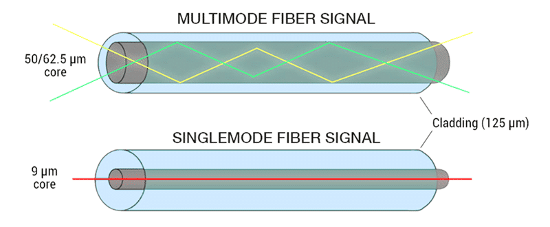

# Single Mode Vs Multimode

Optical Fiber ကို အခြေခံအားဖြင့် **Single Mode Fiber (SMF)** နှင့် **Multimode Fiber (MMF)** ဟူ၍ အဓိကနှစ်မျိုး ခွဲခြားနိုင်သည်။

နှစ်မျိုးစလုံးသည် Data များကို Optical Signal အဖြစ် ပို့ဆောင်ရန် အသုံးပြုသော်လည်း **Core Size၊ Light Propagation၊ Transmission Distance၊ Optical Source နှင့် အသုံးပြုသည့် Network Environment** တို့တွင် ကွာခြားမှုများ ရှိသည်။

ထို့ကြောင့် Fiber Network တစ်ခု တည်ဆောက်ရာတွင် Single Mode နှင့် Multimode တို့၏ ကွာခြားချက်ကို နားလည်ထားခြင်းသည် သင့်လျော်သော Fiber Type ကို ရွေးချယ်နိုင်ရန် အရေးကြီးသည်။

## Single Mode Fiber ဆိုတာဘာလဲ?

**Single Mode Fiber (SMF)** သည် Core အရွယ်အစား သေးငယ်သော Optical Fiber ဖြစ်ပြီး သတ်မှတ်ထားသော Wavelength နှင့် Operating Conditions အောက်တွင် အဓိကအားဖြင့် **Mode တစ်ခု** ဖြင့် Light ကို ပို့ဆောင်သည်။

Core သေးငယ်သောကြောင့် Light Modes များစွာ ဖြတ်သန်းသွားလာမှုကို ကန့်သတ်ပေးနိုင်ပြီး Long-Distance Data Transmission အတွက် သင့်လျော်သည်။

Single Mode Fiber ကို အများအားဖြင့် -

* **FTTH Network**
* **Telecommunication Network**
* **Long-Distance Communication**
* **Metro Network**
* **Data Center အတွင်းရှိ သတ်မှတ်ထားသော High-Speed Links**

များတွင် အသုံးပြုသည်။

## Multimode Fiber ဆိုတာဘာလဲ?

**Multimode Fiber (MMF)** သည် Single Mode Fiber ထက် Core ပိုကြီးသော Optical Fiber ဖြစ်သည်။ Core ပိုကြီးသောကြောင့် Light သည် Fiber အတွင်းတွင် **Modes များစွာ** ဖြင့် Propagate လုပ်နိုင်သည်။

Multimode Fiber သည် Shorter-Distance Communication အတွက် အထူးသင့်လျော်ပြီး Building Network နှင့် Data Center အတွင်းရှိ Connection များတွင် အသုံးပြုလေ့ရှိသည်။

Multimode Fiber တွင် အသုံးများသော Core Size များအနက် **50 µm** နှင့် **62.5 µm** တို့ကို တွေ့ရနိုင်သည်။

## Core Size ကွာခြားချက်

Single Mode နှင့် Multimode တို့၏ အထင်ရှားဆုံး ကွာခြားချက်တစ်ခုမှာ **Core Size** ဖြစ်သည်။

*Single Mode နှင့် Multimode Fiber တို့၏ Core Size ကွာခြားချက်*

**Single Mode Fiber** ၏ Core သည် အလွန်သေးငယ်ပြီး ပုံမှန်အားဖြင့် **8–10 µm အတန်းအစား** ဖြစ်သည်။ အသုံးများသော Single Mode Fiber Specification တစ်ခုမှာ 9/125 µm ဖြစ်သည်။

**Multimode Fiber** ၏ Core သည် ပိုမိုကြီးပြီး 50/125 µm သို့မဟုတ် 62.5/125 µm ကဲ့သို့သော Specification များကို တွေ့ရနိုင်သည်။

Core Size ကွာခြားမှုကြောင့် Light သွားလာပုံနှင့် Fiber တစ်မျိုးချင်းစီ၏ Transmission Characteristics များလည်း ကွာခြားလာသည်။

## Light Propagation ကွာခြားချက်

Single Mode Fiber တွင် Core သေးငယ်သောကြောင့် Light ၏ Propagation Modes ကို အဓိကအားဖြင့် တစ်ခုတည်းသို့ ကန့်သတ်ထားနိုင်သည်။

Multimode Fiber တွင် Core ပိုကြီးသောကြောင့် Light သည် လမ်းကြောင်းအမျိုးမျိုးဖြင့် Fiber အတွင်း Propagate လုပ်နိုင်သည်။

Modes များစွာ အသုံးပြုခြင်းကြောင့် Multimode Fiber တွင် **Modal Dispersion** ဖြစ်ပေါ်နိုင်သည်။ Light Modes များသည် Receiver သို့ ရောက်ရှိသည့်အချိန် မတူညီနိုင်သောကြောင့် Transmission Distance နှင့် Data Rate အပေါ် ကန့်သတ်ချက် ဖြစ်စေနိုင်သည်။

Single Mode Fiber တွင် Modal Dispersion ၏ သက်ရောက်မှုသည် Multimode Fiber ထက် များစွာနည်းသောကြောင့် Long-Distance နှင့် High-Bandwidth Transmission များအတွက် သင့်လျော်သည်။

## Transmission Distance

Single Mode နှင့် Multimode တို့ကို ခွဲခြားရာတွင် **Transmission Distance** သည် အရေးကြီးသောအချက်တစ်ခုဖြစ်သည်။

**Single Mode Fiber** သည် Long-Distance Transmission အတွက် သင့်လျော်သည်။ Fiber Link ၏ အမှန်တကယ် ရောက်နိုင်သောအကွာအဝေးသည် Fiber Type တစ်ခုတည်းပေါ်တွင် မူတည်ခြင်းမရှိဘဲ Transceiver, Wavelength, Data Rate, Optical Power Budget နှင့် Network Design တို့အပေါ်လည်း မူတည်သည်။

**Multimode Fiber** သည် ပုံမှန်အားဖြင့် Single Mode ထက် Shorter Distance Links များအတွက် အသုံးပြုသည်။ ထို့ကြောင့် Building အတွင်း၊ Floor-to-Floor Connection နှင့် Data Center အတွင်းကဲ့သို့သော အကွာအဝေးတိုသော Network များတွင် အသုံးဝင်သည်။

## Bandwidth နှင့် Data Transmission

Single Mode Fiber နှင့် Multimode Fiber နှစ်မျိုးစလုံးသည် High-Speed Data Transmission အတွက် အသုံးပြုနိုင်သည်။

သို့သော် Long-Distance နှင့် အလွန်မြင့်သော Data Rate များအတွက် Single Mode Fiber သည် ပိုမိုသင့်လျော်သော Transmission Medium ဖြစ်လာသည်။

Multimode Fiber တွင် Modal Dispersion ရှိသောကြောင့် Distance နှင့် Data Rate တို့ ပေါင်းစပ်သတ်မှတ်ရာတွင် **OM1, OM2, OM3, OM4 နှင့် OM5** ကဲ့သို့သော Fiber Category နှင့် သက်ဆိုင်ရာ Standards များကို ထည့်သွင်းစဉ်းစားရန် လိုအပ်သည်။

ထို့ကြောင့် "Multimode က Speed နိမ့်ပြီး Single Mode က Speed မြင့်သည်" ဟု ရိုးရိုးရှင်းရှင်း သတ်မှတ်ခြင်းထက် **Distance + Data Rate + Fiber Category + Transceiver** တို့ကို ပေါင်းစပ်စဉ်းစားခြင်းက ပိုမှန်ကန်သည်။

## Optical Source ကွာခြားချက်

Single Mode နှင့် Multimode Network များတွင် အသုံးပြုသော Optical Transceiver နှင့် Light Source များသည်လည်း Application အလိုက် ကွာခြားနိုင်သည်။

Single Mode System များတွင် Long-Distance နှင့် High-Speed Application များအတွက် သင့်လျော်သော **Laser-based Optical Transmitter** များကို အသုံးပြုလေ့ရှိသည်။

Multimode System များတွင်လည်း Application နှင့် Standard အပေါ်မူတည်၍ VCSEL ကဲ့သို့သော **Laser-based Sources** များကို အသုံးပြုနိုင်သည်။ ထို့ကြောင့် Multimode ကို LED နှင့်သာ တွဲဖက်အသုံးပြုသည်ဟု သတ်မှတ်ခြင်း မမှန်ကန်ပါ။

## Single Mode နှင့် Multimode နှိုင်းယှဉ်ခြင်း

| အချက် | Single Mode Fiber | Multimode Fiber |
|---|---|---|
| အတိုကောက် | SMF | MMF |
| Core Size | အများအားဖြင့် 8–10 µm အတန်းအစား | 50 µm သို့မဟုတ် 62.5 µm |
| Light Modes | အဓိကအားဖြင့် Mode တစ်ခု | Modes များစွာ |
| Modal Dispersion | အလွန်နည်းပါး | ဖြစ်ပေါ်နိုင်သည် |
| Transmission Distance | Long Distance အတွက် သင့်လျော် | Shorter Distance အတွက် သင့်လျော် |
| အသုံးများသောနေရာ | FTTH, Telecom, Long-Distance Network | LAN, Building Network, Data Center |
| Fiber Categories | OS1, OS2 စသည် | OM1, OM2, OM3, OM4, OM5 |
| Typical Application | Long-Haul နှင့် Access Network | Short-Reach High-Speed Network |

## Single Mode ကို ဘယ်အချိန်မှာ အသုံးပြုသင့်သလဲ?

Network Link သည် အကွာအဝေးရှည်လျားပြီး High-Speed Communication လိုအပ်ပါက Single Mode Fiber ကို စဉ်းစားသင့်သည်။

ဥပမာ -

* FTTH Access Network
* ISP Backbone နှင့် Metro Network
* Long-Distance Communication Link
* Campus များအကြား Fiber Connection
* သတ်မှတ်ထားသော High-Speed Data Center Interconnect များ

သို့သော် Fiber Type ကို ရွေးချယ်ရာတွင် Distance တစ်ခုတည်းကို မကြည့်ဘဲ အသုံးပြုမည့် Transceiver နှင့် Network Standard တို့၏ Compatibility ကိုပါ စစ်ဆေးရန် လိုအပ်သည်။

## Multimode ကို ဘယ်အချိန်မှာ အသုံးပြုသင့်သလဲ?

Network Link သည် အကွာအဝေးတိုပြီး Building သို့မဟုတ် Data Center အတွင်း High-Speed Connection လိုအပ်ပါက Multimode Fiber သည် သင့်လျော်သောရွေးချယ်စရာတစ်ခု ဖြစ်နိုင်သည်။

ဥပမာ -

* Data Center အတွင်း Server နှင့် Switch Connection
* Building အတွင်း Backbone Link
* Floor-to-Floor Fiber Connection
* Short-Reach Enterprise Network

Multimode အသုံးပြုရာတွင်လည်း OM Category, Data Rate, Link Distance နှင့် Transceiver Specification တို့ကို ကိုက်ညီအောင် ရွေးချယ်ရမည်။

## Practical Example

ဥပမာအားဖြင့် Data Center တစ်ခုအတွင်း Switch နှစ်လုံးကို အကွာအဝေးတိုသော Fiber Link ဖြင့် ချိတ်ဆက်ရန် လိုအပ်သည်ဆိုပါစို့။

ထို Link အတွက် Multimode Fiber ကို အသုံးပြုနိုင်သော်လည်း Fiber Category နှင့် Transceiver Specification တို့သည် သတ်မှတ်ထားသော Data Rate နှင့် Distance ကို Support လုပ်ရန် လိုအပ်သည်။

အခြားတစ်ဖက်တွင် မြို့နှစ်မြို့အကြား သို့မဟုတ် FTTH Access Network ကဲ့သို့ Long-Distance Link တစ်ခု တည်ဆောက်မည်ဆိုပါက Single Mode Fiber ကို အသုံးပြုခြင်းသည် ထို Application ၏ Transmission Requirements နှင့် ပိုမိုကိုက်ညီနိုင်သည်။

အဓိကမှာ **Fiber Type ကို Distance တစ်ခုတည်းဖြင့် မရွေးချယ်ဘဲ Link Requirements အားလုံးကို ပေါင်းစပ်စဉ်းစားရန်** ဖြစ်သည်။

## Fiber Type ရွေးချယ်ရာတွင် စဉ်းစားရမည့်အချက်များ

Single Mode သို့မဟုတ် Multimode ကို ရွေးချယ်ရာတွင် အောက်ပါအချက်များကို စစ်ဆေးသင့်သည်။

* လိုအပ်သော **Transmission Distance**
* လိုအပ်သော **Data Rate**
* အသုံးပြုမည့် **Transceiver**
* Fiber Category နှင့် Standard
* Wavelength
* Optical Power Budget
* Installation Environment
* Network ၏ လက်ရှိနှင့် အနာဂတ် Upgrade Requirements

ထိုအချက်များကို သတ်မှတ်ပြီးမှ Fiber နှင့် Optical Equipment များကို Compatibility ရှိအောင် ရွေးချယ်ခြင်းက Network Performance နှင့် Reliability အတွက် အရေးကြီးသည်။

## အနှစ်ချုပ်

**Single Mode Fiber** နှင့် **Multimode Fiber** နှစ်မျိုးစလုံးသည် Data များကို Optical Signal ဖြင့် ပို့ဆောင်ပေးနိုင်သော်လည်း Core Size နှင့် Light Propagation ပုံစံတို့တွင် အဓိကကွာခြားသည်။

Single Mode Fiber တွင် Core သေးငယ်ပြီး Light Mode ကို အဓိကအားဖြင့် တစ်ခုတည်းဖြင့် ပို့ဆောင်သောကြောင့် Long-Distance Communication နှင့် High-Speed Network များအတွက် သင့်လျော်သည်။ Multimode Fiber တွင် Core ပိုကြီးပြီး Modes များစွာ ဖြတ်သန်းနိုင်သောကြောင့် Short-Reach Network များ၊ Building Network နှင့် Data Center အတွင်းရှိ Link များတွင် အသုံးများသည်။

Fiber Type ရွေးချယ်ရာတွင် **Core Size, Distance, Data Rate, Fiber Category, Transceiver နှင့် Network Requirements** တို့ကို ပေါင်းစပ်စဉ်းစားရန် လိုအပ်သည်။