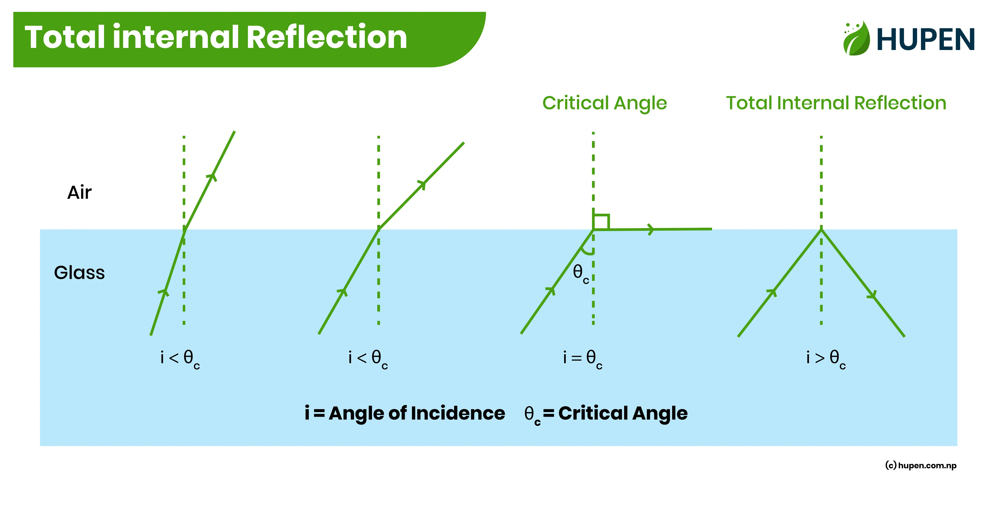
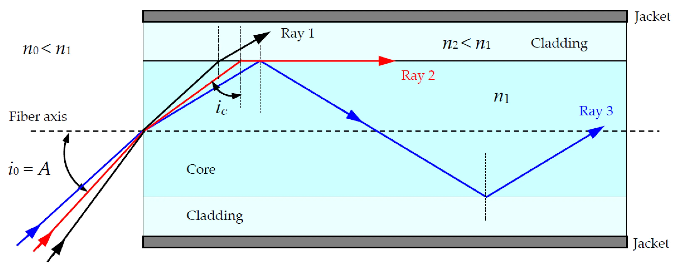

# Total Internal Reflection (TIR)

**Total Internal Reflection (TIR)** သည် Optical Fiber ၏ အလုပ်လုပ်ပုံကို နားလည်ရန် အရေးကြီးသော အခြေခံ Optical Principle တစ်ခုဖြစ်သည်။

Optical Fiber သည် Electrical Signal အစား **Light** ကို အသုံးပြု၍ Data များကို ပို့ဆောင်ပေးသည်။ ထိုအလင်းသည် Fiber အတွင်းတွင် မိမိလိုချင်သည့် လမ်းကြောင်းအတိုင်း ဆက်လက်သွားနိုင်ရန်အတွက် **Total Internal Reflection** ၏ အခြေခံသဘောတရားသည် အရေးပါသည်။

## Total Internal Reflection ဆိုတာ ဘာလဲ

အလင်းရောင်သည် **Refractive Index** မတူညီသော Material နှစ်ခုကြားသို့ ဖြတ်သန်းသည့်အခါ အလင်း၏ လမ်းကြောင်းသည် ပြောင်းလဲနိုင်သည်။ ထိုဖြစ်စဉ်ကို **Refraction** ဟုခေါ်သည်။

သို့သော် အလင်းသည် **ပိုမိုမြင့်မားသော Refractive Index ရှိသည့် Medium** မှ **နိမ့်သော Refractive Index ရှိသည့် Medium** သို့ သွားသောအခါ၊ အလင်းကျရောက်သည့်ထောင့် (Angle of Incidence) သည် သတ်မှတ်ထားသော **Critical Angle** ထက် ကြီးလာပါက အလင်းသည် ဒုတိယ Medium ထဲသို့ မဝင်တော့ဘဲ ပထမ Medium အတွင်းသို့ ပြန်လည်ရောင်ပြန်သည်။

ဤဖြစ်စဉ်ကို **Total Internal Reflection (TIR)** ဟုခေါ်သည်။

*အလင်းသည် Critical Angle ထက် ကျော်လွန်သောအခါ Total Internal Reflection ဖြစ်ပေါ်ပုံ*

## TIR ဖြစ်ရန် လိုအပ်သော အခြေအနေများ

Total Internal Reflection ဖြစ်ရန် အဓိကအခြေအနေ နှစ်ခုရှိသည်။

* အလင်းသည် **ပိုမိုမြင့်မားသော Refractive Index (n)** ရှိသည့် Medium မှ နိမ့်သော Refractive Index ရှိသည့် Medium သို့ သွားရမည်။
* Angle of Incidence သည် **Critical Angle** ထက် ကြီးရမည်။

Critical Angle တွင် အလင်းသည် နယ်နိမိတ်တစ်လျှောက်သို့ သွားသကဲ့သို့ ဖြစ်ပြီး Critical Angle ထက် ပိုမိုကြီးလာသောအခါ TIR ဖြစ်ပေါ်သည်။

## Refractive Index ဆိုတာ ဘာလဲ

**Refractive Index (n)** သည် Material တစ်ခုအတွင်း အလင်း၏ အမြန်နှုန်းသည် Vacuum ထဲရှိ အလင်း၏ အမြန်နှုန်းနှင့် နှိုင်းယှဉ်ပါက မည်မျှလျော့ကျသွားသည်ကို ဖော်ပြပေးသော အတိုင်းအတာတစ်ခုဖြစ်သည်။

အကြမ်းဖျင်းအားဖြင့် -

* Refractive Index မြင့် → အလင်းသည် Material အတွင်း ပိုမိုနှေးကွေးစွာ သွားသည်။
* Refractive Index နိမ့် → အလင်းသည် Material အတွင်း ပိုမိုမြန်ဆန်စွာ သွားသည်။

Refractive Index ကို ပုံမှန်အားဖြင့် **n** ဖြင့် ဖော်ပြသည်။

## Critical Angle

**Critical Angle** သည် Total Internal Reflection စတင်ဖြစ်ပေါ်နိုင်သည့် အရေးကြီးသော ထောင့်တစ်ခုဖြစ်သည်။

Medium နှစ်ခု၏ Refractive Index များကို \(n_1\) နှင့် \(n_2\) ဟု သတ်မှတ်ပြီး \(n_1 > n_2\) ဖြစ်ပါက Critical Angle ကို -

\[
\sin(\theta_c) = \frac{n_2}{n_1}
\]

ဖြင့် ဖော်ပြနိုင်သည်။

ဤနေရာတွင် -

* \(\theta_c\) = Critical Angle
* \(n_1\) = အလင်းစတင်သွားသည့် Medium ၏ Refractive Index
* \(n_2\) = ဒုတိယ Medium ၏ Refractive Index

Angle of Incidence သည် Critical Angle ထက် ကြီးလာသောအခါ Total Internal Reflection ဖြစ်နိုင်သည်။

## Optical Fiber အတွင်း TIR ဘယ်လိုအလုပ်လုပ်သလဲ

Optical Fiber ၏ အဓိကအပိုင်းများထဲတွင် **Core** နှင့် **Cladding** သည် TIR နှင့် တိုက်ရိုက်ဆက်နွယ်နေသည်။

**Core** သည် Light Signal များ အဓိကဖြတ်သန်းသွားသည့် အလယ်ပိုင်းဖြစ်သည်။

**Cladding** သည် Core ကို ပတ်လည်ဝန်းရံထားပြီး Core ထက် **Refractive Index နိမ့်သော Material** ဖြင့် ပြုလုပ်ထားသည်။

ထို့ကြောင့် Fiber အတွင်းသို့ သင့်လျော်သော ထောင့်ဖြင့် ဝင်ရောက်လာသော Light သည် Core နှင့် Cladding ကြား နယ်နိမိတ်တွင် TIR ဖြစ်ပေါ်နိုင်ပြီး Fiber ၏ အရှည်တစ်လျှောက် ဆက်လက်လမ်းကြောင်းသွားသည်။

*Optical Fiber ၏ Core နှင့် Cladding ကြားတွင် Light ကို လမ်းကြောင်းပေးသည့် TIR ဖြစ်စဉ်*

## Core နှင့် Cladding ၏ အခန်းကဏ္ဍ

Optical Fiber တစ်ခုကို ရိုးရှင်းစွာ နားလည်မည်ဆိုပါက -

**Core → Light သွားသည့်နေရာ**

**Cladding → Core ကို ပတ်လည်ဝန်းရံထားသည့် Light Guiding Structure၏ အစိတ်အပိုင်း**

Core ၏ Refractive Index သည် Cladding ထက် မြင့်မားခြင်းသည် Conventional Step-Index Fiber များတွင် TIR-based guiding ဖြစ်ပေါ်ရန် အခြေခံလိုအပ်ချက်တစ်ခုဖြစ်သည်။

သို့သော် Modern Optical Fiber များ၏ Light Guiding ကို TIR တစ်ခုတည်းဖြင့်သာ အပြည့်အစုံရှင်းပြခြင်းသည် မလုံလောက်ပါ။ အထူးသဖြင့် **Waveguide Theory** နှင့် **Mode** များကို ထည့်သွင်းစဉ်းစားရသည်။

## Optical Fiber တွင် TIR ဘာကြောင့် အရေးကြီးသလဲ

Fiber Optic Communication တွင် Data များကို Light Signal အဖြစ် ပြောင်းလဲပြီး Fiber မှတစ်ဆင့် ပို့ဆောင်သည်။

Light ကို Fiber ၏ Core အတွင်း ထိန်းသိမ်းလမ်းကြောင်းပေးနိုင်ခြင်းကြောင့် -

* အဝေးအကွာအဝေးများအထိ Data ပို့နိုင်သည်။
* High-speed Communication အတွက် အသုံးပြုနိုင်သည်။
* Electromagnetic Interference (EMI) ကို Copper Cable များကဲ့သို့ မခံစားရပါ။
* Telecommunications နှင့် Internet Network များတွင် အသုံးပြုနိုင်သည်။
* FTTH (Fiber to the Home) ကဲ့သို့သော Broadband Access Network များတွင် အရေးပါသည်။

## TIR နှင့် Fiber Optic Communication

Fiber Optic Communication ၏ အခြေခံလုပ်ငန်းစဉ်ကို ရိုးရှင်းစွာ ကြည့်မည်ဆိုပါက -

**Electrical Data → Light Source → Optical Fiber → Light Detection → Electrical Data**

Transmitter ဘက်တွင် Electrical Data ကို Optical Signal အဖြစ် ပြောင်းလဲပြီး Fiber အတွင်းသို့ ထည့်သွင်းသည်။

Fiber အတွင်းတွင် Light သည် Fiber ၏ Optical Properties နှင့် Waveguide Structure ကြောင့် လမ်းကြောင်းသွားပြီး Receiver ဘက်သို့ ရောက်ရှိသည်။

Receiver တွင် Optical Signal ကို ပြန်လည် Detect လုပ်ပြီး Data အဖြစ် အသုံးပြုနိုင်သည်။

## TIR ကို နားလည်ရန် ရိုးရှင်းသော ဥပမာ

ရေထဲမှ အလင်းသည် လေထဲသို့ ထွက်လာသည့်အခါ အလင်း၏ ထောင့်နှင့် Material ၏ Refractive Index များအပေါ်မူတည်ပြီး အလင်းသည် Refraction ဖြစ်နိုင်သည်။

သို့သော် အလင်း၏ Angle of Incidence သည် Critical Angle ထက် ကျော်လွန်လာပါက အလင်းသည် လေထဲသို့ ထွက်မသွားဘဲ ရေထဲသို့ ပြန်လည်ရောင်ပြန်နိုင်သည်။

ဤအခြေခံသဘောတရားကို Optical Fiber ၏ Core နှင့် Cladding ဖွဲ့စည်းပုံကို နားလည်ရာတွင် အသုံးချနိုင်သည်။

## TIR နှင့် Reflection ကွာခြားချက်

**Reflection** သည် အလင်းသည် Surface တစ်ခုကို ထိတွေ့ပြီး ပြန်လည်ရောင်ပြန်ခြင်း၏ ယေဘုယျဖြစ်စဉ်ဖြစ်သည်။

**Total Internal Reflection** သည် သတ်မှတ်ထားသော အခြေအနေများအောက်တွင် ဖြစ်ပေါ်သည့် အထူး Reflection ဖြစ်စဉ်တစ်ခုဖြစ်သည်။

အဓိကကွာခြားချက်မှာ TIR ဖြစ်ရန် -

* Light သည် Higher Refractive Index Medium မှ Lower Refractive Index Medium သို့ သွားရမည်။
* Angle of Incidence သည် Critical Angle ထက် ကြီးရမည်။

## TIR ၏ Limitations

TIR ကို နားလည်ထားခြင်းသည် Fiber Optics အတွက် အရေးကြီးသော်လည်း လက်တွေ့ Optical Fiber System တွင် Signal အားလျော့ခြင်းနှင့် Dispersion ကဲ့သို့သော အခြား Optical Effects များလည်း ရှိသည်။

ဥပမာ -

* **Attenuation** ကြောင့် Signal Power လျော့ကျနိုင်သည်။
* **Dispersion** ကြောင့် Pulse များ ပြန့်ကျဲပြီး High-Speed Transmission ကို သက်ရောက်နိုင်သည်။
* Fiber Bending များပြားပါက Optical Loss ဖြစ်နိုင်သည်။

ထို့ကြောင့် Fiber Optic Communication ၏ Performance ကို TIR တစ်ခုတည်းဖြင့် ဆုံးဖြတ်၍ မရပါ။

## အနှစ်ချုပ်

**Total Internal Reflection (TIR)** သည် Higher Refractive Index Medium မှ Lower Refractive Index Medium သို့ သွားသော Light သည် Critical Angle ထက် ပိုမိုကြီးသော Angle of Incidence ဖြင့် နယ်နိမိတ်ကို ထိတွေ့သောအခါ အတွင်းဘက်သို့ ပြန်လည်ရောင်ပြန်သည့် ဖြစ်စဉ်ဖြစ်သည်။

Optical Fiber တွင် **Core ၏ Refractive Index သည် Cladding ထက် မြင့်မားခြင်း** နှင့် သင့်လျော်သော Light Launching Conditions တို့ကြောင့် Light ကို Fiber အတွင်း လမ်းကြောင်းပေးနိုင်သည်။

TIR ကို နားလည်ထားခြင်းသည် နောက်ပိုင်းတွင် **Numerical Aperture, Acceptance Angle, Modes, Attenuation, Dispersion** နှင့် အခြား Optical Fiber Concepts များကို ဆက်လက်လေ့လာရာတွင် အခြေခံကောင်းတစ်ခု ဖြစ်စေသည်။

## Further Learning

Total Internal Reflection ကို ပိုမိုမြင်သာစွာ နားလည်ရန် အောက်ပါ Video ကိုလည်း လေ့လာနိုင်ပါတယ်။

https://youtu.be/dY2ZMAjYPjI?si=w8wM1kvGuN-1ZznT