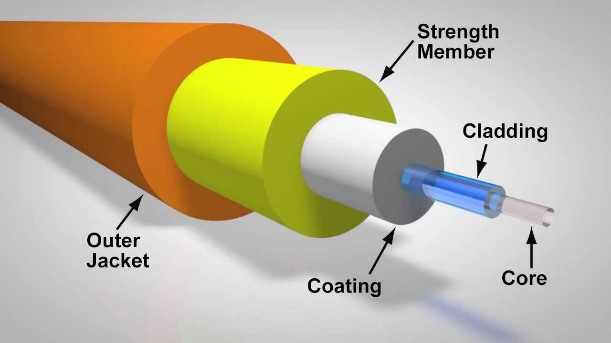
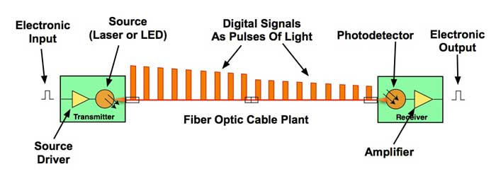

# What is Fiber Optic?

Fiber Optic ဆိုသည်မှာ **အလင်းအချက်ပြ (Light Signal)** ကို အသုံးပြုပြီး Data များကို တစ်နေရာမှ တစ်နေရာသို့ ပို့ဆောင်ပေးသည့် ဆက်သွယ်ရေးနည်းပညာတစ်ခုဖြစ်သည်။ ယနေ့ခေတ်တွင် Internet, Telephone, Cable TV, Data Center နှင့် အခြား Telecommunications Network များတွင် Fiber Optic ကို ကျယ်ပြန့်စွာ အသုံးပြုကြသည်။

ရိုးရိုး Copper Cable များတွင် Data ကို လျှပ်စစ်အချက်ပြ (Electrical Signal) ဖြင့် ပို့ဆောင်သော်လည်း Fiber Optic တွင် Data ကို အလင်းအချက်ပြအဖြစ် ပြောင်းလဲပြီး **Optical Fiber** အတွင်းမှ ပို့ဆောင်သည်။

## Fiber Optic ဆိုတာဘာလဲ?

**Fiber Optic** သည် အလွန်သေးငယ်ပြီး ပေါ့ပါးသော ဖန်သား သို့မဟုတ် သင့်လျော်သော Polymer ဖြင့် ပြုလုပ်ထားသည့် Optical Fiber များကို အသုံးပြု၍ အလင်းမှတစ်ဆင့် Information ပို့ဆောင်သည့် နည်းပညာဖြစ်သည်။

Optical Fiber တစ်ချောင်းသည် လူ့ဆံပင်ထက်ပင် သေးငယ်နိုင်သော်လည်း အလွန်မြင့်မားသော Data Capacity ရှိနိုင်သည်။ ထို့ကြောင့် အင်တာနက်ကဲ့သို့ Data ပမာဏများစွာ လွှဲပြောင်းရန်လိုအပ်သည့် Network များတွင် Fiber Optic သည် အရေးကြီးသော Transmission Medium တစ်ခုဖြစ်လာသည်။

*Optical Fiber ၏ အခြေခံဖွဲ့စည်းပုံ*

## Optical Fiber ၏ ဖွဲ့စည်းပုံ

Optical Fiber တစ်ချောင်းတွင် အဓိကအားဖြင့် အောက်ပါအစိတ်အပိုင်းများ ပါဝင်သည်။

* **Core** — အလင်းအချက်ပြ ဖြတ်သန်းသွားသော အလယ်ပိုင်း။
* **Cladding** — Core ကို ဝန်းရံထားပြီး အလင်းကို Core အတွင်း ဆက်လက်ဖြတ်သန်းနိုင်အောင် ကူညီပေးသော အလွှာ။
* **Coating** — Fiber ကို အစိုဓာတ်၊ ခြစ်ရာနှင့် အခြားရုပ်ပိုင်းဆိုင်ရာ ထိခိုက်မှုများမှ ကာကွယ်ပေးသော အပြင်ဘက် Protective Layer။

Core နှင့် Cladding တို့သည် မတူညီသော **Refractive Index** ရှိသောကြောင့် အလင်းသည် Fiber အတွင်းမှ ထိန်းချုပ်ထားသော ပုံစံဖြင့် ဖြတ်သန်းနိုင်သည်။

## Fiber Optic ဘယ်လိုအလုပ်လုပ်သလဲ?

Fiber Optic Communication ၏ အခြေခံလုပ်ဆောင်ပုံကို ရိုးရှင်းစွာ နားလည်ရန် Data ကို အလင်းအချက်ပြအဖြစ် ပြောင်းလဲပြီး Fiber အတွင်း ပို့ဆောင်ခြင်းဟု မှတ်ယူနိုင်သည်။

လုပ်ဆောင်ပုံမှာ -

1. ပို့လိုသော **Data** ကို Communication System က လက်ခံသည်။
2. Data ကို Transmission အတွက် သင့်လျော်သော Electrical Signal အဖြစ် စီမံပြင်ဆင်သည်။
3. **Optical Transmitter** သည် Electrical Signal ကို Optical Signal အဖြစ် ပြောင်းလဲသည်။
4. အလင်းအချက်ပြသည် Optical Fiber ၏ Core အတွင်းမှ ဖြတ်သန်းပြီး Receiver ဘက်သို့ ရောက်ရှိသည်။
5. **Optical Receiver** သည် ရရှိလာသော Optical Signal ကို ပြန်လည်လက်ခံပြီး Electrical Signal အဖြစ် ပြောင်းလဲသည်။
6. ထို Signal မှ မူရင်း Data ကို Network System က ပြန်လည်အသုံးပြုနိုင်သည်။

*Fiber Optic မှတစ်ဆင့် Data ကို အလင်းအချက်ပြဖြင့် ပို့ဆောင်ခြင်း*

## Fiber Optic မှာ အလင်းဘယ်လိုဖြတ်သန်းသလဲ?

Optical Fiber အတွင်းရှိ အလင်း၏ လမ်းကြောင်းကို နားလည်ရန် **Total Internal Reflection** ဆိုသည့် အခြေခံ Optical Principle ကို သိထားရန်လိုသည်။

Core နှင့် Cladding တို့၏ Refractive Index မတူညီမှုကြောင့် သတ်မှတ်ထားသော အခြေအနေများတွင် အလင်းသည် Core-Cladding Interface တွင် အတွင်းဘက်သို့ ပြန်လည်ရောင်ပြန်ပြီး Core အတွင်း ဆက်လက်ဖြတ်သန်းနိုင်သည်။

ထို့ကြောင့် Fiber သည် အလင်းကို ရိုးရိုးဖြောင့်တန်းသော လမ်းကြောင်းတစ်ခုတည်းဖြင့် ပို့ဆောင်ခြင်းမဟုတ်ဘဲ Fiber ၏ Optical Properties များအပေါ်မူတည်၍ အလင်းအချက်ပြကို ထိန်းချုပ်ပို့ဆောင်ပေးသည်။

## Fiber Optic အမျိုးအစားများ

Optical Fiber များကို အဓိကအားဖြင့် **Single-Mode Fiber (SMF)** နှင့် **Multimode Fiber (MMF)** ဟူ၍ ခွဲခြားနိုင်သည်။

| အမျိုးအစား | အခြေခံလက္ခဏာ | အသုံးများသောနေရာ |
|---|---|---|
| Single-Mode Fiber | Core သေးပြီး Long-Distance Transmission အတွက် သင့်တော် | Telecom, FTTH, Long-Haul Network |
| Multimode Fiber | Core ပိုကြီးပြီး Shorter-Distance Transmission အတွက် သင့်တော် | Data Center, LAN, Building Network |

**Single-Mode Fiber** သည် အကွာအဝေးရှည်လျားသော Telecommunications Network များတွင် အထူးအသုံးများသည်။ **Multimode Fiber** သည် အကွာအဝေးတိုသော Data Center နှင့် Building Network များတွင် တွေ့ရများသည်။

## Fiber Optic ၏ အားသာချက်များ

Fiber Optic ကို Modern Communication Network များတွင် အသုံးများလာရခြင်းမှာ အောက်ပါအားသာချက်များကြောင့် ဖြစ်သည်။

* **High Bandwidth** ရှိသောကြောင့် Data ပမာဏများစွာ ပို့ဆောင်နိုင်သည်။
* Long-Distance Communication အတွက် သင့်တော်သည်။
* Copper Cable များနှင့် နှိုင်းယှဉ်ပါက Electromagnetic Interference (EMI) ၏ သက်ရောက်မှုကို ခံရမှုနည်းသည်။
* အလေးချိန်နှင့် အရွယ်အစားသည် အချို့သော Copper Cable စနစ်များထက် ပိုမိုသေးငယ်ပေါ့ပါးနိုင်သည်။
* Telecommunications နှင့် Internet Infrastructure များအတွက် မြင့်မားသော Transmission Capacity ပေးနိုင်သည်။

## Fiber Optic ကို ဘယ်နေရာတွေမှာ အသုံးပြုသလဲ?

Fiber Optic သည် Communication Infrastructure အမျိုးမျိုးတွင် အသုံးပြုသည်။

* **FTTH (Fiber to the Home)** — အိမ်သုံး Broadband Internet ဝန်ဆောင်မှုများ။
* **Telecommunication Network** — Telephone နှင့် Mobile Network အခြေခံ Infrastructure များ။
* **Data Center** — Server နှင့် Network Equipment များအကြား High-Speed Data Transmission။
* **Submarine Cable** — နိုင်ငံနှင့် တိုင်းပြည်များအကြား Internet နှင့် Telecommunications Data များ ပို့ဆောင်ခြင်း။
* **Enterprise Network** — ရုံးများနှင့် အဖွဲ့အစည်းများ၏ High-Speed Network Infrastructure များ။

## Fiber Optic နှင့် Copper Cable ကွာခြားချက်

Fiber Optic နှင့် Copper Cable နှစ်မျိုးစလုံးကို Data Transmission အတွက် အသုံးပြုနိုင်သော်လည်း Signal ပို့ဆောင်သည့် နည်းလမ်းမှာ မတူညီပါ။

| အချက် | Fiber Optic | Copper Cable |
|---|---|---|
| Signal | Optical Signal | Electrical Signal |
| Transmission Medium | Glass/Polymer Fiber | Copper Conductor |
| Bandwidth | မြင့်မားနိုင်သည် | Cable Type ပေါ်မူတည် |
| EMI သက်ရောက်မှု | အလွန်နည်း | သက်ရောက်နိုင် |
| Long-Distance Use | သင့်တော် | Signal Attenuation ကြောင့် အကွာအဝေးအလိုက် ကန့်သတ်မှုရှိနိုင် |

ထို့ကြောင့် Network တစ်ခုတည်ဆောက်ရာတွင် Transmission Distance, Required Bandwidth, Installation Environment နှင့် Cost စသည့်အချက်များကို ထည့်သွင်းစဉ်းစားပြီး သင့်လျော်သော Transmission Medium ကို ရွေးချယ်ရသည်။

## Fiber Optic Network တွင် လိုအပ်သော အခြေခံပစ္စည်းများ

Fiber Optic Communication System တစ်ခုတွင် Optical Fiber တစ်ခုတည်းသာ ရှိရုံဖြင့် မပြီးဆုံးပါ။ Signal ကို ပို့ခြင်း၊ လက်ခံခြင်းနှင့် Fiber ကို ချိတ်ဆက်အသုံးပြုခြင်းအတွက် အခြား Components များလည်း လိုအပ်သည်။

အခြေခံအားဖြင့် -

* **Optical Transmitter** — Electrical Signal ကို Optical Signal အဖြစ် ပြောင်းလဲပေးသည်။
* **Optical Fiber Cable** — Optical Signal ကို သယ်ဆောင်ပေးသည်။
* **Fiber Connector** — Fiber နှင့် Equipment များကို ချိတ်ဆက်ပေးသည်။
* **Splice** — Fiber နှစ်ချောင်းကို အမြဲတမ်း သို့မဟုတ် သင့်လျော်သော နည်းလမ်းဖြင့် ဆက်သွယ်ပေးသည်။
* **Optical Receiver** — Optical Signal ကို လက်ခံပြီး Electrical Signal အဖြစ် ပြန်လည်ပြောင်းလဲပေးသည်။

## Fiber Optic ကို နားလည်ရန် အရေးကြီးသော Concepts

Fiber Optic ကို လက်တွေ့အသုံးပြုရာတွင် အောက်ပါ Technical Concepts များကို နားလည်ထားရန် အရေးကြီးသည်။

* **Optical Power** — Fiber အတွင်း ဖြတ်သန်းနေသော Optical Signal ၏ Power Level။
* **Optical Loss** — Fiber, Connector, Splice နှင့် အခြား Components များကြောင့် Optical Signal Power လျော့နည်းသွားခြင်း။
* **Attenuation** — Fiber အတွင်း အလင်းအချက်ပြ ဖြတ်သန်းသည့်အခါ Distance နှင့်အတူ Signal Power လျော့နည်းလာခြင်း။
* **Wavelength** — Fiber Communication တွင် Optical Signal အတွက် အသုံးပြုသော အလင်း၏ Wavelength ဖြစ်ပြီး nm ဖြင့် ဖော်ပြလေ့ရှိသည်။
* **Bandwidth** — Communication System တစ်ခုက Data ပို့ဆောင်နိုင်သည့် စွမ်းရည်နှင့် ဆက်စပ်သော အရေးကြီးသည့် Parameter ဖြစ်သည်။

ဤ Concepts များကို နားလည်လာခြင်းသည် Fiber Installation, Testing နှင့် Troubleshooting များကို ဆက်လက်လေ့လာရာတွင် အခြေခံကောင်းတစ်ခု ဖြစ်စေသည်။

## လက်တွေ့အသုံးချမှုကို နားလည်ခြင်း

ဥပမာအားဖြင့် အိမ်တစ်အိမ်သို့ FTTH Internet ချိတ်ဆက်ပေးသည်ဟု ယူဆပါစို့။

Internet Provider ဘက်မှလာသော Optical Signal သည် Fiber Distribution Network မှတစ်ဆင့် အသုံးပြုသူ၏ အိမ်သို့ ရောက်ရှိလာသည်။ ထို့နောက် Optical Network Terminal (ONT) သို့မဟုတ် Optical Network Unit (ONU) က Optical Signal ကို Network Equipment များအသုံးပြုနိုင်သော Signal အဖြစ် ပြောင်းလဲပေးသည်။

ထိုသို့ **Data → Optical Signal → Optical Fiber → Optical Receiver → Network Data** ဟူသော အဆင့်များဖြင့် Data Communication ဖြစ်ပေါ်သည်။

## အနှစ်ချုပ်

Fiber Optic သည် **အလင်းအချက်ပြကို အသုံးပြု၍ Data များကို ပို့ဆောင်ပေးသော High-Speed Communication Technology** ဖြစ်သည်။ Optical Fiber ၏ Core, Cladding နှင့် Coating တို့သည် Fiber ၏ အခြေခံဖွဲ့စည်းပုံများဖြစ်ပြီး အလင်းသည် Optical Properties များကို အသုံးပြု၍ Fiber အတွင်းမှ ဖြတ်သန်းသည်။

Fiber Optic သည် High Bandwidth, Long-Distance Transmission နှင့် Electromagnetic Interference မှ သက်ရောက်မှုနည်းခြင်းတို့ကြောင့် ယနေ့ခေတ် Internet နှင့် Telecommunications Infrastructure များ၏ အရေးကြီးသော အစိတ်အပိုင်းတစ်ခု ဖြစ်လာသည်။