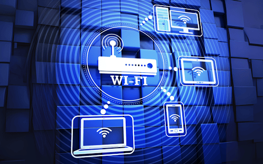
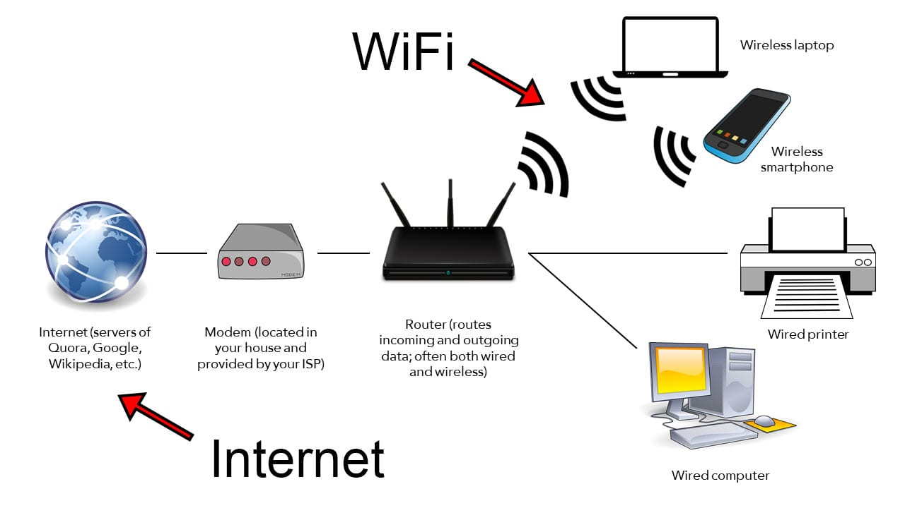

# What is Wifi?

ယနေ့ခေတ်တွင် Smartphone, Laptop, Tablet, Smart TV နှင့် အခြား Smart Devices များကို Network နှင့် ချိတ်ဆက်အသုံးပြုရာတွင် **Wi-Fi** ကို ကျယ်ပြန့်စွာ အသုံးပြုကြသည်။

Wi-Fi သည် Device များကို Network နှင့် **Wireless** နည်းလမ်းဖြင့် ချိတ်ဆက်ပေးသည့် နည်းပညာဖြစ်ပြီး Network Cable မလိုဘဲ Data များကို Radio Signal များမှတစ်ဆင့် ပေးပို့လက်ခံနိုင်စေသည်။

အထူးသဖြင့် အိမ်သုံး Internet, Office Network, Public Wi-Fi နှင့် Smart Home Devices များတွင် Wi-Fi ကို နေ့စဉ်အသုံးပြုနေကြသည်။

*Router နှင့် Wireless Devices များ Wi-Fi ဖြင့် ချိတ်ဆက်အသုံးပြုပုံ*

## Wi-Fi ဆိုတာဘာလဲ?

**Wi-Fi** ဆိုတာ Wireless Local Area Network (**WLAN**) အတွင်းရှိ Devices များကို Wireless Communication ဖြင့် Network နှင့် ချိတ်ဆက်ပေးသည့် နည်းပညာဖြစ်သည်။

Wi-Fi သည် **IEEE 802.11** မိသားစုဝင် Wireless Networking Standards များကို အခြေခံထားသည်။ Wi-Fi Network တစ်ခုတွင် Wireless Device များနှင့် Access Point သို့မဟုတ် Wireless Router တို့ကြား Data များကို Radio Frequency Signal များအသုံးပြု၍ ပေးပို့လက်ခံကြသည်။

ထို့ကြောင့် Wi-Fi ၏ အဓိကရည်ရွယ်ချက်မှာ Network Connection ကို Cable ဖြင့်သာ ချိတ်ဆက်ရန်မလိုဘဲ Wireless နည်းလမ်းဖြင့် အသုံးပြုနိုင်စေရန် ဖြစ်သည်။

## Wi-Fi နှင့် Internet ဘာကွာသလဲ?

Wi-Fi နှင့် Internet သည် တူညီသောအရာများ မဟုတ်ပါ။

**Internet** သည် ကမ္ဘာတစ်ဝှမ်းရှိ Network များနှင့် Computer Systems များကို ချိတ်ဆက်ပေးထားသော Global Network ဖြစ်သည်။

**Wi-Fi** သည် Device တစ်ခုနှင့် Local Network Equipment ကြား Wireless Connection တည်ဆောက်ပေးသည့် နည်းပညာဖြစ်သည်။

ဥပမာ အိမ်တွင် Fiber Internet အသုံးပြုနေပါက အခြေခံအားဖြင့်—

**Fiber Optic → ONT → Router / Access Point → Wi-Fi → Smartphone / Laptop**

ဟူသော Connection လမ်းကြောင်းကို တွေ့ရနိုင်သည်။

ထို့ကြောင့် Wi-Fi ရှိခြင်းနှင့် Internet ရှိခြင်းသည် အတူတူမဟုတ်ပါ။ Wi-Fi Network တစ်ခုသည် Internet မချိတ်ထားဘဲ Local Network အဖြစ်လည်း အသုံးပြုနိုင်သည်။ ထိုအပြင် Internet Connection ကို Wi-Fi မသုံးဘဲ Ethernet Cable ဖြင့်လည်း အသုံးပြုနိုင်သည်။

## Wi-Fi ဘယ်လိုအလုပ်လုပ်သလဲ?

Wi-Fi Network တစ်ခုတွင် **Access Point** သို့မဟုတ် Wireless Router သည် Wireless Communication အတွက် အဓိကအခန်းကဏ္ဍမှ ပါဝင်သည်။

Wireless Router သို့မဟုတ် Access Point သည် Network Connection ကို Wireless Radio Signal များဖြင့် ထုတ်လွှင့်ပေးသည်။ Smartphone, Laptop နှင့် အခြား Wi-Fi Support လုပ်သော Devices များက ထို Wireless Network ကို ရှာဖွေပြီး ချိတ်ဆက်နိုင်သည်။

အခြေခံလုပ်ဆောင်ပုံမှာ—

1. Internet သို့မဟုတ် Local Network Connection သည် Router သို့မဟုတ် Network Equipment သို့ ရောက်ရှိသည်။
2. Wireless Router သို့မဟုတ် Access Point သည် Wi-Fi Network ကို ပံ့ပိုးပေးသည်။
3. Access Point သည် Wireless Radio Signal များမှတစ်ဆင့် Network ကို ထုတ်လွှင့်ပေးသည်။
4. Smartphone, Laptop နှင့် အခြား Wireless Devices များသည် ထို Wi-Fi Network ကို ရှာဖွေပြီး ချိတ်ဆက်သည်။
5. ချိတ်ဆက်ပြီးနောက် Device နှင့် Network ကြား Data များကို Wireless Communication ဖြင့် ပေးပို့လက်ခံနိုင်သည်။

*Wi-Fi Network အတွင်း Wireless Devices များ ချိတ်ဆက်အသုံးပြုပုံ*

## Wi-Fi Network တွင် ပါဝင်သော အဓိကအရာများ

### Access Point

**Access Point (AP)** သည် Wireless Devices များကို Network နှင့် Wireless နည်းလမ်းဖြင့် ချိတ်ဆက်ပေးသည့် Network Device ဖြစ်သည်။

အိမ်သုံး Wireless Router အများစုတွင် Router Function နှင့် Access Point Function နှစ်မျိုးလုံး ပါဝင်နိုင်သည်။

### Wireless Device

Smartphone, Laptop, Tablet, Smart TV နှင့် Wi-Fi Support လုပ်သော အခြား Devices များသည် Wi-Fi Network နှင့် ချိတ်ဆက်အသုံးပြုနိုင်သည်။

Device တစ်ခုတွင် Wi-Fi Adapter သို့မဟုတ် Wireless Network Interface ပါရှိခြင်းဖြင့် Wireless Network နှင့် ဆက်သွယ်နိုင်သည်။

### SSID

**SSID (Service Set Identifier)** သည် Wi-Fi Network ၏ အမည်ဖြစ်သည်။

ဥပမာ Wi-Fi Network တစ်ခု၏ SSID ကို `FiberOpticHub` ဟု သတ်မှတ်ထားနိုင်သည်။ Smartphone သို့မဟုတ် Laptop တွင် Wi-Fi Network များကို ရှာဖွေသောအခါ ထို Network Name ကို မြင်တွေ့ရမည်ဖြစ်သည်။

### Wi-Fi Security

Wi-Fi Network ကို ခွင့်ပြုချက်မရှိဘဲ အသုံးပြုခြင်းမှ ကာကွယ်ရန် Security Mechanisms များကို အသုံးပြုနိုင်သည်။

အိမ်သုံး Wi-Fi Network များတွင် Password သတ်မှတ်ခြင်းသည် အသုံးများသော Security နည်းလမ်းတစ်ခုဖြစ်သည်။

## Wi-Fi Frequency Bands

Wi-Fi Technology တွင် Wireless Communication အတွက် Frequency Bands များကို အသုံးပြုသည်။

အသုံးများသော Wi-Fi Bands များတွင်—

* **2.4 GHz**
* **5 GHz**
* **6 GHz**

တို့ ပါဝင်သည်။

Frequency Band တစ်ခုချင်းစီတွင် Coverage, Interference နှင့် Performance အစရှိသော လက္ခဏာများ ကွာခြားနိုင်သည်။

ဥပမာအားဖြင့် 2.4 GHz Band သည် ပိုမိုကျယ်ပြန့်သော Coverage ရရှိနိုင်သော်လည်း အသုံးပြုနေသော Wireless Devices များနှင့် အခြား Radio Sources များကြောင့် Interference ပိုမိုတွေ့ရနိုင်သည်။ 5 GHz နှင့် 6 GHz Band များတွင် Channel များနှင့် Spectrum အခြေအနေအပေါ်မူတည်၍ ပိုမိုကောင်းမွန်သော Wireless Performance ရရှိနိုင်သည့် အခြေအနေများ ရှိနိုင်သည်။

## Wi-Fi Speed ကို ဘာတွေက သက်ရောက်သလဲ?

Wi-Fi Connection ၏ Performance သည် Internet Package Speed တစ်ခုတည်းအပေါ် မူတည်ခြင်းမရှိပါ။

အောက်ပါအချက်များက Wi-Fi Performance ကို သက်ရောက်နိုင်သည်—

* Access Point နှင့် Device ကြား Distance
* နံရံများနှင့် အခြား Physical Obstacles
* Radio Interference
* တစ်ချိန်တည်း ချိတ်ဆက်အသုံးပြုနေသော Devices အရေအတွက်
* Wi-Fi Standard နှင့် Device Capability
* Access Point ၏ နေရာချထားမှု
* အသုံးပြုနေသော Frequency Band

ထို့ကြောင့် Fiber Internet Connection သည် Speed မြင့်မားသော်လည်း Wireless Environment သို့မဟုတ် Device Capability ကြောင့် User Device တွင် ရရှိသည့် Speed သည် ထို Internet Package Speed ထက် နည်းနိုင်သည်။

## Wi-Fi ကို ဘယ်နေရာတွေမှာ အသုံးပြုသလဲ?

Wi-Fi ကို Personal နှင့် Business Network များတွင် ကျယ်ပြန့်စွာ အသုံးပြုသည်။

* Home Network
* Office Network
* School နှင့် University Network
* Hotel နှင့် Restaurant Network
* Public Wi-Fi
* Smart Home Devices
* IoT Devices

အထူးသဖြင့် Mobile Devices များကို Network နှင့် အလွယ်တကူ ချိတ်ဆက်အသုံးပြုနိုင်ခြင်းကြောင့် Wi-Fi သည် နေ့စဉ် Network အသုံးပြုမှုတွင် အရေးပါသော Technology တစ်ခု ဖြစ်လာသည်။

## Wi-Fi ၏ အားသာချက်များ

* Network Cable မလိုဘဲ Wireless Connection အသုံးပြုနိုင်ခြင်း
* Smartphone နှင့် Laptop ကဲ့သို့ Mobile Devices များအတွက် အသုံးပြုရလွယ်ကူခြင်း
* Devices အများအပြားကို Wireless Network တစ်ခုနှင့် ချိတ်ဆက်နိုင်ခြင်း
* Home, Office နှင့် Public Areas များတွင် အသုံးပြုနိုင်ခြင်း
* Network Connection ကို အသုံးပြုသူများ၏ လိုအပ်ချက်နှင့်အညီ Flexible ဖြစ်စေခြင်း

## Wi-Fi ၏ ကန့်သတ်ချက်များ

Wi-Fi သည် Cable Connection မလိုဘဲ အသုံးပြုနိုင်သော်လည်း Wireless Environment ကြောင့် ကန့်သတ်ချက်အချို့ ရှိနိုင်သည်။

Distance တိုးလာခြင်း၊ နံရံများနှင့် အခြား Obstacles များကြောင့် Signal Strength လျော့နည်းခြင်း၊ Radio Interference ဖြစ်ပေါ်ခြင်းနှင့် Connected Devices များပြားလာခြင်းတို့ကြောင့် Wi-Fi Performance ကျဆင်းနိုင်သည်။

ထို့အပြင် Wi-Fi Speed သည် အသုံးပြုနေသော Router, Access Point, Client Device နှင့် Wireless Environment တို့၏ Capability များပေါ်တွင်လည်း မူတည်နိုင်သည်။

## အနှစ်ချုပ်

**Wi-Fi** သည် Wireless Radio Communication ကို အသုံးပြုပြီး Devices များကို Network နှင့် ကြိုးမဲ့ချိတ်ဆက်ပေးသည့် နည်းပညာဖြစ်သည်။

Wi-Fi နှင့် Internet သည် တူညီသောအရာမဟုတ်ပါ။ Internet သည် Global Network ဖြစ်ပြီး Wi-Fi သည် Device များနှင့် Network Equipment ကြား Wireless Connection တည်ဆောက်ပေးသည့် နည်းပညာဖြစ်သည်။

FTTH Internet Network များတွင် Fiber Optic Connection မှတစ်ဆင့် ရောက်ရှိလာသော Network Connection ကို ONT နှင့် Router / Access Point တို့မှတစ်ဆင့် Wi-Fi ဖြင့် Smartphone, Laptop နှင့် အခြား Wireless Devices များတွင် အသုံးပြုနိုင်သည်။ ထို့ကြောင့် Fiber Optic နှင့် Wi-Fi သည် မတူညီသော Technology များဖြစ်သော်လည်း ယနေ့ခေတ် Internet အသုံးပြုမှုတွင် တစ်ဆင့်ပြီးတစ်ဆင့် ဆက်စပ်အသုံးပြုလေ့ရှိသည်။